# Architektur-Konzept: Tool zur stabilen Prozessmodellierung und Prozessinstanzerstellung

> Schwerpunkt: Konzepte und **Korrektheitsgarantien** nach dem Vorbild der **ADEPT2-Forschung** (Universität Ulm, Dadam/Reichert), eingeordnet in den Standard **BPMN 2.0**.
>
> Status: Konzept. Version 0.10 (Roadmap §13.1 fortgeschrieben: additive Umsetzung von E3 Wertschöpfungs-Klassifikation, E5-statisch Zeitperspektive T1/T2, E7 Modellmetriken & 7PMG-Hinweise, E8 Arbeitslisten-Priorität sowie der Zeit-/Flexibilitätsteil von E4 – jeweils mit Tests und ohne Lockerung bestehender Kriterien; laufzeit-invasive Punkte E1/E2/E6/E9 sowie Kosten/Qualität in E4 bleiben ehrlich offen ausgewiesen). Frühere Vertiefung (0.9): 7PMG-Priorisierung/SEQUAL, ITIL-Eskalation & Priorität = Auswirkung + Dringlichkeit, drei Flexibilitätsdimensionen; Abschnitte 2.4.1, 3.8, 6.2.1, 6.5, 13.1, 15.1.
>
> Leitprinzip (nicht verhandelbar): **Correctness by Construction** – jede Änderung am Modell führt ausnahmslos zu einem syntaktisch korrekten und ausführbaren Modell (siehe Abschnitt 1.1).

---

## 1. Ziel und Leitidee

Ziel ist der Entwurf eines Werkzeugs, das drei Dinge zuverlässig leistet:

1. **Stabile Prozessmodellierung** – der Modellierer kann ein Prozessmodell nur so verändern, dass es zu *jedem Zeitpunkt* syntaktisch und semantisch **korrekt** bleibt.
2. **Prozessinstanzerstellung und -ausführung** – aus einem korrekten Modell werden Instanzen erzeugt, ausgeführt, bei Bedarf zur Laufzeit angepasst (ad hoc) und auf neue Modellversionen migriert.
3. **Intuitive, moderne Bedienung** – Modellierung, Visualisierung, Monitoring und Instanzverwaltung (inkl. geführter Revisionsübernahme) sind durchgängig erstklassig bedienbar. **Hier heben wir uns bewusst von klassischen, technisch geprägten Workflow-Werkzeugen ab** – ohne Abstriche bei Stabilität/Konsistenz im Backend (siehe Abschnitt 8).

Die zentrale Leitidee stammt aus ADEPT2 und heißt **„Correctness by Construction"**:

> Das Werkzeug bietet dem Nutzer ausschließlich Änderungsoperationen an, deren Anwendung die Korrektheit des Modells bzw. der Instanz garantiert erhält. Falsche Modelle können gar nicht erst entstehen.

Das unterscheidet den Ansatz vom „freien Zeichnen" klassischer BPMN-Editoren, in denen sich Modelle mit Deadlocks, fehlenden Synchronisationen oder fehlenden Daten konstruieren lassen, die erst nachträglich (oder gar nicht) geprüft werden.

### 1.1 Correctness by Construction als verbindlicher Architektur-Vertrag

Correctness by Construction (CbC) ist in diesem Werkzeug **kein nachgelagerter Validierungsschritt, sondern eine durchgängige Architektur-Eigenschaft**: Es gibt zu keinem Zeitpunkt einen Zustand, in dem ein inkorrektes Modell existiert. Daraus folgt die zentrale Zusicherung des Systems:

> **Korrektheitsinvariante (I):** Jeder *persistierte* und *anzeigbare* Modellzustand erfüllt sämtliche Struktur- und Datenflussregeln (K1–K7, D1–D5 aus Abschnitt 3). Es existiert keine Operation und kein Pfad – weder im Editor, noch über die API, noch zur Laufzeit –, der diese Invariante verletzen kann.

#### 1.1.1 Zwei Korrektheitsstufen – bewusst getrennt

Die Anforderung „syntaktisch korrekt **und** ausführbar" umfasst zwei Stufen, die das Werkzeug unterschiedlich behandelt:

| Stufe | Was wird garantiert | Wann erzwungen |
|-------|---------------------|----------------|
| **(A) Strukturelle/syntaktische Korrektheit** | Blockstruktur, Soundness, Datenfluss-Wohlgeformtheit (K1–K7, D1–D5) | **Bei jeder einzelnen Operation** – die Invariante I ist *immer* erfüllt |
| **(B) Ausführbarkeit / Release-Reife** | Zusätzlich: jeder Schritt hat einen ausführbaren Dienst, jeder interaktive Schritt eine Bearbeiterzuordnung, alle Pflichtparameter sind gebunden (B1–B3, Abschnitt 3.4) | **Spätestens beim Release**; während der Bearbeitung als Vollständigkeits-/Warnzustand sichtbar |

Diese Trennung ist wichtig und ehrlich: Ein *halbfertiges* Modell (z. B. ein Schritt ohne zugeordneten Dienst) ist **strukturell jederzeit korrekt**, aber noch **nicht ausführbar**. Das Werkzeug lässt das Weitermodellieren zu, verhindert aber die **Instanziierung/Freigabe** so lange, bis auch Stufe (B) vollständig erfüllt ist. So ist garantiert: Was freigegeben (released) wird, ist *immer* sowohl korrekt als auch lauffähig – und während des Modellierens kann nie ein strukturell kaputtes Zwischenmodell entstehen.

#### 1.1.2 Operationen als korrektheitserhaltende Transformationen

Der Mechanismus, der Invariante I trägt, ist das **geschlossene Operationsmodell**. Jede Modelländerung ist eine Funktion, die einen korrekten Zustand in einen korrekten Zustand überführt – oder die Operation wird abgelehnt; einen Teil-/Zwischenzustand gibt es nie:

```text
apply : (Model_valid, Operation, Params) ? Model_valid        // Erfolg: wieder gültig
      | Rejected(Begründung, Lokalisierung)                   // Ablehnung: Modell unverändert
```

Konkret bedeutet das fünf zusammenwirkende Konstruktionsprinzipien:

1. **Keine Roh-Editierung.** Es gibt *keine* Primitive wie „Kante von X nach Y ziehen" oder „Knoten frei platzieren". Der Nutzer wählt ausschließlich aus **High-Level-Operationen** (`serialInsert`, `parallelInsert`, `conditionalInsert`, `insertLoop`, `deleteNode`, `moveNode`, `addDataElement`, `connectData` …). Damit sind ganze Fehlerklassen (offener Split, mehrere Startknoten, gekreuzte Blöcke) syntaktisch unmöglich.
2. **Angebotsmodell statt Verbotsmodell („dummer Editor").** Der Editor fragt für den aktuellen Zustand beim **Change-Operations-Service** ab, *welche* Operationen an *welchen* Stellen überhaupt zulässig sind, und bietet nur diese an. Unzulässige Aktionen erscheinen gar nicht erst – der Nutzer kann den Fehler nicht machen.
3. **Transaktionale Anwendung (validate-before-commit, atomar).** Vor dem Commit prüft der Correctness Validator die Operation gegen K/D-Regeln. Nur bei vollständiger Erfüllung wird der neue Zustand atomar persistiert; andernfalls bleibt das Modell **unverändert**. Es gibt keinen „halb angewandten" Zwischenzustand.
4. **Automatische Strukturkomplettierung.** Strukturbildende Operationen erzeugen immer das **vollständige, symmetrische Konstrukt**: Ein eingefügter XOR-Split bringt seinen zugehörigen XOR-Join mit, eine Schleife ihren LOOP-Start/-End. Die Block-Symmetrie (K1) ist damit per Konstruktion nie verletzbar.
5. **Kein Bypass.** Editor, öffentliche API und Laufzeit-Ad-hoc-Änderungen nutzen **denselben** Change-Operations-Service und **denselben** Validator. Es gibt keinen privilegierten „Roh-Modus", der die Invariante umgehen könnte – auch nicht beim Import (siehe 1.1.3).

#### 1.1.3 Konsequenz für Import und Schnittstellen

Weil die Invariante systemweit gilt, kann **kein** externer Eingang sie aushebeln: Ein BPMN-2.0-Import wird nicht als Rohgraph übernommen, sondern auf die geprüfte, blockstrukturierte Teilmenge **abgebildet und validiert**. Nicht abbildbare Konstrukte werden abgelehnt oder zur manuellen Auflösung markiert – aber niemals als inkorrektes Modell gespeichert. Gleiches gilt für jeden API-Aufruf.

#### 1.1.4 Was der Nutzer dadurch erlebt

- **Es gibt keinen „Validieren"-Knopf** für die Struktur – Korrektheit ist kein Ergebnis einer Prüfung, sondern eine Eigenschaft des Zustands.
- **Fehlermeldungen betreffen nur abgelehnte Operationen**, nicht den bestehenden Modellzustand (der ist immer gültig), und sind präzise lokalisiert.
- **Vor der Instanziierung** signalisiert das Werkzeug klar die noch offene Stufe (B) (fehlende Dienste/Bearbeiter/Datenbindungen) und gibt die Freigabe erst frei, wenn auch diese erfüllt ist.

> Diese Eigenschaft ist die fachliche Begründung dafür, das interne **blockstrukturierte Meta-Modell** (nicht den freien BPMN-Graphen) zur „Single Source of Truth" zu machen: Nur auf einer wohlstrukturierten Repräsentation lassen sich korrektheitserhaltende Operationen *vollständig* und *effizient* garantieren.

---

## 2. Fachliche Grundlagen

### 2.1 BPMN 2.0 (OMG / ISO 19510)

BPMN 2.0 (2011, aktuell 2.0.2 von 2014) ist der De-facto-Standard für Prozessnotation und definiert seit 2.0 auch eine **Ausführungssemantik**.

Wesentliche Elementkategorien:

| Kategorie | Elemente |
|-----------|----------|
| **Flow Objects** | Events (Start/Intermediate/End; catching/throwing), Activities (Task, Sub-Process, Call Activity, Transaction), Gateways (XOR, AND, OR/inclusive, Event-based, Complex) |
| **Connecting Objects** | Sequence Flow, Message Flow, Association |
| **Swimlanes** | Pool, Lane |
| **Artifacts** | Data Object, Group, Annotation |

**Stärke:** verbreitete, verständliche Notation, breite Tool-Unterstützung, standardisiertes XML-Austauschformat (BPMN-XML / DI).

**Schwäche für stabile Ausführung:** BPMN erlaubt **unstrukturierte Graphen**. Beliebige Kombinationen von Gateways (insbesondere des inklusiven OR) können zu **Deadlocks** oder **Lack of Synchronization** führen. Der Standard garantiert **keine Soundness**.

### 2.2 ADEPT2 (Forschungsgrundlage)

Die hier genutzten Korrektheitskonzepte stammen aus dem Forschungssystem **ADEPT** (Institut für Datenbanken und Informationssysteme, Universität Ulm). Kernanspruch: **adaptive, jederzeit korrekte Workflows**, die per „Plug & Play“ aus Anwendungsbausteinen zusammengesetzt werden.

Die für dieses Konzept entscheidenden ADEPT2-Konzepte:

1. **Block-/wohlstrukturierter Prozessgraph.** Kontrollstrukturen werden als **symmetrische, sauber geschachtelte Blöcke** modelliert (Sequenz, AND-Block, XOR-Block, Schleife). Jeder Split hat einen zugehörigen Join. Das schließt ganze Fehlerklassen (Deadlock, fehlende Synchronisation) **konstruktiv** aus.
2. **Trennung von Kontroll- und Datenfluss.** Aktivitäten lesen/schreiben **Datenelemente** über explizite Datenkanten. Der Datenfluss wird unabhängig vom Kontrollfluss auf Korrektheit geprüft.
3. **High-Level-Änderungsoperationen** mit formalen Vor-/Nachbedingungen statt freiem Kantenziehen (z. B. *serialInsert*, *parallelInsert*, *conditionalInsert*, *delete*, *move*, *embedInLoop*).
4. **Datenfluss-Korrektheit.** Jeder **Pflicht-Eingabeparameter** einer Aktivität muss auf **allen** zu ihr führenden Ausführungspfaden zuvor geschrieben worden sein (keine „missing data", keine „lost updates").
5. **Activity Repository (Plug & Play).** Aktivitäten sind Komponenten mit klar definierter Schnittstelle (Ein-/Ausgabeparameter, ausführende Anwendung). Modellieren = Bausteine verschalten.
6. **Ad-hoc-Änderungen zur Laufzeit.** Einzelne *Instanzen* können während der Ausführung verändert werden (Schritt einfügen/löschen/verschieben), ohne die Soundness zu verletzen; zustandsbasierte Vorbedingungen verhindern unzulässige Eingriffe.
7. **Schema-Evolution & Instanzmigration.** Wird ein Prozesstyp geändert, werden **kompatible** laufende Instanzen kontrolliert auf die neue Version migriert (Compliance-Prüfung des Ausführungszustands).

### 2.3 Positionierung BPMN ? ADEPT

| Aspekt | BPMN 2.0 (klassischer Editor) | ADEPT2-Ansatz (dieses Konzept) |
|--------|-------------------------------|--------------------------------|
| Graphstruktur | beliebig (unstrukturiert erlaubt) | blockstrukturiert/wohlgeformt |
| Korrektheit | nachträglich (Validierung optional) | per Konstruktion garantiert |
| Datenfluss | implizit/optional | explizit, geprüft |
| Laufzeitänderung | nicht standardisiert | ad hoc, soundness-erhaltend |
| Versionsmigration | herstellerabhängig | Compliance-basiert |

**Empfohlene Strategie:** internes, blockstrukturiertes Meta-Modell (ADEPT-artig) als „Single Source of Truth" für Korrektheit und Ausführung; **BPMN 2.0 als Import-/Export- und Darstellungsformat** auf einer geprüften, ausführbaren Teilmenge (Sequence, AND, XOR, strukturierte Loops, Sub-Process). So bleibt Standardkompatibilität erhalten, ohne die Korrektheitsgarantien zu verlieren.

### 2.4 Modellierungsrichtlinien & -regeln (BPMN 2.0 + ADEPT)

Bei der **Modellerstellung** werden die Richtlinien aus BPMN 2.0 **und** die strengeren Strukturregeln aus ADEPT durchgängig berücksichtigt. Sie sind nicht bloß Empfehlung, sondern werden vom Editor **konstruktiv erzwungen** bzw. als Vollständigkeits-/Warnzustand angezeigt (Correctness by Construction, Abschnitt 1.1). Die formale Prüfbasis liefert Abschnitt 3 (K/D/Z/B); dieser Abschnitt bündelt die daraus folgenden **praktischen Modellierungsregeln**.

**A. Struktur & Kontrollfluss (verbindlich, aus ADEPT):**

- **MR1 – Blockstruktur:** Jeder Split wird mit einem korrespondierenden Join desselben Typs geschlossen (XOR/AND/LOOP), sauber geschachtelt – keine sich überkreuzenden Verzweigungen (entspricht K1).
- **MR2 – Genau ein Start/Ende:** Jeder Prozess hat genau einen START- und einen END-Knoten; keine isolierten Knoten, keine Sackgassen (K2/K3).
- **MR3 – Strukturierte Schleifen:** Wiederholungen ausschließlich über das explizite LOOP-Konstrukt (REPEAT-UNTIL) mit definierter Abbruchbedingung – keine „Rück-Kanten" von Hand (K6).
- **MR4 – Vollständige, überlappungsfreie XOR-Prädikate:** Bedingungen an XOR-Splits decken den Wertebereich vollständig ab und schließen sich gegenseitig aus (K7).
- **MR5 – Synchronisation nur zwischen Parallelzweigen:** SYNC-Kanten verbinden nur Aktivitäten verschiedener AND-Zweige (K4).

**B. Datenfluss (verbindlich, aus ADEPT):**

- **MR6 – Schreiben vor Lesen:** Jeder Pflicht-Eingabeparameter ist auf **allen** Pfaden vor Aktivierung versorgt (D1); Typkonformität von Quelle und Senke (D3).
- **MR7 – Keine konkurrierenden Schreibzugriffe:** Parallele Schreibzugriffe auf dasselbe Datenelement werden vermieden bzw. aufgelöst (D2).

**C. Notation & Lesbarkeit (Richtlinien, aus BPMN 2.0):**

- **MR8 – Aussagekräftige Benennung:** Aktivitäten als „Objekt + Verb" (z. B. „Antrag prüfen"), Ereignisse als Zustand, Gateways als Frage. Konsistente, fachliche Begriffe.
- **MR9 – Gateways statt Bedingungen an Tasks:** Verzweigungen ausschließlich über explizite Gateways modellieren, nicht über mehrere ausgehende Sequenzflüsse an einer Aktivität.
- **MR10 – Sparsamer, klarer Ereigniseinsatz:** Start-/End-Ereignisse typisieren (z. B. Nachricht, Timer); Zwischenereignisse nur wo fachlich nötig.
- **MR11 – Verantwortlichkeiten über Lanes:** Zuständigkeiten werden über Pools/Lanes bzw. das Organisationsmodell (BZR, Z1–Z4) ausgedrückt, nicht im Aktivitätsnamen.
- **MR12 – Modularität statt Größe:** Umfangreiche Abläufe werden in **Sub-Prozesse** zerlegt und über **Folgeprozesse** verkettet (Abschnitt 4.2); ein einzelnes Diagramm bleibt überschaubar.

> **Verhältnis BPMN ? ADEPT:** Wo BPMN nur *empfiehlt* (Lesbarkeit, Benennung), gibt der Editor Hinweise; wo ADEPT *Korrektheit garantiert* (Struktur, Datenfluss), erzwingt der Editor die Regel konstruktiv. Beim **BPMN-Import** wird auf die geprüfte, ausführbare Teilmenge abgebildet; nicht regelkonforme Konstrukte (z. B. unstrukturierte OR-Gateways) werden abgelehnt oder in eine blockstrukturierte Form überführt.

### 2.4.1 Bezug zu etablierten Modellierungsrichtlinien (7PMG, GoM)

Die obigen MR-Regeln stehen im Einklang mit anerkannten, empirisch fundierten Richtlinien der Prozessmodellierungs-Forschung. Wir nennen sie hier explizit, um die fachliche Verankerung offenzulegen; übernommen werden ausschließlich die zugrunde liegenden, allgemein anerkannten Konzepte – in eigener Formulierung.

- **Seven Process Modeling Guidelines (7PMG).** Die sieben Faustregeln von Mendling, Reijers und van der Aalst zielen auf verständliche, fehlerarme Modelle [MRA10]. Mehrere decken sich unmittelbar mit unseren erzwungenen Regeln:
  - *Modell so weit wie möglich strukturieren* (Blockstruktur) ? MR1 / K1.
  - *Wenige Elemente verwenden bzw. große Modelle zerlegen* ? MR12 (Modularität über Sub-/Folgeprozesse).
  - *Routing-Pfade je Element minimieren* ? MR9 (Verzweigung nur über explizite Gateways).
  - *Strukturiert modellieren und OR-Routing vermeiden* ? begründet unsere bewusste Beschränkung auf AND/XOR (kein unstrukturiertes OR-Gateway).
  - *Verbale Benennungskonventionen (Objekt + Verb) nutzen* ? MR8.

  Wo eine 7PMG-Empfehlung formal garantierbar ist, hebt ProcWorks sie von der bloßen Empfehlung zur **konstruktiv erzwungenen** Regel an; rein stilistische Punkte bleiben Hinweis. Eine Expertenbefragung in [MRA10] priorisiert die Richtlinien nach ihrem Verständlichkeitsbeitrag (höchster zuerst): G4 (Strukturierung) > G7 (Zerlegung) > G1 (wenige Elemente) > G6 (Benennung) > G2 (Routing-Pfade) > G3 (ein Start/Ende) > G5 (kein OR). Bemerkenswert: Die beiden am höchsten bewerteten Punkte (G4, G7) sind in ProcWorks **bauartbedingt** garantiert; das niedrigst bewertete G5 (kein OR) ist bei uns ohnehin Konstruktionsentscheidung – die nach Expertensicht wirkungsvollsten Maßnahmen sind also bereits Teil der Architektur.
- **Grundsätze ordnungsmäßiger Modellierung (GoM).** Die GoM – Richtigkeit, Relevanz, Wirtschaftlichkeit, Klarheit, Vergleichbarkeit und systematischer Aufbau [Ros96][BRU00] – bilden den übergeordneten Qualitätsrahmen: „Richtigkeit" und „systematischer Aufbau" entsprechen unserer **Stufe A** (strukturelle Korrektheit, K/D), „Klarheit" den Notations- und Benennungsregeln (MR8–MR11), „Vergleichbarkeit" der einheitlichen, blockstrukturierten Form.

> **Einordnung:** Empirische Studien belegen einen Zusammenhang zwischen Modellmetriken (Größe, Verschachtelungstiefe, Gateway-Heterogenität) und Fehlerwahrscheinlichkeit [MNV07]. Übergeordnete semiotische Qualitätsrahmen wie SEQUAL [KSJ06][LSS94] ordnen diese Befunde ein (vgl. §3.7). ProcWorks senkt die Fehlerquellen **bauartbedingt**: Blockstruktur, einheitliche Gateways und Modularisierung sind nicht optional, sondern Teil der Konstruktion (Correctness by Construction).

---

## 3. Korrektheitskriterien (formale Basis)

Diese Kriterien definieren, was „stabil/korrekt" konkret bedeutet, und bilden die Prüfregeln der Engine.

### 3.1 Struktur- und Kontrollfluss-Korrektheit

Die folgenden Regeln entsprechen den in ADEPT systemseitig erzwungenen Strukturregeln (vgl. Reichert, Diss. 2000).

- **K1 – Wohlgeformtheit:** Der Graph ist ein blockstrukturierter, sauber geschachtelter Kontrollgraph; jeder Split hat genau einen korrespondierenden Join desselben Typs (**eineindeutige** XOR-Split/Join-, AND-Split/Join- und LOOP-Start/End-Zuordnung).
- **K2 – Ein-/Ausgang:** Genau ein START- und ein END-Knoten; START hat keinen eingehenden, END keinen ausgehenden Kontrollkonnektor. Jeder Aktivitätsknoten hat genau einen eingehenden und genau einen ausgehenden Kontrollkonnektor.
- **K3 – Erreichbarkeit:** Alle Knoten liegen auf einem Pfad von START nach END – **keine isolierten Knoten, keine Sackgassen**.
- **K4 – Sync-Kanten:** Synchronisationskanten sind nur zwischen Aktivitäten **verschiedener AND-Zweige** zulässig (warten auf Beendigung bzw. Abwahl des Quellzweigs).
- **K5 – Soundness** (in Anlehnung an Workflow-Netze, in ADEPT formal bewiesen):
  - *Option to complete:* von jedem erreichbaren Zustand ist ein Endzustand erreichbar.
  - *Proper completion:* unter jeder erreichbaren Endmarkierung sind alle Aktivitäten `COMPLETED` oder `SKIPPED`.
  - *Korrekte Vergangenheit:* für jeden `COMPLETED`/`SKIPPED`-Knoten sind alle Vorgänger ebenfalls `COMPLETED`/`SKIPPED`.
- **K6 – Schleifenkorrektheit:** Schleifen sind strukturiert (REPEAT-UNTIL mit explizitem LOOP-Start/End; Abbruchbedingung über eine dem LOOP-End zugeordnete XOR-Aktivität).
- **K7 – Verzweigungsprädikate:** XOR-Prädikate werden so konstruiert, dass sie den Wertebereich **vollständig überdecken** und **überlappungsfrei** sind (ggf. mehrdimensional).

> Durch K1–K4 (Blockstruktur) sind K5–K6 weitgehend **konstruktiv** erfüllt – das ist der Kern des ADEPT-Vorteils gegenüber freien BPMN-Graphen.

### 3.2 Datenfluss-Korrektheit

Datenelemente = Prozessinstanzvariablen; Aktivitäten kommunizieren über Lese-/Schreib-/Lese-Schreib-Kanten (Ein-/Ausgabeparameter). Typen: `Integer`, `Float`, `String`, `Date`, `Boolean`, `URI` sowie benutzerdefinierte Typen.

- **D1 – Vollständige Versorgung:** Jeder **nicht-optionale** Eingabeparameter wird in **allen** vom Modell zugelassenen Ausführungsreihenfolgen vor Aktivierung der Aktivität durch einen nicht-optionalen Schreibzugriff versorgt. (Beispiel: ein nur im B-C-Pfad geschriebenes Datenelement darf von einer Aktivität hinter dem XOR-Join nicht pflichtweise gelesen werden.)
- **D2 – Keine verlorenen Schreibvorgänge / definierte Konflikte:** parallele Schreibzugriffe auf dasselbe Datenelement werden erkannt und unterbunden bzw. aufgelöst.
- **D3 – Typkonformität:** Parametertypen von Quelle und Senke passen zusammen.
- **D4 – Optionalität:** optionale Inputs dürfen unversorgt bleiben, Pflicht-Inputs nicht. XOR-Join- und AND-Join-Knoten werden nicht mit Datenelementen verknüpft.
- **D5 – Live-Prüfung:** Datenflussfehler (z. B. Lesen vor Schreiben) werden bereits während der Modellierung nebenläufig angezeigt und müssen vor Freigabe behoben sein.

### 3.2.1 Ressourcen-/Bearbeiterzuordnung (Z1–Z4)

Analog zum Datenfluss ist auch die Zuordnung von **Ressourcen** (Bearbeiter/Agenten, ausführende Dienste) korrektheitsrelevant. Eine Zuordnung wird zu jeder Änderung gegen folgende Regeln geprüft:

- **Z1 – Wohlgeformte Bearbeiterregel:** Jede Bearbeiterzuordnungsregel (BZR) ist syntaktisch gültig (auswertbarer Ausdruck der funktionalen BZR-Sprache: `AND`/`OR`/`EXCEPT`, Modifikatoren `*`/`+`, `NodePerformingAgent(nodeId)`) und referenziert nur **existierende** Elemente des Organisationsmodells (Rolle, OrgPosition, OrgUnit …).
- **Z2 – Auflösbarkeit (nicht-leer):** Die Regel ist gegen das aktuelle Organisationsmodell **potenziell erfüllbar** – sie kann mindestens einen Agenten liefern. Strukturell leere Regeln (z. B. Verweis auf eine Rolle ohne Träger) werden als Inkonsistenz gemeldet.
- **Z3 – Gültige Rückbezüge:** `NodePerformingAgent(nodeId)`-Bezüge verweisen nur auf Schritte, die im Kontrollfluss **garantiert vorher** ausgeführt werden (sonst ist der Bearbeiter zur Auswertungszeit unbestimmt) – strukturell analog zur Datenfluss-Regel D1.
- **Z4 – Dienst-/Schnittstellenkonformität:** Der einem Schritt zugeordnete Dienst (`ActivityTemplate`) passt mit seinen Ein-/Ausgabeparametern zu den am Knoten verbundenen Datenelementen (Typen gemäß D3); automatische Schritte brauchen keine BZR, interaktive schon.

### 3.3 Laufzeit-/Änderungskorrektheit

- **R1 – Zustandsverträglichkeit:** Eine ad-hoc-Änderung ist nur zulässig, wenn der aktuelle Instanzzustand sie erlaubt (z. B. ein bereits abgeschlossener Schritt darf nicht gelöscht werden).
- **R2 – Erhalt von K1–D3:** Nach jeder Änderung gelten weiterhin alle Struktur- und Datenflussregeln.
- **R3 – Migrations-Compliance:** Eine Instanz darf nur dann auf ein neues Schema migriert werden, wenn ihr bisheriger Ausführungsverlauf mit dem neuen Schema verträglich ist. R3 wird durch die Kriterien M1–M5 (Abschnitt 3.3.1) präzisiert.

#### 3.3.1 Konsistenzkriterien der Instanzmigration (M1–M5)

Die Migration einer laufenden Instanz `i` von Schema `S_alt` auf `S_neu` ist genau dann **konsistent** (und damit erlaubt), wenn alle folgenden Kriterien erfüllt sind. Sie bilden den formalen Kern des „intensiven Konsistenz"-Anspruchs:

- **M1 – Strukturelle Korrektheit des Ziels:** `S_neu` erfüllt selbst alle Stufe-A- und Stufe-B-Kriterien (es ist ein freigegebenes, ausführbares Schema). Migration kann also nie *in* ein kaputtes Modell führen.
- **M2 – Trace-Verträglichkeit (Compliance):** Der bisherige Ausführungsverlauf („Trace") von `i` ist auch unter `S_neu` **produzierbar** – d. h. die Reihenfolge aller bereits `COMPLETED`/`SKIPPED`/`RUNNING` Schritte ist mit dem Kontrollfluss von `S_neu` vereinbar. Formal: der bisherige Verlauf ist ein gültiges Präfix einer Ausführung von `S_neu`. Andernfalls würde Migration „Vergangenheit fälschen".
- **M3 – Zustands-/Markierungs-Abbildbarkeit:** Die aktuellen Knoten-/Kantenmarkierungen (NS/ES) von `i` lassen sich eindeutig und regelkonform auf `S_neu` abbilden. Insbesondere darf kein bereits abgeschlossener Bereich rückwirkend re-aktiviert werden und kein gerade `RUNNING` Schritt verloren gehen.
- **M4 – Datenkonsistenz:** Alle in `S_neu` benötigten Pflicht-Datenelemente, die für den **bereits durchlaufenen** Teil relevant sind, sind in `i` mit typkonformen Werten belegt (D1–D3 gelten nach Migration weiter). Neu hinzugekommene Pflicht-Datenelemente dürfen nur im **noch nicht** durchlaufenen Teil verlangt werden – oder es existiert ein Default/Migrations-Mapping.
- **M5 – Ad-hoc-Verträglichkeit:** Bei Instanzen mit instanzspezifischen Ad-hoc-Deltas (Abschnitt 6.3) wird geprüft, ob das Delta mit `S_neu` kollidiert. Nicht-kollidierende Deltas bleiben nach der Migration erhalten; kollidierende verhindern die automatische Migration (Instanz bleibt migrationsfähig nur nach manueller Auflösung).

> Eine Instanz heißt **migrierbar**, wenn M1–M5 erfüllt sind. Ist auch nur eines verletzt, bleibt die Instanz **konsistent auf `S_alt`** weiterlaufen – sie wird nie in einen unklaren Mischzustand gezwungen. Damit ist Konsistenz in *beide* Entscheidungsrichtungen garantiert.

### 3.4 Ausführbarkeits-/Release-Kriterien (Stufe B)

Während K/D-Regeln die **strukturelle Korrektheit jederzeit** sichern (Stufe A, Abschnitt 1.1.1), prüfen die folgenden Kriterien die **Ausführbarkeit**. Sie sind während der Modellierung als Vollständigkeits-/Warnzustand sichtbar und werden **spätestens beim Release** erzwungen – erst danach ist eine Instanziierung möglich.

- **B1 – Dienstzuordnung:** Jeder Aktivitätsknoten ist mit einem ausführbaren `ActivityTemplate` (Dienst + Ausführungsumgebung) verknüpft.
- **B2 – Bearbeiterzuordnung:** Jeder interaktive (nicht automatische) Schritt besitzt eine auswertbare Bearbeiterzuordnungsregel (BZR); zudem ist eine Startberechtigung definiert.
- **B3 – Vollständige Datenbindung:** Alle Pflicht-Eingabeparameter aller Schritte sind gemäß D1 versorgt; Verzweigungsprädikate (K7) und Schleifen-Abbruchbedingungen (K6) sind vollständig spezifiziert.

> Erst wenn A (K1–K7, D1–D5) **und** B (B1–B3) erfüllt sind, ist das Modell *korrekt und ausführbar* und kann ins Server-Repository hochgeladen/freigegeben werden.

### 3.5 Correctness by Construction für Daten- und Ressourcenbindung

Die Korrektheitsinvariante (Abschnitt 1.1) gilt **nicht nur für den Kontrollfluss**, sondern gleichermaßen für Daten- und Ressourcenbindung. Auch hier wird Konsistenz *konstruktiv und zu jedem Zeitpunkt* gewahrt – nicht erst bei einer Abschlussprüfung:

- **Bindung nur über geprüfte Operationen.** Datenelemente anlegen, Lese-/Schreibkanten ziehen, Dienste und Bearbeiterregeln zuordnen geschieht ausschließlich über Bindungs-Operationen (`addDataElement`, `connectData`, `assignService`, `assignStaffRule` …), die der Change-Operations-Service anbietet. Jede prüft ihre Vorbedingungen gegen D1–D5 bzw. Z1–Z4 und committet **transaktional** (validate-before-commit); bei Verletzung bleibt die Bindung unverändert.
- **Symmetrische Mitänderung bei Strukturoperationen.** Löscht oder verschiebt eine Strukturoperation einen Knoten, werden **abhängige Bindungen automatisch mitgeprüft und korrigiert** (z. B. eine Lesekante, deren schreibender Vorgänger entfällt, wird erkannt). Es entsteht nie eine „verwaiste" Daten- oder Ressourcenreferenz.
- **Live-Konsistenz als Zustand, nicht als Prüflauf.** Wie beim Kontrollfluss gibt es **keinen „Validieren"-Knopf** für Bindungen: Der Bindungszustand ist immer in sich konsistent (D/Z erfüllt). Was fehlt, um *lauffähig* zu sein – noch nicht versorgte Pflichtparameter, Schritte ohne Dienst, interaktive Schritte ohne BZR –, wird kontinuierlich als **Vollständigkeitszustand (Stufe B)** angezeigt.
- **Lauffähigkeit = vollständige, konsistente Bindung.** Ein Modell ist genau dann lauffähig, wenn **alle** relevanten Daten **und** Ressourcen konsistent verbunden sind (B1–B3 zusammen mit D1–D5 und Z1–Z4). Die Freigabe/Instanziierung wird bis dahin blockiert – ein nicht vollständig gebundenes Modell kann nicht released werden.

> Damit gilt das durchgängige Versprechen in **allen drei Dimensionen** – Kontrollfluss, Datenfluss und Ressourcen: jede einzelne Änderung führt zu einem in sich konsistenten Modell, und die Lauffähigkeit ist genau dann erreicht, wenn alle Bindungen vollständig und geprüft sind.

### 3.6 Komposition: Hierarchie & Modularität (H1–H4, F1–F3)

Sub- und Folgeprozesse (Abschnitt 4.2) sind ebenfalls **Correctness by Construction** unterworfen. Eine Verknüpfung über Schema-Grenzen hinweg darf das Gesamtmodell nie in einen inkonsistenten oder nicht ausführbaren Zustand bringen.

**Sub-Prozesse (hierarchisch):**

- **H1 – Referenz auf freigegebenes Schema:** Ein `SUBPROCESS`-Knoten darf nur auf ein **RELEASED** Zielschema mit **fester (gepinnter) Version** verweisen. Ein Entwurf darf zwar referenziert werden, blockiert aber das Release des Elternschemas (Stufe B).
- **H2 – Schnittstellenkonformität:** Das Input-/Output-Mapping ist **typkonform** (analog D3). Jeder Pflicht-Input des Sub-Prozesses ist aus einem geschriebenen Datenelement des Hauptprozesses versorgt; jeder genutzte Output ist auf ein Datenelement des Hauptprozesses gemappt.
- **H3 – Azyklische Hierarchie:** Die transitive Sub-Prozess-Referenzierung ist **zyklenfrei** (ein Prozess kann sich weder direkt noch indirekt selbst enthalten). Der Validator prüft den Aufrufgraphen vor dem Commit.
- **H4 – Versions-Stabilität & Evolution:** Die gepinnte Zielversion ist **immutable**. Erscheint eine neue Version des Sub-Schemas, bleibt das freigegebene Elternschema unberührt; eine Übernahme erfolgt nur über eine **neue Revision** des Elternschemas (Migration M1–M5 gilt analog über die Hierarchiegrenze).

**Folgeprozesse (modular/lateral):**

- **F1 – Zielexistenz:** Ein `FollowUpLink` verweist auf einen **existierenden Prozesstyp** mit mindestens einer freigegebenen Version (gepinnt oder „neueste RELEASED").
- **F2 – Handover-Konformität:** Das Handover-Mapping ist **typkonform**; alle Pflicht-Startdaten des Folgeprozesses sind versorgt.
- **F3 – Entkopplung:** Bei `ASYNC` hat der Abschluss des Hauptprozesses **keine** Rückabhängigkeit vom Folgeprozess; ein Fehlschlag des Folgeprozesses macht den abgeschlossenen Hauptprozess nicht rückwirkend ungültig (lose Kopplung, eigene Fehlerbehandlung/Recovery).

> Komposition erweitert die Korrektheitsinvariante über das einzelne Schema hinaus auf den **Aufruf- und Kettengraphen**: Auch zusammengesetzte Prozesse sind zu jedem Zeitpunkt strukturell korrekt; ihre Ausführbarkeit (Stufe B) erfordert zusätzlich erfüllte H/F-Kriterien.

---

### 3.7 Einordnung: syntaktische, semantische und pragmatische Qualität

Modellqualität lässt sich entlang dreier semiotischer Dimensionen einordnen [LSS94]. Diese Unterscheidung macht **transparent, was ProcWorks garantieren kann und was nicht** – eine bewusst ehrliche Abgrenzung der Correctness-by-Construction-Reichweite.

| Dimension | Frage | Reichweite in ProcWorks |
|-----------|-------|--------------------------|
| **Syntaktisch** | Entspricht das Modell den Regeln der Modellierungssprache? | **Garantiert (Stufe A).** Blockstruktur, Gateways, Daten-/Kontrollfluss (K/D) werden konstruktiv erzwungen – ein syntaktisch falsches Modell kann nicht entstehen. |
| **Semantisch** | Ist das Modell *gültig* (alle Aussagen treffen zu) und *vollständig* (alle relevanten Aussagen enthalten) gegenüber der realen Domäne? | **Unterstützt, nicht automatisierbar garantierbar.** Gültigkeit und Vollständigkeit erfordern fachliches Domänenwissen und Abstimmung mit den Beteiligten. ProcWorks unterstützt dies durch Vorschau/Simulation, klare Visualisierung und geführte Modellierung – die Entscheidung bleibt aber fachlich. |
| **Pragmatisch** | Wird das Modell von seinen Lesern *verstanden*? | **Gefördert.** Benennungs-, Notations- und Modularitätsregeln (MR8–MR12) sowie 7PMG/GoM (§2.4.1) verbessern die Verständlichkeit; Layout, Sichten (§8.2) und Konsistenz unterstützen das Verstehen. |

Dazu passend die übliche Begriffstrias der Modellprüfung:

- **Verifikation** – „Bauen wir das Modell *richtig*?" (formale Korrektheit). Das ist die Domäne unseres Correctness Validators (K/D/Z/B, Soundness): vollständig automatisiert und beim Commit erzwungen.
- **Validierung** – „Bauen wir das *richtige* Modell?" (Übereinstimmung mit dem fachlichen Bedarf). Das bleibt ein Dialog mit den Fachverantwortlichen; ProcWorks liefert hierfür Werkzeuge (Vorschau, Simulation, Diff), trifft die Entscheidung aber nicht.
- **Zertifizierung** – Bestätigung, dass beides erfüllt ist (z. B. Freigabe-Gate, Stufe B): in ProcWorks der dokumentierte, auditierte **Release** einer Schema-Version.

> **Kernaussage:** Correctness by Construction garantiert die **syntaktisch-strukturelle** Korrektheit lückenlos und automatisiert. **Semantische** Korrektheit (passt das Modell zur Realität?) ist prinzipiell nicht maschinell entscheidbar – ProcWorks macht sie aber durch Sichtbarkeit, Simulation und geführte Modellierung **leichter erreichbar**, statt sie vorzutäuschen.

---

### 3.8 Zeitliche Perspektive (T1–T3, Roadmap)

Die zeitliche Perspektive ergänzt das Modell um **Fristen, Dauern und Zeitabstände** und ist in der Forschung als eigenständige, korrektheitsrelevante Dimension etabliert (u. a. die *Time Patterns* für prozessorientierte Informationssysteme, Lanz/Reichert/Weber 2016; [RW12]). Sie ist heute **noch nicht umgesetzt** und hier als geplante Erweiterung mit eigenen, künftig prüfbaren Kriterien spezifiziert – konsequent demselben Correctness-by-Construction-Gedanken folgend:

- **T1 – Wohldefinierte Zeitangaben:** Fristen/Dauern werden nur an zulässigen Stellen modelliert (Aktivität, Block, Prozess) und sind typ-/einheitenkonform (Dauer ≥ 0, gültige Kalender/Geschäftszeiten).
- **T2 – Konsistenz im Kontrollfluss:** Zeitliche Vorgaben dürfen sich entlang der Blockstruktur nicht widersprechen (z. B. darf die Summe minimaler Teildauern eines Blocks dessen Maximalfrist nicht überschreiten). Analog zur Struktur-/Datenprüfung erfolgt dies blocklokal.
- **T3 – Definierte Fristverletzungs-Reaktion:** Zu jeder harten Frist gehört eine modellierte Reaktion (Eskalation, Benachrichtigung, alternativer Pfad), damit eine Überschreitung nie zu einem undefinierten Zustand führt. Für nicht rechtzeitig bearbeitete Arbeitslisten-Einträge sind mehrstufige Eskalationen vorgesehen (siehe unten).

**Eskalations- und Prioritätsmodell (aus dem IT-Service-Management übernommen).** Für die operative Ausgestaltung von T3 greift ProcWorks auf zwei im IT-Service-Management (ITIL) etablierte, allgemein anerkannte Konzepte zurück [Olb12]:

- **Zwei Eskalationsrichtungen:** Eine **funktionale (horizontale) Eskalation** reicht eine Aufgabe an eine fachlich höhere Bearbeiterstufe weiter (in unserem Modell: an eine andere, über die Bearbeiterzuordnungsregel ermittelte Agentenmenge). Eine **hierarchische (vertikale) Eskalation** informiert bei Fristüberschreitung oder SLA-Gefährdung eine verantwortliche Leitungsstelle. Beide sind als zeitgesteuerte Übergänge des Arbeitslisten-Lebenszyklus (§6.2.1) modellierbar.
- **Priorität = Auswirkung + Dringlichkeit:** Die Bearbeitungsreihenfolge eines Arbeitslisten-Eintrags ergibt sich aus dem Zusammenspiel von **Auswirkung** (wie viele/welche Beteiligten betroffen sind) und **Dringlichkeit** (wie schnell reagiert werden muss). Daraus lassen sich – wie bei SLA-gebundenen Antwort-/Wiederherstellungszeiten – Fristen je Prioritätsklasse ableiten.

> **Einordnung:** T1–T3 sind als **künftige Stufe-A/B-Kriterien** vorgesehen (Struktur-Konsistenz als A, vollständige Eskalationsabdeckung als B). Bis zur Umsetzung erfasst ProcWorks Zeit ausschließlich **beobachtend** (Start-/Endzeitstempel im Audit-Log, SLA-Anzeige im Monitoring, §8.4). Die konkrete Toolanpassung ist in Abschnitt 13 vorbereitet.

---

## 4. Meta-Modell (Kern des Systems)

Das interne Meta-Modell ist die Grundlage für Modellierung, Prüfung und Ausführung.

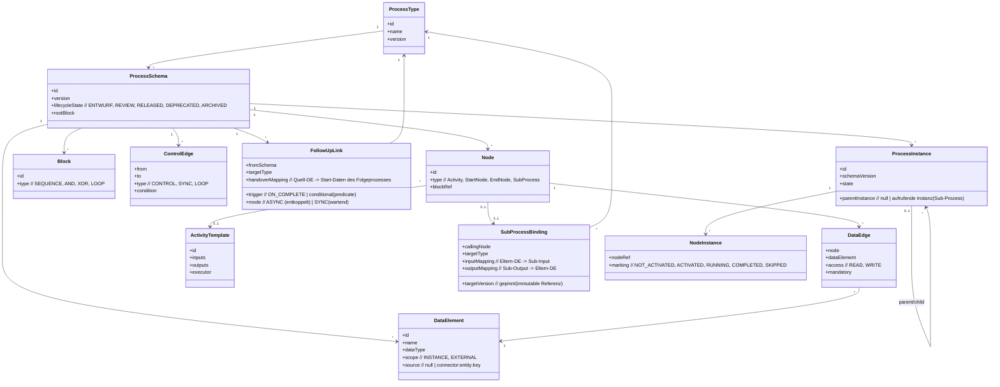

**Kantentypen** (nach ADEPT): `CONTROL` (normaler Ablauf), `SYNC` (Synchronisation zwischen Parallelzweigen), `LOOP` (Rücksprung). **Datenkanten** verbinden Knoten mit Datenelementen (READ/WRITE/READ-WRITE, mandatory/optional). Knotentypen: `START`, `END`, `ACTIVITY`, `SUBPROCESS` (ruft ein eigenständiges, freigegebenes Schema als Baustein auf), `XOR_SPLIT`/`XOR_JOIN`, `AND_SPLIT`/`AND_JOIN`, `LOOP_START`/`LOOP_END`, `NULL` (Hilfsknoten zur Blockbildung).

**Zustands-/Markierungsmodell** der Ausführung (ADEPT-Markierungs- und Ausführungsregeln). Knotenmarkierung (NS) und Kantenmarkierung (ES) bilden gemeinsam den aktuellen Zustand **und** den bisherigen Verlauf ab – dadurch ist ohne Logfile entscheidbar, ob ein Schritt in Vergangenheit oder Zukunft der Instanz liegt:

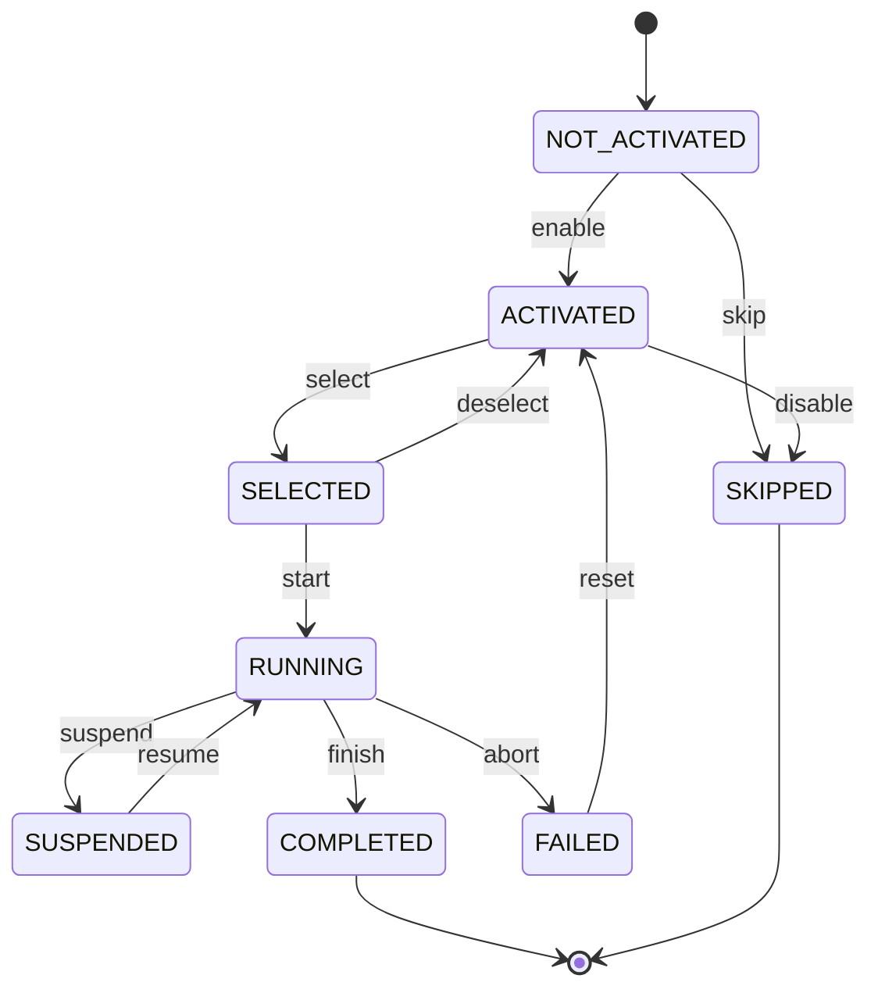

- **Knotenmarkierung (NS):** `NOT_ACTIVATED`, `ACTIVATED`, `RUNNING`, `COMPLETED`, `SKIPPED` (zzgl. Laufzeit-Detailzustände `SELECTED`, `SUSPENDED`, `FAILED`).
- **Kantenmarkierung (ES):** `TRUE_SIGNALED` / `FALSE_SIGNALED` (steuert XOR-Auswahl und Schleifenrücksprung).
- **Markierungsregeln** propagieren bei Beendigung eines Knotens den Zustand an Nachfolger (gewählter XOR-Zweig ? `ACTIVATED`, abgewählter Zweig ? `SKIPPED`).

### 4.1 Modell-Speicherung & Status-Lebenszyklus

Prozessmodelle werden **persistent gespeichert** und durchlaufen einen klar definierten **Status-Lebenszyklus**. Maßgeblich ist das Feld `ProcessSchema.lifecycleState`. Der Status entscheidet, ob ein Schema **bearbeitbar**, **instanziierbar** oder nur noch **historisch** ist.

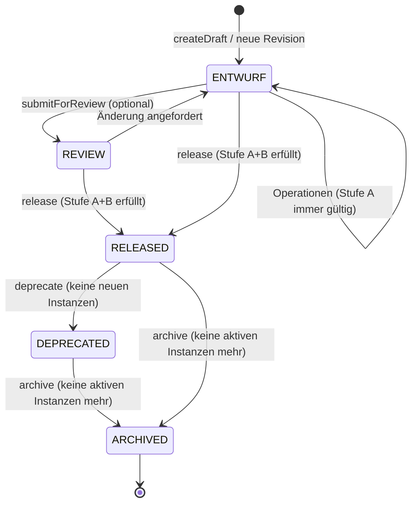

| Status | Bedeutung | Bearbeitbar? | Instanziierbar? |
|--------|-----------|--------------|-----------------|
| **ENTWURF** | Arbeitsversion; Stufe A gilt jederzeit, Stufe B darf noch unvollständig sein | ja (nur über geprüfte Operationen) | nein |
| **REVIEW** *(optional)* | eingefroren zur Abnahme/Feedback | nein (nur zurück nach ENTWURF) | nein |
| **RELEASED** | freigegeben; **immutable**, erhält eine feste Version | nein | **ja** |
| **DEPRECATED** | abgekündigt; laufende Instanzen laufen weiter, **keine neuen** Instanzen | nein | nein |
| **ARCHIVED** | historisch; keine aktiven Instanzen mehr | nein | nein |

- **Versionierung:** Jede Freigabe erzeugt eine **neue, unveränderliche Version** (`S_v1`, `S_v2`, …). Eine Änderung an einem freigegebenen Schema erfolgt **nie** in-place, sondern stets als **neue Revision im Status ENTWURF** (per `createDraft(fromVersion)`), die wieder den Lebenszyklus durchläuft. Damit bleibt die Versions-Koexistenz aus 6.4 konsistent.
- **Statusübergänge sind geprüfte Operationen** (Abschnitt 7.6) mit Vorbedingungen: `release` setzt Stufe A **und** B voraus; `archive` setzt voraus, dass **keine aktive Instanz** mehr auf dieser Version läuft. Ein Übergang, der eine Bedingung verletzt, wird abgelehnt – die Korrektheitsinvariante gilt auch für den Lebenszyklus.
- **Speicherung:** Schemata, Versionen und ihr Status liegen im **Process Repository** (Abschnitt 5.3, PostgreSQL). Freigegebene Versionen sind schreibgeschützt; nur Statusfelder (RELEASED ? DEPRECATED ? ARCHIVED) und Metadaten (Tags, Owner) dürfen sich noch ändern.

### 4.2 Hierarchie & Modularität (Sub- und Folgeprozesse)

Prozesse können **hierarchisch zerlegt** und **modular verknüpft** werden. Es werden zwei Kompositionsarten unterschieden:

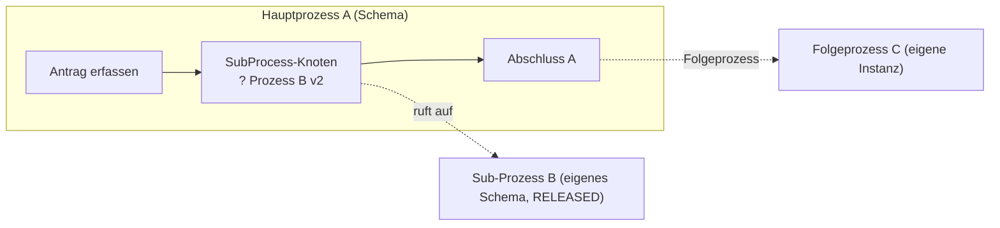

- **Sub-Prozess (hierarchisch, synchron):** Ein Knoten vom Typ `SUBPROCESS` wird durch ein **eigenständiges, freigegebenes Schema** implementiert (vergleichbar einer BPMN *Call Activity*). Der Sub-Prozess läuft als **Kind-Instanz** innerhalb des Schritts; erst sein Abschluss aktiviert den Nachfolger im Hauptprozess. Datenübergabe erfolgt über ein typisiertes **Input-/Output-Mapping** (`SubProcessBinding`). Dies ermöglicht **Wiederverwendung** (eine geprüfte Teillogik in vielen Prozessen) und **Kapselung** (der Hauptprozess kennt nur die Schnittstelle, nicht die Interna).
- **Folgeprozess (modular, sequenziell/entkoppelt):** Am Ende eines Prozesses (oder bedingt) wird ein **eigenständiger Prozess als Nachfolger** ausgelöst (`FollowUpLink`). Anders als der Sub-Prozess läuft er als **separate Instanz** mit **eigenem Lebenszyklus** – entweder `ASYNC` (Hauptprozess endet, Folgeprozess läuft unabhängig weiter) oder `SYNC` (selten; wartende Übergabe). Übergebene Startdaten folgen einem typisierten **Handover-Mapping**.

| Merkmal | Sub-Prozess (`SUBPROCESS`-Knoten) | Folgeprozess (`FollowUpLink`) |
|---------|-----------------------------------|-------------------------------|
| Beziehung | hierarchisch (Eltern/Kind) | modular/lateral (Kette) |
| Instanz | Kind-Instanz **innerhalb** des Schritts | **eigene**, getrennte Instanz |
| Ablauf | synchron – Hauptprozess wartet auf Abschluss | i. d. R. asynchron/entkoppelt |
| Datenfluss | Input-/Output-Mapping (rückgekoppelt) | einmaliges Handover-Mapping (vorwärts) |
| Versionsbindung | **gepinnte** Zielversion (immutable) | gepinnte oder „neueste freigegebene" Zielversion |
| Typischer Nutzen | Wiederverwendung geprüfter Teillogik | Prozessketten/Choreografie über Domänengrenzen |

Die Korrektheitskriterien für Komposition (H1–H4, F1–F3) sind in Abschnitt 3.6 definiert, die zugehörigen Operationen in Abschnitt 7.7.

---

### 4.3 Geteilte Organisationsmodelle (modellübergreifend)

Das Organisationsmodell (`Role`, `OrgUnit`, `Agent` mit Vorgesetzten, Vertretern und Hierarchie) kann **zwei Ausprägungen** haben:

- **Eingebettet (lokal):** Das Org-Modell gehört genau einem Schema (Default; `ProcessSchema.org_model_id = null`). So war das System bisher – Rollen, Abteilungen und Agenten werden direkt im jeweiligen Schema gepflegt.
- **Geteilt (zentral, modellübergreifend):** Eine Organisation wird **einmal** als eigenständige Stammdaten-Entität modelliert und von **beliebig vielen** Schemata referenziert (`ProcessSchema.org_model_id` zeigt auf die geteilte Organisation in einer eigenen Registry). So lässt sich dieselbe Aufbauorganisation in mehreren Prozessmodellen wiederverwenden.

> **Leitidee „einmal pflegen, überall wirksam":** Eine geteilte Organisation ist die **alleinige Quelle der Wahrheit**. Änderungen daran (neuer Agent, geänderte Rolle, Umhängen einer Abteilung, neuer Vertreter) wirken **sofort live** in allen verknüpften Modellen – und damit auch in deren bereits laufenden Instanzen, deren Bearbeiterauflösung (Z2/Z3 zur Laufzeit) gegen den aktuellen Stand erfolgt.

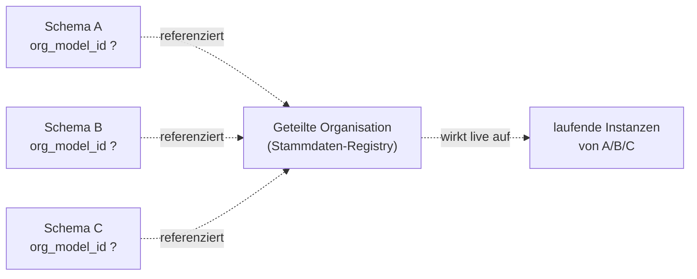

**Hydration als Architekturprinzip (geringe Invasivität).** Damit Validator, Bearbeiterauflösung und Ausführungs-Engine **unverändert** bleiben, wird die geteilte Organisation an der **API-Grenze** in das Schema *hydriert*: Beim Laden eines verknüpften Schemas wird sein `org_model` aus der Registry gefüllt, vor dem Speichern wieder geleert (nur `org_model_id` wird persistiert). Alle Korrektheitsregeln (Z1–Z4) lesen weiterhin `schema.org_model` und sehen so stets den geteilten Stand – die geteilte Organisation bleibt die einzige persistierte Wahrheit.

**Correctness by Construction über die Modellgrenze.** Eine Änderung an einer geteilten Organisation könnte ein **anderes**, referenzierendes Schema brechen (z. B. würde das Entfernen der letzten Trägerrolle eine dort aktive BZR leerlaufen lassen, Z2). Deshalb wird **jede** Org-Änderung gegen **alle** referenzierenden Schemata revalidiert: nur wenn jedes davon korrekt bleibt, wird die Änderung übernommen – andernfalls wird sie atomar abgelehnt (HTTP 422). Damit gilt die Korrektheitsinvariante auch hier konstruktiv: Eine geteilte Organisation kann nie in einen Zustand geraten, der ein verknüpftes Modell inkonsistent macht.

**Verknüpfen/Lösen.** Das Verknüpfen (`linkOrgModel`) und Lösen (`unlinkOrgModel`) eines Schemas ist – wie strukturelle Bindungsänderungen – nur im Status **ENTWURF** zulässig (R0). Beim Verknüpfen muss jede vorhandene BZR weiterhin gegen die geteilte Organisation auflösbar sein (Z1–Z4); beim Lösen wird der zuletzt sichtbare Org-Stand als lokale Kopie ins Schema übernommen, sodass bestehende BZR weiter auflösbar bleiben. Die Pflege der Org-Stammdaten selbst (Rollen/Abteilungen/Agenten, Vorgesetzte/Vertreter/Hierarchie) erfolgt bei verknüpften Schemata ausschließlich über die geteilte Organisation, nicht in-place im Schema.

---

## 5. Systemarchitektur

### 5.1 Schichtenüberblick

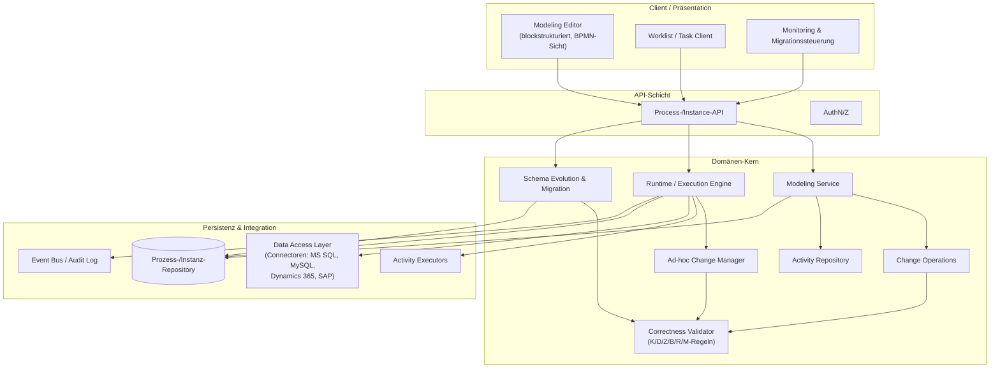

### 5.2 Kernkomponenten

1. **Modeling Service + Change Operations.** Stellt ausschließlich **High-Level-Operationen** bereit (`serialInsert`, `parallelInsert`, `conditionalInsert`, `insertLoop`, `insertBetweenNodeSets`, `deleteNode`, `moveNode`, `addDataElement`, `connectData`, `assignService`, `assignStaffRule`, `unassignService`/`unassignStaffRule`). Sowohl **Struktur-** als auch **Daten-** und **Ressourcen-Bindungsoperationen** haben Vorbedingungen; ihre Anwendung führt deterministisch wieder in einen korrekten Zustand (K/D/Z erhalten). **Wichtig (ADEPT-Prinzip):** Derselbe Change-Operations-Service liefert dem Editor die kontextabhängig erlaubten Operationen *und* führt die Änderung aus – der Editor ist bewusst „dumm“. Genau dieselbe Komponente wird zur Laufzeit für Ad-hoc-Änderungen genutzt.
2. **Correctness Validator.** Implementiert K1–K7, D1–D5, Z1–Z4, B1–B3, R1–R3, M1–M5. Wird **vor** dem Commit jeder Operation aufgerufen (Fail-fast). Liefert präzise, lokalisierte Fehlermeldungen. Bei Ad-hoc-Änderungen bestimmt er den **minimalen Block**, der neu analysiert werden muss, und begrenzt so den Prüfaufwand.
3. **Activity Repository.** Verwaltet `ActivityTemplate`s (Ein-/Ausgabeparameter, Datentypen, ausführende Anwendung/Konnektor, Fähigkeiten wie Suspend/Resume). Templates **homogenisieren nach oben** (logisch Prozeduren mit I/O-Parametern) und liefern **nach unten** die technischen Aufrufdetails. Unterscheidung anwendungsneutrale vs. anwendungsspezifische Vorlagen. Ermöglicht „Plug & Play“-Modellierung und Datenfluss-Prüfung gegen die Schnittstellen.
4. **OrgModel & Staff Assignment.** Verwaltet das Organisationsmodell (`Agent`, `OrgPosition`, `OrgUnit`, `OrgGroup`, `ProjectGroup`, `Role`, `Ability`, `SubstitutionRule`) und wertet **Bearbeiterzuordnungsregeln** aus (funktionale Navigation zu einer Agentenmenge; Verknüpfung per `AND`/`OR`/`EXCEPT`; rekursive Modifikatoren `*`/`+`; Rückbezüge auf frühere Schritte via `NodePerformingAgent(nodeId)`). Prüft Bearbeiterregeln gegen Z1–Z4 (Wohlgeformtheit, Auflösbarkeit, gültige Rückbezüge) – sowohl bei der Modellierung als auch bei Änderungen am Organisationsmodell selbst (eine entfernte Rolle/Position darf keine zugeordnete Regel leerlaufen lassen).
5. **Runtime / Execution Engine.** Erzeugt aus einem freigegebenen Schema **Instanzen**, verwaltet Markings (NS/ES), aktiviert Knoten, ermittelt Bearbeiter, bindet Worklists an, ruft Executors auf, erkennt/behandelt Fehler (Recovery) und persistiert Zustände.
6. **Executors / Ausführungsumgebungen.** Führen die einer Aktivität zugeordneten Dienste in ihrer jeweiligen Umgebung aus (z. B. exe?Shell, Java?JVM, SQL?JDBC, Web Service?WS-Runtime, Skript?Interpreter). Interaktive Schritte erscheinen in der Worklist, automatische Schritte laufen über einen Automatic Client.
7. **Ad-hoc Change Manager.** Wendet dieselben Change Operations auf eine **laufende Einzelinstanz** an, geprüft gegen R1/R2. Protokolliert instanzspezifische Abweichungen vom Typ-Schema.
8. **Schema Evolution & Migration.** Versioniert Prozesstypen; prüft beim **Release** einer neuen Version pro laufender Instanz die Migrierbarkeit (M1–M5, unter Berücksichtigung von Fortschritt und evtl. Ad-hoc-Deltas), erstellt den **Migrations-Report**, ermöglicht die **instanzindividuelle Entscheidung** (manuell oder per Policy) und vollzieht migrierte Instanzen **atomar** auf die neue Version. Nicht migrierte Instanzen laufen konsistent auf ihrer Version weiter (Versions-Koexistenz).

### 5.3 Persistenz

- **Process Repository:** Prozesstypen, Schema-Versionen mit **Status** (`lifecycleState`: ENTWURF/REVIEW/RELEASED/DEPRECATED/ARCHIVED; immutable ab Freigabe), Activity Templates, Sub-Prozess-Referenzen (`SubProcessBinding`) und Folgeprozess-Verknüpfungen (`FollowUpLink`). Entwürfe sind editierbar, freigegebene Versionen schreibgeschützt.
- **Instance Store:** Instanzen, NodeInstance-Markings, Datenwerte, ad-hoc-Deltas.
- **Audit/Event Log:** vollständige Ereignishistorie (Basis für Monitoring, Process Mining, Migration).

### 5.4 Trennung Frontend/Backend & headless Prozessengine (API-first)

Frontend und Backend sind **strikt getrennt**. Das Frontend (GUI) ist ein reiner **Client** der öffentlichen API; es enthält **keine** Korrektheits- oder Ausführungslogik. Sämtliche Fachlogik – Modellierung, Validierung (K/D/Z/B/R/M, H/F), Change Operations, Lebenszyklus, Ausführung und Migration – liegt **ausschließlich im Backend-Kern**.

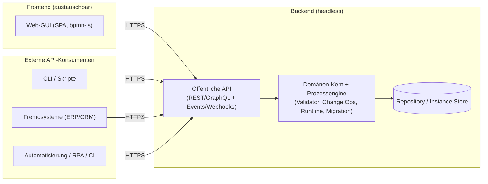

**Konsequenzen dieser Trennung:**

- **Headless betreibbar:** Die Prozessengine läuft **eigenständig ohne GUI**. Modelle anlegen/freigeben, Instanzen starten, Tasks abschließen, Migrationen anstoßen und Monitoring-Daten abfragen ist **vollständig über die API** möglich – die GUI ist nur *eine* von mehreren möglichen Oberflächen.
- **Ansteuerung von außerhalb der GUI:** Fremdsysteme (ERP/CRM), Skripte/CLI, Automatisierungen (RPA, CI/CD) und andere Dienste rufen dieselbe API auf wie das Frontend. Es gibt **keine privilegierte Hintertür** der GUI – alle Mandanten/Clients nutzen denselben, validierten Pfad.
- **Eine Wahrheit, ein Validierungspfad:** Da die GUI „dumm" ist (ADEPT-Prinzip, Abschnitt 5.2), kann **kein** Client die Korrektheitsregeln umgehen. Jede Operation – egal von welchem Aufrufer – durchläuft denselben Validator vor dem Commit.
- **Stateless & skalierbar:** Der API-Server ist zustandslos; der gesamte Zustand liegt im Backing-Store (Abschnitt 5.3). Dadurch horizontal skalierbar und unabhängig vom Frontend deploybar.
- **Austauschbares Frontend:** Die Web-GUI kann ersetzt oder ergänzt werden (z. B. mobile App, Desktop-Client, eingebettetes Widget), ohne den Kern zu ändern.
- **Versionierte, dokumentierte API-Verträge:** Die öffentliche Schnittstelle ist als stabiler Vertrag spezifiziert (OpenAPI/GraphQL-Schema), mit Authentifizierung/Autorisierung (OIDC, Abschnitt 11.2) und Ereignis-Push (Webhooks/Streaming) für Worklist- und Monitoring-Aktualisierung.

> Die API-Schicht (Abschnitt 5.1) ist damit die **einzige** Eintrittstür zum Domänen-Kern. „API-first" bedeutet: Jede Funktion existiert zuerst als API-Operation; die GUI ist deren Konsument. Das technische Deployment (Reverse Proxy, TLS, Container) beschreibt Abschnitt 11.2/11.3.

---

### 5.5 Prozessperspektiven (PAIS-Einordnung)

ProcWorks ist ein **prozessorientiertes Informationssystem (PAIS – Process-Aware Information System)**: ein System, das Abläufe auf Basis explizit modellierter Prozessschemata koordiniert und ausführt [RW12]. Ein vollständiges Prozessmodell beschreibt einen Ablauf aus mehreren, abgestimmten **Perspektiven** [Dum+13]. Die folgende Tabelle ordnet unsere Bausteine diesen Perspektiven zu und macht damit auch sichtbar, **welche Perspektive heute trägt und welche für die Roadmap reserviert ist**:

| Perspektive | Inhalt | Umsetzung in ProcWorks |
|-------------|--------|------------------------|
| **Funktional** | *Was* wird getan (Aktivitäten/Schritte)? | Knoten/`ActivityTemplate`s, Activity Repository (§5.2) |
| **Verhalten (Kontrollfluss)** | *Wann/in welcher Reihenfolge*? | Blockstruktur, Gateways, Schleifen, Markierungsmodell (§3.1, §4) |
| **Information (Daten)** | *Welche Daten* werden gelesen/geschrieben? | Datenelemente, Datenkanten, D1–D5 (§3.2, §8.2) |
| **Organisation (Ressourcen)** | *Wer* führt aus? | Organisationsmodell, Bearbeiterzuordnungsregeln, Z1–Z4 (§3.3) |
| **Operational** | *Womit* (Anwendungen/Dienste)? | Executors/Ausführungsumgebungen, Connectoren (§5.2, §9) |
| **Zeit (temporal)** | *Bis wann* (Fristen, Dauern, Zeitabstände)? | **Roadmap** – derzeit nur Start-/Endzeit im Audit-Log; deadlines/Eskalation als geplante Erweiterung (§3.8, §13) |

> **Honest gap:** Fünf der sechs Perspektiven sind im Meta-Modell und in den Korrektheitskriterien bereits verankert. Die **zeitliche Perspektive** ist bewusst als nächster Ausbauschritt ausgewiesen (Abschnitt 3.8) und nicht stillschweigend als „erledigt" dargestellt.

---

## 6. Zentrale Abläufe

### 6.1 Modellierung (Correctness by Construction)

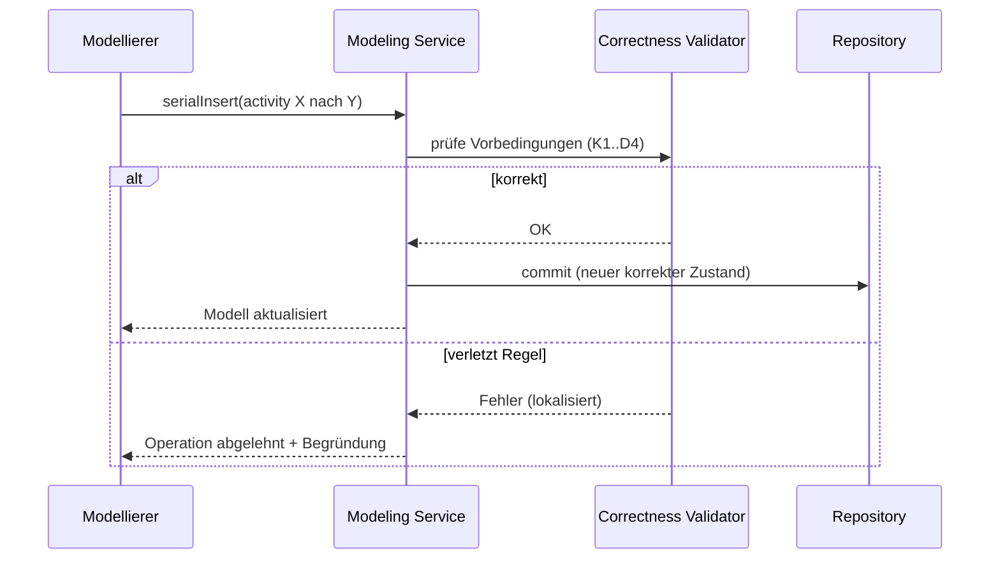

### 6.2 Instanzerstellung & Ausführung

Voraussetzungen für die Inbetriebnahme einer Vorlage (Release): keine Strukturfehler, korrekt implementierte Verzweigungen/Schleifen, **jedem Schritt ist ein Dienst zugeordnet** und **jedem interaktiven Schritt eine Bearbeiterzuordnungsregel**. Erst dann ist ein Upload ins Server-Repository möglich.

1. Schema wird **freigegeben** (Release) ? wird immutable und erhält eine Version; Startberechtigung wird per BZR festgelegt.
2. `createInstance(schemaVersion, startData)` erzeugt eine Instanz; Startknoten `ACTIVATED`.
3. Engine-Schleife: aktivierte Aktivität ? Bearbeiter ermitteln/Worklist-Eintrag erzeugen ? Datenbindung der Inputs ? Executor ausführen ? Outputs schreiben ? Markierungsregeln anwenden ? Nachfolgerknoten `ACTIVATED` bzw. abgewählte XOR-Zweige `SKIPPED`.
4. Endknoten erreicht und keine aktiven Knoten ? Instanz `COMPLETED`.

#### 6.2.1 Lebenszyklus eines Arbeitslisten-Eintrags (Bearbeitersicht)

Während das Knoten-Markierungsmodell (§4) den Ablauf aus **Prozesssicht** beschreibt, hat ein interaktiver Schritt zusätzlich einen Lebenszyklus aus **Bearbeitersicht** – den eines Arbeitslisten-Eintrags (Work Item). Dieser ist in der PAIS-Literatur als eigenständiges Zustandsmodell etabliert [Dum+13]; ProcWorks macht ihn explizit, weil daraus konkrete Tool-Anforderungen folgen (Abschnitt 13).

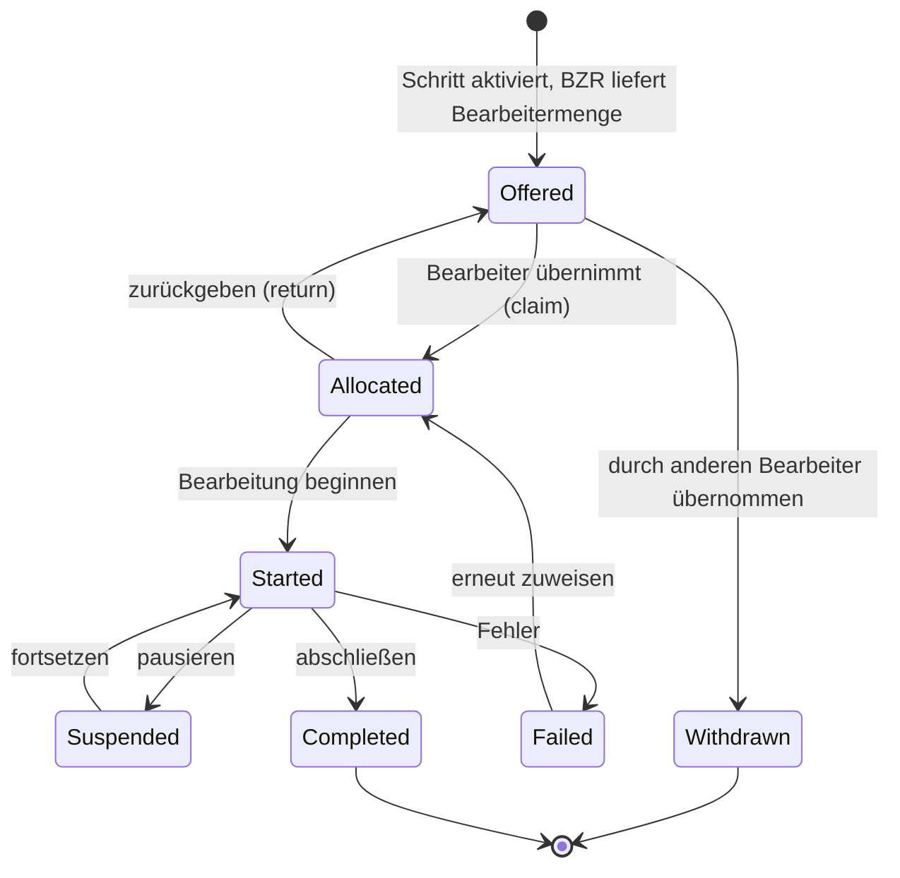

- **Offered (angeboten):** Der aktivierte Schritt erscheint in der Arbeitsliste **aller** durch die Bearbeiterzuordnungsregel (Z1–Z3) ermittelten Agenten – als Angebot, noch nicht verbindlich zugewiesen.
- **Allocated (übernommen):** Ein Agent übernimmt den Eintrag (`claim`). Damit wird der Eintrag bei den **übrigen** angebotenen Agenten **zurückgezogen** (`Withdrawn`) – genau das gewünschte „einer nimmt, die anderen sehen ihn nicht mehr"-Verhalten. Eine Rückgabe (`return`) macht ihn wieder allgemein verfügbar.
- **Started (in Bearbeitung):** Die eigentliche Ausführung läuft; entspricht der Knotenmarkierung `RUNNING`.
- **Suspended / Failed:** spiegeln die Laufzeit-Detailzustände des Knotens (§4) auf der Arbeitslisten-Ebene wider und ermöglichen Pausieren bzw. definierte Fehlerbehandlung.
- **Completed (abgeschlossen):** Der Schritt ist fertig; Outputs sind geschrieben, die Markierungsregeln propagieren weiter.

Jeder Eintrag trägt zusätzlich eine **Priorität** (abgeleitet aus Auswirkung und Dringlichkeit, §3.8), die die Sortierung der Arbeitsliste und die Frist je Eintrag bestimmt; bei Fristüberschreitung greifen die in §3.8 beschriebenen funktionalen bzw. hierarchischen Eskalationen.

> Dieses Zustandsmodell ist die fachliche Grundlage für die geplante Arbeitslisten-Zustandsmaschine (Abschnitt 13). Die Übergänge `claim`/`return`/`complete` laufen – wie alle Eingriffe – ausschließlich über geprüfte API-Operationen (Abschnitt 7), nie an der Validierung vorbei.

### 6.3 Ad-hoc-Änderung einer Instanz

`adHoc(instance, deleteNode Z)` ? R1 (Z noch nicht `COMPLETED`/`RUNNING`?) ? R2 (Struktur/Daten bleiben korrekt?) ? bei OK: Delta speichern und anwenden, sonst ablehnen.

### 6.4 Schema-Evolution + instanzindividuelle Migration

Dies ist das tragende Modell für die Änderung **bereits laufender** Instanzen. Grundsatz: Eine Schemaänderung wirkt nie heimlich oder global-erzwungen, sondern wird beim **Release** der neuen Version kontrolliert gegen jede aktive Instanz abgeglichen – und **je Instanz, abhängig von ihrem Fortschritt, individuell entschieden**.

#### 6.4.1 Versionierung & Koexistenz

- Prozesstypen sind **versioniert**; ein freigegebenes Schema ist **immutable** (`S_v1`, `S_v2`, …).
- Mehrere Versionen koexistieren: Eine Instanz läuft **immer genau gegen eine** Schema-Version. Neue Instanzen starten ab Release auf der neuesten Version; bestehende Instanzen behalten ihre Version, bis (und falls) sie migriert werden.
- Es entsteht nie ein Mischmodell: Migration ist ein **atomarer Wechsel** der Versionszuordnung einer Instanz, kein schrittweises „Vermengen".

#### 6.4.2 Ablauf beim Release einer neuen Version

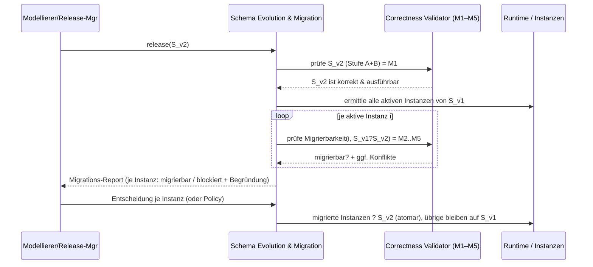

1. **Release-Gate:** `S_v2` muss selbst Stufe A **und** B erfüllen (M1). Ein nicht ausführbares Schema kann gar nicht released werden – also auch keine Migration auslösen.
2. **Instanz-Inventur:** Alle aktiven Instanzen von `S_v1` (und ggf. älterer Versionen) werden ermittelt.
3. **Compliance-Analyse je Instanz:** Für jede Instanz prüft der Validator M2–M5 **abhängig vom aktuellen Fortschritt** (Markierungszustand). Ergebnis ist ein **Migrations-Report**: pro Instanz `migrierbar` oder `blockiert` mit präziser, lokalisierter Begründung (welches Kriterium, welcher Knoten/welches Datenelement).
4. **Individuelle Entscheidung:** Der Release-/Prozessverantwortliche entscheidet **je Instanz** – manuell im Monitor oder regelbasiert per **Migrations-Policy** (siehe 6.4.4).
5. **Atomarer Vollzug:** Migrierte Instanzen werden in **einer Transaktion** auf `S_v2` umgestellt (Versionszuordnung + NS/ES-Remapping + Datenmapping). Schlägt ein Schritt fehl, wird die Instanz vollständig auf `S_v1` zurückgelassen (kein Teilzustand). Nicht migrierte Instanzen laufen unverändert konsistent auf `S_v1` zu Ende.

#### 6.4.3 Entscheidungslogik je Instanz (fortschrittsabhängig)

Die Migrierbarkeit hängt direkt davon ab, **wo** sich die Instanz befindet und **was** geändert wurde:

| Änderung in `S_v2` liegt … | Instanz hat den Bereich … | Ergebnis |
|----------------------------|---------------------------|----------|
| im **noch nicht** ausgeführten Teil | noch nicht erreicht | i. d. R. **migrierbar** (M2–M4 meist erfüllt) |
| im **bereits** ausgeführten Teil | bereits durchlaufen | häufig **blockiert** (M2/M3 verletzt – Vergangenheit unvereinbar) |
| an einem **gerade aktiven** (`RUNNING`) Schritt | mittendrin | **blockiert**, bis Schritt abgeschlossen ist (M3) |
| betrifft nur **zukünftige** Datenelemente/Bearbeiter | unkritisch | **migrierbar** (M4/M5 prüfen Default/Mapping) |

So erhält man genau das gewünschte Verhalten: Eine früh gestartete Instanz übernimmt die Verbesserung, eine bereits über die geänderte Stelle hinausgelaufene Instanz bleibt konsistent auf ihrer Version.

#### 6.4.4 Entscheidungsmodi & Policies

- **Manuell (Default-Empfehlung):** Pro Instanz im Monitor entscheiden – mit Vorschau des Remappings und der Begründung aus dem Report.
- **Policy-gesteuert:** z. B. „alle *migrierbaren* automatisch migrieren", „nur Instanzen vor Knoten X migrieren", „blockierte immer auf alter Version belassen". Policies entscheiden nie über M1–M5 hinweg – sie wählen nur **innerhalb** der als migrierbar bewerteten Menge.
- **Aufschub:** Eine zunächst blockierte Instanz kann **später automatisch** migrierbar werden (z. B. sobald der `RUNNING`-Schritt fertig ist); der Migrations-Report ist daher als Monitor-Ansicht **wiederholt auswertbar**, nicht nur einmalig beim Release.

#### 6.4.5 Konsistenz-, Audit- & Rollback-Garantien

- **Atomar & isoliert:** Jede Einzelmigration ist transaktional; währenddessen nimmt die Instanz keine fachlichen Schritte an.
- **Nachvollziehbar:** Quell-/Zielversion, angewandtes Mapping, Entscheidung und Zeitpunkt werden im **Audit-/Event-Log** festgehalten (Basis für Monitoring & Revision).
- **Reversibel auf Versionsebene:** Da `S_v1` immutable erhalten bleibt und die Migration atomar ist, lässt sich eine fehlgeschlagene Migration sauber verwerfen; die Instanz verbleibt definiert auf `S_v1`.
- **Keine stille Korruption:** Es gibt keinen Pfad, auf dem eine Instanz teilweise migriert oder in einen schemafremden Zustand gerät – die Korrektheitsinvariante (Abschnitt 1.1) gilt auch über Versionsgrenzen hinweg.

### 6.5 Einordnung der Flexibilitätsdimensionen

Die Forschung unterscheidet Prozessflexibilität entlang dreier Dimensionen [DRR10][WRR08]. Die folgende Zuordnung zeigt, wie die in §6.1–§6.4 beschriebenen Mechanismen diese Dimensionen abdecken – übernommen ist dabei nur das allgemein anerkannte Ordnungsschema, in eigener Formulierung:

- **Flexibilität zur Entwurfszeit:** Varianten und alternative Pfade werden bereits im Schema vorgesehen (Gateways, Sub-/Folgeprozesse). ProcWorks hält diese Flexibilität durch Stufe A **korrektheitserhaltend** – jede modellierte Variante ist bauartbedingt wohlstrukturiert.
- **Flexibilität zur Ausführungszeit:** Einzelne laufende Instanzen weichen kontrolliert vom Schema ab – in ProcWorks die **Ad-hoc-Änderung** (§6.3), abgesichert über R1/R2, sodass auch die abgewichene Instanz korrekt bleibt.
- **Prozessschemaevolution:** Der Prozesstyp selbst wird versioniert weiterentwickelt; laufende Instanzen werden bei Verträglichkeit migriert – in ProcWorks die **Schema-Evolution mit instanzindividueller Migration** (§6.4, M1–M5).

> **Einordnung:** Die zentrale These der zitierten Arbeit [DRR10] – punktuelle Flexibilität allein genügt nicht, nötig ist durchgängige, korrektheitserhaltende Anpassbarkeit über alle drei Dimensionen – deckt sich mit dem Correctness-by-Construction-Ansatz: ProcWorks bietet in jeder Dimension nur Operationen an, die die Korrektheitsinvariante (Abschnitt 1.1) wahren.

---

## 7. Operationskontrakte (Spezifikationsgrundlage des Validators)

Dieser Abschnitt ist die **direkte Implementierungsvorlage** für den Change-Operations-Service und den Correctness Validator. Jede Operation ist als **Kontrakt** definiert: Vorbedingungen (`requires`) müssen vor Anwendung gelten, Nachbedingungen (`ensures`) gelten danach garantiert. Verletzt eine Vorbedingung, wird die Operation **abgelehnt** und das Modell bleibt unverändert (transaktional, Abschnitt 1.1.2).

### 7.1 Gemeinsamer Rahmen (für *alle* Operationen)

```text
operation op(model M, params P):
    assert M ? Model_valid                      # Invariante I gilt am Eingang (immer)
    if not checkPreconditions(op, M, P):        # operationsspezifische requires
        return Rejected(reason, location)       # M bleibt unverändert
    M' := transform(op, M, P)                   # rein funktionale Transformation
    assert M' ? Model_valid (K1–K7, D1–D5, Z1–Z4)   # globale Nachbedingung, sonst Abbruch
    commit(M')                                  # atomar
    return M'
```

- **Globale Vorbedingung (alle):** `M` erfüllt bereits K1–K7, D1–D5, Z1–Z4 (Invariante I).
- **Globale Nachbedingung (alle):** `M'` erfüllt K1–K7, D1–D5, Z1–Z4. Bei Strukturoperationen bleibt zusätzlich die **Block-Symmetrie** (K1) und **Eindeutigkeit** von Split/Join erhalten.
- **Identische Semantik in allen Kontexten:** Dieselben Kontrakte gelten bei Modellierung **und** Ad-hoc-Laufzeitänderung – Letztere prüfen zusätzlich die Laufzeit-Vorbedingungen aus 7.5.

### 7.2 Struktur-/Kontrollfluss-Operationen

| Operation | Vorbedingungen (`requires`) | Nachbedingungen (`ensures`) |
|-----------|------------------------------|------------------------------|
| `serialInsert(act, posEdge)` | `act` aus Activity Repository; `posEdge` ist ein bestehender Kontrollkonnektor in `M` | neue Aktivität liegt sequenziell auf `posEdge`; genau 1 ein-/ausgehender Konnektor (K2); Erreichbarkeit (K3) erhalten |
| `parallelInsert(act, blockRef)` | Zielbereich ist ein wohlgeformter Block | `act` liegt in neuem/bestehendem AND-Zweig; AND-Split/Join eineindeutig (K1) |
| `conditionalInsert(act, predicate, blockRef)` | `predicate` über existierenden Datenelementen; Wertebereich abdeckend & überlappungsfrei (K7) | `act` liegt im XOR-Zweig mit gültigem Prädikat; XOR-Split/Join eineindeutig (K1) |
| `insertSurroundingBlock(type?{AND,XOR,LOOP}, nodeSet)` | `nodeSet` ist ein **konvexer**, blockbildender Bereich (eine SESE-Region) | Bereich ist sauber von Split/Join (bzw. LOOP-Start/End) umschlossen; Schachtelung intakt |
| `insertLoop(nodeSet, exitCondition)` | `nodeSet` SESE-Region; `exitCondition` als XOR-Aktivität am LOOP-End spezifizierbar | REPEAT-UNTIL-Struktur mit eindeutigem LOOP-Start/End (K6) |
| `insertBetweenNodeSets(act, srcSet, dstSet)` | `srcSet`/`dstSet` liegen in verschiedenen Zweigen; erzeugt keinen Zyklus außerhalb LOOP | `act` korrekt eingebettet; Sync-Kanten nur zwischen AND-Zweigen (K4) |
| `addSyncEdge(srcAct, dstAct)` | beide Aktivitäten in **verschiedenen** AND-Zweigen desselben AND-Blocks; keine Zyklusbildung | SOFT/HARD-Sync-Kante; `dst` wartet auf `src` (bzw. dessen Abwahl) – K4 erhalten |
| `deleteNode(node)` | `node ? START/END`; bei Split/Join wird der **gesamte Block** als Einheit entfernt; das Entfernen des letzten Knotens eines Zweigs entfernt den Zweig | Knoten + verwaiste Daten-/Sync-Kanten entfernt; Lücke geschlossen; bleibt nur **ein** Zweig übrig, wird die Verzweigung (Split + passender Join) aufgelöst und der verbleibende Zweig inline behalten; K1–K4, D1–D5 erhalten |
| `renameNode(node, label)` | `node` ist Aktivität oder Teilprozess; Schema editierbar (R0) | nur `label` geändert; Struktur unverändert; K/D-Regeln trivial erhalten |
| `moveNode(node, targetPos)` | Quelle/Ziel wohlgeformt; Move erzeugt keine Daten-Vorwärtsreferenz (D1) | `node` an neuer Position; alle K/D-Regeln erhalten |

> **Implementierungsstand.** `serialInsert`, `parallelInsert`, `conditionalInsert`, `deleteNode` und `renameNode` sind im Kern (`procworks.operations`) sowie über die HTTP-API (`POST …/serial-insert`, `…/parallel-insert`, `…/conditional-insert`, `PATCH /schemas/{id}/nodes/{nodeId}`, `DELETE /schemas/{id}/nodes/{nodeId}`) und im Web-Editor umgesetzt. `deleteNode` entfernt bei einem Split den gesamten von ihm und seinem passenden Join eingeschlossenen SESE-Block (inkl. aller Zweigknoten und davon abhängiger Staff-/Service-/Daten-Bindungen); Aktivitäten/Teilprozesse werden nur auf serieller Strecke entfernt und die Lücke geschlossen. Entfernt man den letzten Knoten eines Verzweigungszweigs, wird der Zweig entfernt; bleibt danach nur **ein** Zweig übrig, löst `deleteNode` die gesamte Verzweigung (Split und passender Join) auf und behält den verbliebenen Zweig inline. Jede Mutation läuft unverändert über *validate-before-commit*. `moveNode`, `insertLoop`, `insertBetweenNodeSets` und Sync-Kanten sind weiterhin spezifiziert, aber noch nicht implementiert.

### 7.3 Datenfluss-Operationen

| Operation | Vorbedingungen (`requires`) | Nachbedingungen (`ensures`) |
|-----------|------------------------------|------------------------------|
| `addDataElement(name, type, optionality)` | `name` eindeutig; `type ? {Integer,Float,String,Date,Boolean,URI,UserDefined}` | neues Datenelement im Schema; noch ungebunden (zulässiger Zwischenzustand der Stufe B) |
| `removeDataElement(de)` | `de` hat **keine** verbleibenden Lese-/Schreibkanten | Datenelement entfernt; keine verwaiste Referenz |
| `connectData(node, de, access?{READ,WRITE,RW}, mandatory)` | bei `READ`/`mandatory`: `de` wird auf **allen** Pfaden zu `node` zuvor (nicht-optional) geschrieben (D1); Typkonformität (D3); `node` ist kein XOR/AND-Join (D4) | Datenkante existiert; D1–D5 erfüllt |
| `disconnectData(node, de)` | nach Entfernen bleibt D1 für alle übrigen Leser erfüllt | Datenkante entfernt; Datenfluss konsistent |
| `setPredicate(xorNode, predicate)` | Prädikate aller Zweige decken Wertebereich vollständig & überlappungsfrei ab (K7) | XOR-Verzweigung deterministisch entscheidbar |

### 7.4 Ressourcen-/Bindungs-Operationen

| Operation | Vorbedingungen (`requires`) | Nachbedingungen (`ensures`) |
|-----------|------------------------------|------------------------------|
| `assignService(node, template)` | `template` aus Activity Repository; I/O-Parameter typkonform zu verbundenen Datenelementen (Z4) | Schritt hat ausführbaren Dienst (Beitrag zu B1) |
| `unassignService(node)` | – (immer zulässig; senkt nur Release-Reife) | Dienst entfernt; Modell strukturell weiter korrekt, B1 für `node` offen |
| `assignStaffRule(node, bzr)` | `node` ist interaktiv; `bzr` syntaktisch gültig (Z1); auflösbar/nicht-leer (Z2); `NodePerformingAgent`-Bezüge nur auf garantierte Vorgänger (Z3) | Schritt hat auswertbare BZR (Beitrag zu B2) |
| `unassignStaffRule(node)` | – | BZR entfernt; B2 für `node` offen |
| `setStartAuthorization(schema, bzr)` | `bzr` gültig & auflösbar (Z1/Z2) | Startberechtigung definiert (Beitrag zu B2) |
| `editOrgModel(op)` (Org-Element ändern/entfernen) | keine **aktiv referenzierende** BZR würde dadurch leer (Z2) | OrgModell konsistent; alle BZR bleiben auflösbar |
| `linkOrgModel(schema, orgId)` (geteilte Org verknüpfen) | `schema` in ENTWURF (R0); geteilte Org existiert; alle BZR bleiben gegen die geteilte Org auflösbar (Z1–Z4) | `schema.org_model_id` gesetzt; Org wird modellübergreifend live referenziert |
| `unlinkOrgModel(schema)` (Verknüpfung lösen) | `schema` in ENTWURF (R0) | Verknüpfung gelöst; zuletzt sichtbarer Org-Stand als lokale Kopie übernommen; BZR weiter auflösbar |
| `editSharedOrgModel(orgId, op)` (geteilte Org pflegen) | Org bleibt intern konsistent (Z1-Stammdaten, azyklische Hierarchie); **jedes** referenzierende Schema bleibt nach der Änderung korrekt (Z1–Z4, modellübergreifend revalidiert) | geteilte Org konsistent; Änderung wirkt live in allen verknüpften Modellen und Instanzen |

### 7.5 Ad-hoc-Operationen (Laufzeit) – zusätzliche Vorbedingungen

Ad-hoc-Operationen verwenden **dieselben** Kontrakte wie oben, plus instanzbezogene Bedingungen (R1/R2):

| Operation (auf Instanz `i`) | Zusätzliche `requires` | Zusätzliche `ensures` |
|------------------------------|------------------------|------------------------|
| `adHoc(i, deleteNode Z)` | `Z` ist `NOT_ACTIVATED`/`ACTIVATED` (nicht `RUNNING`/`COMPLETED`) – R1 | Instanzdelta gespeichert; Markierungen konsistent (R2) |
| `adHoc(i, serialInsert …)` | Einfügeort liegt **in der Zukunft** der Instanz (Nachfolger noch nicht durchlaufen) | neuer Schritt korrekt aktivierbar; K/D/Z erhalten |
| `adHoc(i, connectData …)` | versorgender Schreibzugriff liegt in der Zukunft des Lesers (D1 zur Instanzlaufzeit) | Datenfluss der Instanz konsistent |
| *(alle Ad-hoc)* | nur **minimaler betroffener Block** wird neu validiert (Effizienz) | Instanz bleibt sound; Delta ist migrationsrelevant (M5) |

> **Vollständigkeitsanspruch:** Die Operationsmenge ist so gewählt, dass jedes wohlstrukturierte Modell allein durch sukzessive Anwendung dieser Operationen aus dem leeren Modell (`START ? END`) erzeugbar ist. Dadurch ist garantiert, dass es **keinen** korrekten Zielzustand gibt, der nur über einen inkorrekten Zwischenzustand erreichbar wäre.

### 7.6 Lebenszyklus-Operationen (Status)

Statusübergänge eines Schemas (Abschnitt 4.1) sind ebenfalls geprüfte Operationen:

| Operation | `requires` | `ensures` |
|-----------|------------|-----------|
| `createDraft(fromVersion?)` | optional Quellversion ist RELEASED/DEPRECATED | neues Schema im Status **ENTWURF** (Kopie oder leer), Stufe A gültig |
| `saveDraft(S)` | `S` ist ENTWURF | persistiert; Stufe A bleibt gewahrt |
| `submitForReview(S)` | `S` ist ENTWURF; Stufe A gültig | Status **REVIEW**; Schema eingefroren |
| `requestChanges(S)` | `S` ist REVIEW | Status zurück auf **ENTWURF** |
| `release(S)` | `S` ist ENTWURF/REVIEW; **Stufe A und B erfüllt** (inkl. H1/H2, F1/F2) | Status **RELEASED**; feste Version vergeben; immutable |
| `deprecate(S)` | `S` ist RELEASED | Status **DEPRECATED**; keine neuen Instanzen, laufende bleiben gültig |
| `archive(S)` | `S` ist RELEASED/DEPRECATED; **keine aktive Instanz** auf dieser Version | Status **ARCHIVED**; nur noch historisch |

### 7.7 Kompositions-Operationen (Sub- und Folgeprozesse)

| Operation | `requires` | `ensures` |
|-----------|------------|-----------|
| `insertSubProcess(posEdge, targetType, targetVersion, ioMapping)` | Zielschema RELEASED (H1); Mapping typkonform (H2); kein Zyklus (H3) | `SUBPROCESS`-Knoten korrekt eingefügt; K/D erhalten |
| `setSubProcessMapping(node, ioMapping)` | Knoten ist `SUBPROCESS`; Mapping typkonform (H2) | Input-/Output-Bindung konsistent |
| `rebindSubProcessVersion(node, newVersion)` | nur auf ENTWURF-Schema; `newVersion` RELEASED; Mapping weiterhin konform (H2/H4) | gepinnte Zielversion aktualisiert |
| `removeSubProcess(node)` | Knoten ist `SUBPROCESS`; löschbar gemäß K1 | Knoten entfernt; abhängige Bindungen mitgeprüft |
| `linkFollowUpProcess(targetType, trigger, handoverMapping, mode)` | Zieltyp existiert mit RELEASED-Version (F1); Mapping typkonform (F2) | `FollowUpLink` angelegt; Kettengraph konsistent |
| `unlinkFollowUpProcess(link)` | Link existiert | Link entfernt |

---

## 8. Benutzeroberfläche (UI/UX – modern & state of the art)

Die Korrektheitsgarantien entfalten ihren Nutzen nur mit einer **intuitiven, modernen Oberfläche**, die das „Correctness by Construction"-Prinzip *erlebbar* macht: Der Nutzer wird geführt, statt nachträglich korrigiert.

> **Differenzierung (bewusste Produktstrategie):** Klassische, korrektheitsstarke Workflow-Systeme sind im Backend extrem stark (Correctness by Construction, Ad-hoc-Änderungen, Migration), wirken in der Bedienung aber oft technisch/werkzeughaft. **Unser Anspruch:** dieselbe – bzw. stärkere – Backend-Stabilität und Konsistenz, aber mit einer **deutlich intuitiveren, moderneren Benutzerführung** über den gesamten Lebenszyklus (Modellieren ? Ausführen ? Monitoren ? Instanzen verwalten ? Revision übernehmen). **Wir machen dabei keinerlei Abstriche bei Stabilität/Konsistenz im Backend** – die UI ist komfortabler, die Korrektheitsentscheidungen bleiben ausnahmslos beim geprüften Kern.
>
> **Klickbarer Prototyp:** Ein eigenständiger, lauffähiger Oberflächen-Prototyp (Modellierung mit geführten „+"-Operationen, Monitoring-Dashboard + geführte Revisionsübernahme) liegt unter [prototype/index.html](prototype/index.html) und lässt sich direkt im Browser öffnen (keine Installation nötig). Er illustriert die Abschnitte 8.1–8.5 mit Demo-Daten und zeigt die Correctness-by-Construction-Bedienung in der Modellierungs-Ansicht.

### 8.1 Leitlinien

- **Geführtes, kontextsensitives Modellieren.** An jeder Stelle werden nur die aktuell **zulässigen Operationen** angeboten (Kontextmenü/Palette, Inline-„+"-Buttons an Kanten). Unmögliches erscheint gar nicht – kein Trial-and-Error.
- **Sofortiges, nicht-blockierendes Feedback.** Vollständigkeits-/Bindungszustände (Stufe B) werden als dezente Inline-Badges/Marker angezeigt (z. B. „Dienst fehlt", „Pflicht-Input ungebunden"), nicht als modale Fehlerdialoge.
- **Direkte Manipulation & Vorschau.** Drag-&-Drop aus Repository-Paletten, Live-Vorschau von Einfügepositionen, Undo/Redo über den Operations-Stack (jede Operation ist atomar reversibel).
- **Erklärende statt sperrende Führung.** Wird eine Geste zurückgewiesen, erklärt die UI **warum** (verletzte Regel, betroffene Stelle) und schlägt die nächste gültige Aktion vor – die Stabilität des Backends wird so als Hilfe, nicht als Hürde erlebt.
- **Barrierearm & responsiv.** Tastaturnavigation, hohe Kontraste, Zoom/Mini-Map, Auto-Layout des blockstrukturierten Graphen, Hell/Dunkel-Theme.

### 8.2 Drei abgestimmte Modellierungssichten

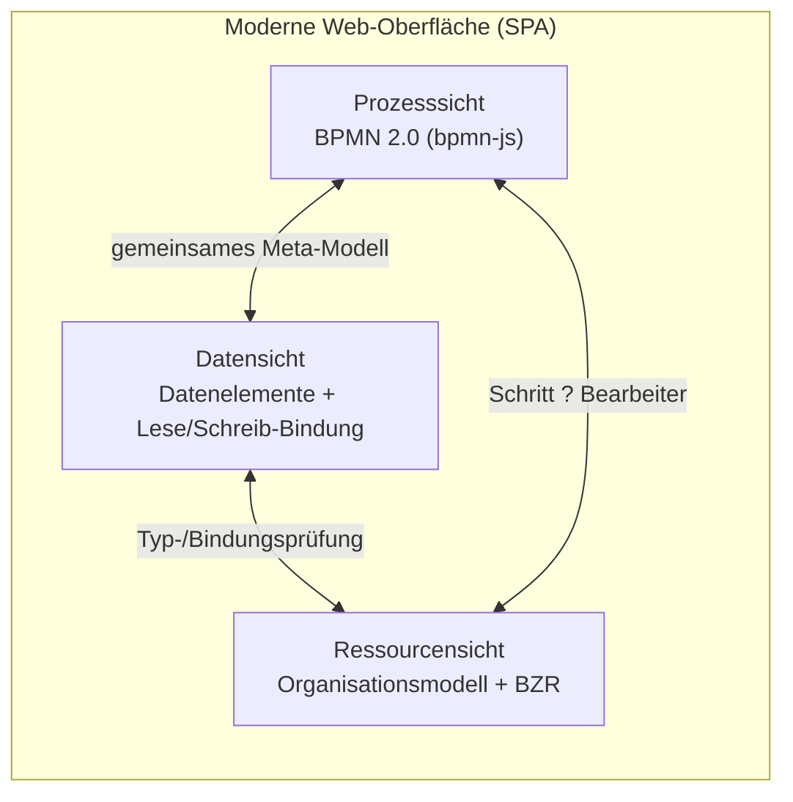

1. **Prozesssicht (BPMN 2.0).** Vertraute BPMN-Notation auf Basis von **bpmn-js** (state of the art Web-Modeler). Wichtig: bpmn-js ist **Editor/Viewer**, nicht Korrektheitsinstanz – jede Geste wird in eine geprüfte High-Level-Operation des Kerns übersetzt. Unzulässige Gesten werden gar nicht erst zugelassen bzw. sauber zurückgewiesen.
2. **Datensicht.** Visuelle Verknüpfung von **Datenelementen** mit Schritten: Lese-/Schreib-/Lese-Schreib-Bindung per Drag-&-Drop; Typkonformität und „Lesen-vor-Schreiben" (D1/D3) werden live geprüft und farblich markiert. Quelle eines Datenelements kann die **Prozessinstanz** oder eine **zentrale Datenbank** sein (siehe Abschnitt 9).
3. **Ressourcensicht.** Grafischer Editor für das **Organisationsmodell** (Agenten, Rollen, OrgUnits, Stellvertretung) und ein **geführter BZR-Builder** (Bedingungsbausteine `AND`/`OR`/`EXCEPT`, Modifikatoren `*`/`+`, `NodePerformingAgent`) mit Live-Vorschau der aufgelösten Bearbeitermenge (Z1–Z3).

### 8.3 Technische UI-Bausteine (Vorschlag)

- **Frontend:** TypeScript-SPA (z. B. React) mit **bpmn-js** für die BPMN-Sicht; Component-Library mit modernem Design-System (z. B. Fluent UI / Material); Graph-Interaktionen für Daten-/Ressourcensicht.
- **Echtzeit:** WebSocket/SSE für Live-Validierungs-Feedback und – optional – kollaboratives Modellieren (mehrere Nutzer, CRDT/Locking je Block).
- **Trennung der Verantwortung:** Die UI rendert und sammelt Intentionen; **alle** Korrektheitsentscheidungen trifft der Server-Kern (Change-Operations-Service/Validator).

### 8.4 Monitoring aktiver Instanzen (Live-Dashboard)

Das Laufzeitgeschehen wird so dargestellt, dass der Zustand jeder Instanz **auf einen Blick** erfassbar ist – ohne Logs lesen zu müssen (möglich, weil NS/ES-Markierungen Vergangenheit und Zukunft eindeutig kodieren).

- **Live-Prozesslandkarte.** Dieselbe BPMN-Visualisierung wie im Editor, jetzt als **Heat-/Status-Overlay**: abgeschlossene Schritte (`COMPLETED`), laufende (`RUNNING`, animiert), übersprungene (`SKIPPED`), wartende und fehlgeschlagene (`FAILED`) sind farblich und durch Icons sofort unterscheidbar; der aktuelle „Token"-Stand wird visuell markiert.
- **Instanz-Liste mit smarten Filtern.** Sortier-/Filterbare Übersicht (Status, Version, Startzeit, Bearbeiter, SLA/Überfälligkeit, Engpass). Bulk-Auswahl für Sammelaktionen.
- **Echtzeit-Aktualisierung.** Push via WebSocket/SSE – Statusänderungen erscheinen ohne Reload; optionale Benachrichtigungen bei Fehlern/Eskalationen.
- **Drill-down & Zeitreise.** Klick auf eine Instanz öffnet Detailsicht: Verlauf (Audit-Timeline), aktuelle Datenwerte, zuständige Bearbeiter, ggf. instanzspezifische Ad-hoc-Abweichungen vom Typ-Schema (hervorgehoben). „Zeitreise" zeigt den Markierungszustand zu jedem vergangenen Zeitpunkt.
- **Kennzahlen/Analytics.** Aggregierte KPIs (Durchlaufzeiten, Engpässe, Fehlerquoten) – Datenbasis ist das Event-/Audit-Log (Abschnitt 5.3); optional Process-Mining-Auswertung.
- **Eingriffe immer geprüft.** Aktionen aus dem Monitor (z. B. Ad-hoc-Änderung, Abbruch, Eskalation) laufen ausnahmslos über dieselben geprüften Operationen/Kontrakte (Abschnitt 7) – bequemer Zugang, gleiche Sicherheit.

> **Umsetzungsstand (Live-Aktualisierung).** Der Web-Client realisiert die
> Echtzeit-Aktualisierung aktuell über ein **schlankes Revisions-Polling** statt
> über WebSocket/SSE – eine bewusst minimal-invasive, betriebsstabile Variante.
> Der Endpunkt `GET /monitoring/revision` liefert einen **monoton steigenden
> Revisionszähler** aus dem Audit-Log (`AuditLog.revision()`). Wird der
> Fortschritt einer Aktivität/Instanz irgendwo aktualisiert, ändert sich dieser
> Zähler; der Client pollt ihn im Hintergrund (alle 4 s) und rendert nur die
> **aktive Laufzeit-Sicht** (Aufgabenlisten, Ausführen, Monitoring) bei
> tatsächlicher Änderung neu. Modellier-Sichten sowie offene Dialoge und
> Formulareingaben bleiben dabei unangetastet. Ein Upgrade auf echtes Event-Push
> (WebSocket/SSE) bleibt abwärtskompatibel möglich.
>
> **Sicht-Persistenz.** Die aktuell gewählte Sicht wird im `localStorage`
> gemerkt; ein Seiten-Reload stellt sie wieder her (z. B. Monitoring bleibt
> Monitoring), statt auf „Modellieren" zurückzuspringen.

#### 8.4.1 Leistungssicht & Verbesserungsunterstützung

Über die reine Statusanzeige hinaus liefert das Audit-Log die Datenbasis, um Prozesse **bewertbar** zu machen – die Voraussetzung für gezielte Verbesserung (Redesign). Zwei in der BPM-Literatur etablierte Denkrahmen strukturieren diese Sicht; ProcWorks übernimmt sie als KPI-Konzept (eigene Formulierung):

- **Vier Leistungsdimensionen (Devil's Quadrangle).** Zeit, Kosten, Qualität und Flexibilität stehen in einem Spannungsverhältnis – eine Verbesserung in einer Dimension geht häufig zu Lasten einer anderen [Dum+13]. Das Monitoring stellt KPIs entlang dieser vier Achsen bereit (z. B. Durchlaufzeit, Bearbeitungskosten je Instanz, Fehler-/Nacharbeitsquote, Anteil ad-hoc-geänderter Instanzen als Flexibilitätsindikator), damit Verbesserungsentscheidungen ihre Wechselwirkungen sichtbar machen.
- **Wertschöpfungs-Klassifikation von Aktivitäten.** Schritte lassen sich danach einordnen, ob sie **wertschöpfend**, **geschäftlich notwendig** (z. B. regulatorisch) oder **nicht wertschöpfend** (Wartezeiten, Übergaben, reine Kontrolle) sind – ein klassisches Kriterium der Prozessanalyse und des Business Process Reengineering [Dum+13][HC94]. Eine optionale Markierung je `ActivityTemplate`/Knoten erlaubt es, in der Prozesslandkarte den Anteil nicht wertschöpfender Schritte und ihre Liegezeiten hervorzuheben – als Ausgangspunkt für eine **neue Schema-Revision** (die dann regulär über §6.4 eingespielt wird).

> **Abgrenzung:** ProcWorks **misst und visualisiert**; die Verbesserungsentscheidung bleibt fachlich. Jede daraus folgende Modelländerung läuft über den korrektheitsgesicherten Pfad (Change Operations + Release + Migration), nie als ungeprüfter Direkteingriff.

### 8.5 Instanzverwaltung & geführte Revisionsübernahme

Das Herzstück der Differenzierung: Die in Abschnitt 6.4 spezifizierte Schema-Evolution wird als **intuitiver, geführter Workflow** erlebbar – die „äußerst stabile Prüfung" (M1–M5) läuft im Hintergrund, die Entscheidung bleibt einfach und transparent.

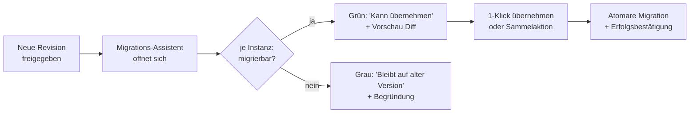

- **Migrations-Assistent statt Fachjargon.** Nach Freigabe einer neuen Revision öffnet sich ein **Assistent**, der je laufender Instanz klar sagt: „kann die neue Version übernehmen" (grün) oder „bleibt aus Konsistenzgründen auf der bisherigen Version" (grau, mit verständlicher Begründung aus dem Migrations-Report). Kein Nutzer muss M1–M5 kennen.
- **Visueller Diff der Revisionen.** Vorher/Nachher-Vergleich des Modells (hinzugefügte/entfernte/verschobene Schritte hervorgehoben) **und** eine Vorschau, *wo* die betrachtete Instanz gerade steht und was die Übernahme für sie konkret bedeutet.
- **Individuell oder als Sammelaktion.** Pro Instanz per **1-Klick** übernehmen, oder über Filter alle *migrierbaren* Instanzen gemeinsam („alle grünen übernehmen"). Optional regelbasierte **Policies** (Abschnitt 6.4.4) als gespeicherte Voreinstellung.
- **Sicherheit spürbar, nicht im Weg.** Die Übernahme wird erst **nach** erfolgreicher M1–M5-Prüfung angeboten; sie läuft **atomar** (Abschnitt 6.4.5) und ist auditiert. Schlägt etwas fehl, bleibt die Instanz sichtbar und unverändert auf der alten Version – der Nutzer erhält eine klare Rückmeldung, nie einen unklaren Zwischenstand.
- **Aufschub transparent.** Zunächst blockierte Instanzen (z. B. mit `RUNNING`-Schritt an der geänderten Stelle) zeigt der Assistent als „später automatisch übernehmbar" und meldet sich, sobald die Übernahme möglich wird.

> **Kernbotschaft:** Vorne maximal einfach und modern, hinten kompromisslos stabil. Jede komfortable Geste in Monitoring und Instanzverwaltung wird auf die geprüften, transaktionalen Backend-Operationen (Abschnitte 6.4 und 7) abgebildet – Bedienkomfort ohne Konsistenzrisiko.

---

## 9. Datenhaltung & Connectoren

Datenelemente können auf zwei Arten versorgt/gespeichert werden – beide unterliegen denselben Datenfluss-Regeln (D1–D5):

### 9.1 Zwei Geltungsbereiche von Daten

| Art | Geltung/Lebensdauer | Verwendung |
|-----|---------------------|------------|
| **Instanzdaten** | leben **in der Prozessinstanz**; gültig nur innerhalb dieser Instanz | Steuerungs-/Zwischenwerte, Entscheidungsparameter (XOR-Prädikate), Übergabe zwischen Schritten |
| **Externe Daten** | liegen in einer **beliebigen zentralen Datenbank/Fachanwendung** | führende Geschäftsdaten (Kunde, Auftrag, Material …), die über die Instanz hinaus Bestand haben |

Im Modell ist einem Datenelement ein **Quell-/Senkentyp** zugeordnet: `INSTANCE` oder `EXTERNAL(connector, entity, key)`. Lese-/Schreibzugriffe (`connectData`) sind für beide identisch modelliert; bei `EXTERNAL` löst die Engine den Zugriff über einen **Connector** auf.

### 9.2 Connector-Konzept

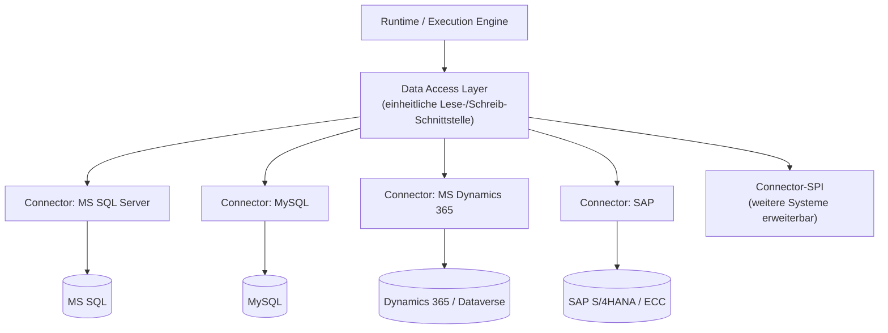

- **Einheitliche Abstraktion (Data Access Layer).** Ein Connector implementiert eine schmale SPI: `read(entity, key) ? record`, `write(entity, key, values)`, `query(filter)`, Metadaten/Schema-Introspektion und Transaktions-/Fehlersemantik. Datenelemente binden gegen diese Abstraktion – das Prozessmodell bleibt **connector-unabhängig**.
- **Vorgesehene Connectoren:**
  - **MS SQL Server** – relationaler Zugriff (z. B. via JDBC/ADO.NET), parametrisierte Statements/Stored Procedures.
  - **MySQL** – relationaler Zugriff analog.
  - **MS Dynamics 365** – über Dataverse/Web API (OData), Entitäten als Daten-Quelle/-Senke.
  - **SAP** – über offizielle Integrationswege (OData/SAP Gateway bzw. BAPI/RFC), z. B. lesend/schreibend auf Geschäftsobjekte.
  - **Connector-SPI** – offene Schnittstelle, sodass weitere Systeme (REST/GraphQL/Dateien) ergänzt werden können.
- **Sicherheit:** Zugangsdaten/Secrets liegen ausschließlich serverseitig (Secret-Store), nie im Modell; Zugriffe laufen über **parametrisierte** Abfragen (kein String-Concat ? kein SQL-Injection-Risiko); least-privilege Dienstkonten je Connector; Audit aller externen Zugriffe.
- **Konsistenz mit D1–D5:** Auch externe Lesezugriffe als **Pflicht-Input** unterliegen D1 – ihre Verfügbarkeit/Versorgung wird beim Modellieren geprüft (z. B. Schlüssel-Datenelement muss vorher gesetzt sein). Typ-Mapping (externer Typ ? interner Datentyp) wird bei `connectData` über Z4/D3 validiert.

> **Bezug zu ADEPT:** Externe Zugriffe werden als **Aktivitätenvorlagen** im Activity Repository gekapselt (z. B. „SAP-Auftrag lesen", „Dynamics-Kontakt anlegen") und homogenisieren den Dienst nach oben (I/O-Parameter), während der Connector die technischen Details nach unten liefert (vgl. Ausführungsumgebungen wie JDBC/Web Service).

---

## 10. Open-Source-Bereitstellung & GitHub-Projekt

Das Werkzeug wird als **quelloffenes Projekt** über GitHub veröffentlicht –
kostenlos zum Testen, Entwickeln und für nicht-konkurrierende Produktivnutzung,
quelloffen und **ohne jegliche Gewährleistung/Haftung**. Die kommerzielle
Verwertung bleibt vollständig beim Rechteinhaber (Quelle offen, aber **kein**
freier Weiterverkauf als Konkurrenzprodukt).

### 10.1 Lizenz & Haftungsausschluss

- **Lizenz: Business Source License 1.1 (BUSL-1.1).** Bewusst gewählt, weil sie
  den Quellcode **offen und frei nutzbar** macht (Lesen, Ändern, Beitragen,
  Self-Hosting zum Testen/Entwickeln und nicht-konkurrierende Produktivnutzung),
  zugleich aber die **konkurrierende kommerzielle Nutzung** (gehostetes/
  eingebettetes Angebot im Wettbewerb zum Lizenzgeber bzw. Weiterverkauf als
  kommerzielles Produkt) bis zum **Change Date** dem Lizenzgeber vorbehält. So
  bleibt das Ziel „erst frei veröffentlichen & Nutzer gewinnen, später
  kommerziell verkaufen/lizenzieren" abgesichert. Am **Change Date (2030-06-17)**
  geht jede betroffene Version automatisch in **Apache-2.0** über. Die Lizenz
  enthält einen **expliziten Haftungs-/Gewährleistungsausschluss** („THE LICENSED
  WORK IS PROVIDED ON AN \"AS IS\" BASIS …").
- **Umsetzung im Repository:**
  - `LICENSE` mit vollständigem BUSL-1.1-Text (Licensor, Licensed Work, Change
    Date, Change License, Additional Use Grant).
  - SPDX-Header `# SPDX-License-Identifier: BUSL-1.1` in Quelldateien.
  - Kurzer Lizenz-/Haftungshinweis in `README.md` und – da externe Connectoren
    genutzt werden – eine `NOTICE`/`THIRD-PARTY-LICENSES`-Datei, die die Lizenzen
    der eingebundenen Open-Source-Abhängigkeiten auflistet.
- **Lizenzkompatibilität der Abhängigkeiten:** Es werden weit überwiegend
  Abhängigkeiten mit **permissiven** Lizenzen (MIT, Apache-2.0, BSD, ISC,
  PostgreSQL …) verwendet; ein automatisierter **License-Check** (siehe 10.4)
  verhindert die versehentliche Aufnahme **strikt copyleft** lizenzierter (z. B.
  GPL/AGPL) Komponenten. Permissive Abhängigkeiten dürfen problemlos in das
  BUSL-lizenzierte Gesamtwerk eingebunden werden. **Einzige Ausnahme** ist der
  **optionale** PostgreSQL-Treiber `psycopg` (LGPL-3.0, schwaches Copyleft): er
  wird **unverändert** als eigenständige, dynamisch importierte und austauschbare
  Bibliothek genutzt (kein abgeleitetes Werk, kein Copyleft-Übergriff auf den
  ProcWorks-Code) und ist nur im `postgres`-Extra enthalten – der In-Memory-Store
  benötigt keinen Treiber. Eine vollständige Auflistung aller Drittlizenzen liegt
  in [THIRD-PARTY-NOTICES.md](../THIRD-PARTY-NOTICES.md).
- **Spätere kommerzielle Verwertung absichern:** Die BUSL-1.1 reserviert die
  konkurrierende kommerzielle Nutzung bereits per Lizenz dem Rechteinhaber –
  eine **kommerzielle (Dual-)Lizenz** kann jederzeit zusätzlich vergeben werden.
  Damit die Verwertungsrechte gebündelt beim Rechteinhaber bleiben, werden
  externe Beiträge nur unter **CLA** (Contributor License Agreement) oder **DCO**
  (Developer Certificate of Origin) angenommen.

> Hinweis: Treiber/Konnektoren zu kommerziellen Systemen (z. B. SAP, Dynamics 365) werden **nicht mitgeliefert**, sondern nur über offene Schnittstellen angebunden; deren proprietäre Client-Bibliotheken bleiben beim Nutzer und unterliegen dessen eigenen Lizenzbedingungen.

### 10.2 Repository-Struktur (Monorepo)

```text
procworks/
?? LICENSE                      # BUSL-1.1
?? README.md                    # Überblick, Quickstart, Lizenz-/Haftungshinweis
?? CONTRIBUTING.md              # Beitragsleitfaden
?? CODE_OF_CONDUCT.md           # Contributor Covenant
?? SECURITY.md                  # Verantwortliche Offenlegung von Schwachstellen
?? CHANGELOG.md                 # Versionshistorie (Keep a Changelog / SemVer)
?? docs/                        # Architektur-Konzept (dieses Dokument), ADRs, Diagramme
?? packages/ (bzw. apps/)
?  ?? core/                     # Meta-Modell, Change-Operations, Correctness Validator
?  ?? engine/                   # Runtime/Execution, Migration
?  ?? connectors/               # MS SQL, MySQL, Dynamics 365, SAP, Connector-SPI
?  ?? api/                      # REST/GraphQL-Server
?  ?? web/                      # moderne Web-GUI (SPA, BPMN-/Daten-/Ressourcensicht)
?? deploy/                      # Dockerfiles, docker-compose, Helm-Charts, IaC
?? .github/                     # Workflows, Issue-/PR-Templates, Dependabot
?? tests/ (bzw. je Paket)       # Unit-/Integration-/E2E-Tests
```

### 10.3 Community-/Governance-Dateien

`README`, `CONTRIBUTING`, `CODE_OF_CONDUCT` (Contributor Covenant), `SECURITY.md`, Issue-/Pull-Request-**Templates** unter `.github/`, optional `GOVERNANCE.md` und `CODEOWNERS`. **Conventional Commits** + **Semantic Versioning** für nachvollziehbare Releases.

### 10.4 Integrierte Open-Source-Tools (im GitHub-Projekt vorgesehen)

| Zweck | Tool (Open Source) | Integration |
|-------|--------------------|-------------|
| CI/CD | **GitHub Actions** | Build, Test, Lint, Container-Build, Release bei Tag |
| Abhängigkeits-Updates | **Dependabot** / Renovate | automatische PRs für Updates |
| Schwachstellen-Scan (Code) | **CodeQL** | statische Sicherheitsanalyse je PR |
| Secret-Scanning | GitHub Secret Scanning | verhindert versehentliche Secrets im Repo |
| SBOM / Lizenz-Check | **Syft/Grype**, **license-checker** / FOSSA-CE | SBOM-Erzeugung + Lizenzkompatibilität (10.1) |
| Container-Scan | **Trivy** | Image-Scan im Build |
| Code-Qualität | **ESLint/Prettier** bzw. sprachspezifische Linter/Formatter | Pre-Commit + CI |
| Pre-Commit-Hooks | **pre-commit** / Husky | lokale Checks vor Commit |
| Tests/Coverage | **Vitest/Jest**, **Playwright** (E2E), Coverage-Upload | Pull-Request-Gate |
| Doku-Site | **Docusaurus**/MkDocs + **GitHub Pages** | veröffentlichte Projektdokumentation |
| Releases | **release-please**/semantic-release | automatische Changelogs + Tags |

---

## 11. Web-Publikation & Deployment (Open Source, Stand der Technik)

Die GUI wird als **moderne Web-Anwendung** bereitgestellt; der gesamte Stack ist quelloffen und containerisiert.

### 11.1 Datenbanken (Open Source)

- **Primär-Datenbank: PostgreSQL.** Speichert Meta-Modell, Schema-Versionen (immutable), Instanzen/Markings, Datenwerte und Audit-Log. Begründung: ausgereift, transaktional (ACID), JSONB für flexible Strukturen, breite Tooling-Unterstützung, sehr permissive Lizenz (PostgreSQL-Lizenz, MIT-kompatibel).
- **Optional ergänzend (alle Open Source):**
  - **Redis** für Worklist-Caching/Locks/Pub-Sub des Live-Feedbacks.
  - **OpenSearch** (o. ä.) für Monitoring/Process-Mining-Auswertungen über das Event-Log.
- **Abgrenzung Connectoren:** Diese Open-Source-DBs sind die **interne** Persistenz des Tools. Die in Abschnitt 9 beschriebenen Connectoren (MS SQL, MySQL, Dynamics 365, SAP) sind davon unabhängig und binden **externe** Fachdaten an.

#### 11.1.1 Warum nicht Graph-Datenbank (Neo4j)?

Ein Prozessmodell *ist* ein Graph – daher liegt die Frage nahe, ob eine native Graph-Datenbank (z. B. Neo4j) die Primär-Datenbank sein sollte. Die bewusste Entscheidung lautet **nein**; PostgreSQL bleibt primär:

- **Die Graphen sind klein und werden im Kern geprüft, nicht in der DB traversiert.** Ein einzelnes Schema umfasst typischerweise zehn bis einige hundert Knoten. Korrektheitsprüfungen (K/D/Z/B, H/F) laufen **im Domänen-Kern in-memory** beim Validieren jeder Operation – nicht als Datenbankabfrage. Der zentrale Vorteil einer Graph-DB (performante Traversierung sehr großer, dicht vernetzter Graphen) entfällt hier weitgehend.
- **Die reale Last ist append-lastig und relational/OLTP.** Das hohe Datenvolumen entsteht durch **Instanzen, Markierungen, Datenwerte und das Audit-/Event-Log** (Monitoring, Process Mining). Das sind klassische transaktionale Schreib-/Auswertelasten, für die PostgreSQL (ACID, Partitionierung, JSONB, Indizes) ausgelegt ist – inklusive analytischer Abfragen über OpenSearch.
- **Lizenz.** Neo4j **Community Edition steht unter GPLv3** (starkes Copyleft) – das kollidiert mit dem Ziel, ausschließlich **permissiv** lizenzierte Abhängigkeiten einzubinden (damit das BUSL-1.1-Gesamtwerk frei verwertbar bleibt). Die Enterprise Edition ist kommerziell. Die **PostgreSQL-Lizenz** ist hingegen permissiv.
- **Connector-Welt ist relational.** Die anzubindenden Fremdsysteme (MS SQL, MySQL, Dynamics 365, SAP) sind relational/tabellarisch – ein relationaler Kern reduziert Impedanz und Betriebskomplexität.

> **Empfehlung:** PostgreSQL als **Primärspeicher** beibehalten. Sollten künftig wirklich graphlastige Abfragen dominieren (z. B. tiefe Organisations-Navigation oder Repository-weite „Wo wird Sub-Prozess X verwendet?"-Analysen über den Aufrufgraphen), wird **kein** Graph-DB-Primärspeicher eingeführt, sondern bei Bedarf eine **abgeleitete, sekundäre Graph-Projektion (Read-Model)** ergänzt – als Cache/Sicht auf die relationale Quelle, ohne die Quelle-der-Wahrheit zu verlagern.

### 11.2 Web-Architektur & Auslieferung

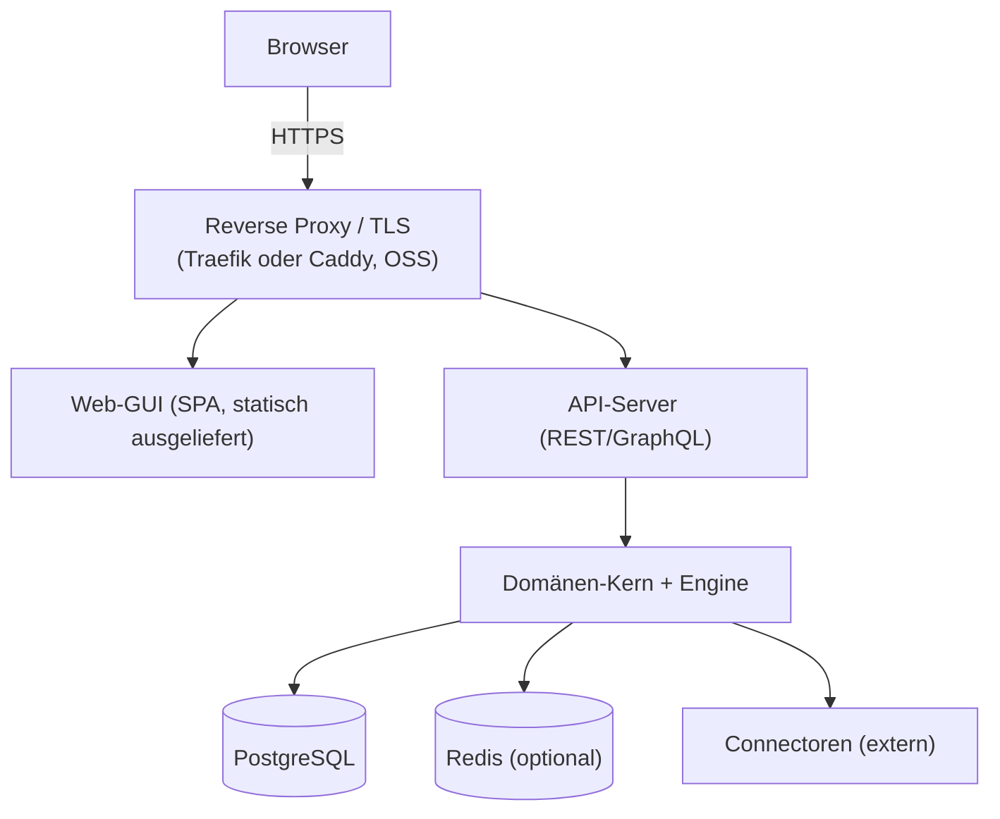

- **Frontend:** SPA (z. B. React + bpmn-js), als **statische Assets** gebaut und über CDN/Reverse-Proxy ausgeliefert.
- **Backend:** API-Server (REST/GraphQL) + Domänen-Kern; **stateless**, horizontal skalierbar.
- **TLS/Routing:** **Traefik** oder **Caddy** (beide OSS) als Reverse Proxy mit automatischem HTTPS (Let's Encrypt).
- **AuthN/Z:** Anbindung an **Keycloak** (OSS, OIDC/OAuth2) oder generisches OIDC; rollenbasierte Zugriffe passend zum Organisationsmodell.

### 11.3 Containerisierung & Betrieb

- **Container:** Dockerfiles je Service; lokale Entwicklung/Demo via **docker-compose** (`deploy/`).
- **Orchestrierung (Produktion):** **Kubernetes** mit **Helm-Chart**; alternativ Single-Host-Compose für kleine Setups.
- **Infrastruktur als Code:** Helm/Manifeste (und optional Terraform) versioniert im Repo – reproduzierbares Deployment.
- **Observability (OSS):** **OpenTelemetry** + **Prometheus**/**Grafana** (Metriken, Tracing), strukturierte Logs.
- **CI?CD:** GitHub Actions baut und scannt Container-Images, veröffentlicht sie in die **GitHub Container Registry (ghcr.io)** und kann (optional) automatisiert deployen.
- **Self-Hosting first:** Da das Tool quelloffen (BUSL-1.1) und vollständig containerisiert ist, kann es jeder ohne Lizenzkosten selbst betreiben (on-prem oder Cloud) – zum Testen, Entwickeln und für nicht-konkurrierende Produktivnutzung; eine konkurrierende kommerzielle Nutzung erfordert eine kommerzielle Lizenz (Abschnitt 10.1).

---

## 12. Technologieentscheidung & -optionen

**Gewählter Stack: Python (Backend-Kern + API), Web-Frontend in TypeScript.** Der Domänen-Kern dieses Werkzeugs besteht primär aus **Korrektheitslogik** (Validator, Change Operations) auf kleinen In-Memory-Graphen sowie einer **API-Schicht** – nicht aus rechen- oder massiv-parallelitätslastiger Verarbeitung. Dafür ist Python sehr produktiv und ausreichend performant; die Frontend/Backend-Trennung (Abschnitt 5.4) entkoppelt die Backend-Sprache ohnehin von der GUI.

| Baustein | Wahl | Begründung / Lizenz |
|----------|------|---------------------|
| Backend-Kern/Engine | **Python 3.12+** | ausdrucksstark für Regel-/Graphlogik, schnelle Entwicklung |
| API-Framework | **FastAPI** + **Pydantic v2** | API-first, automatisches OpenAPI, starke Typvalidierung an der Grenze (MIT) |
| Validierung/Typen | **Pydantic**, **mypy --strict** | Modellstrenge ohne schweren Compiler-Stack |
| Graph-Hilfen | **NetworkX** | Erreichbarkeit (K3), Zyklenprüfung (H3) – BSD |
| Persistenz | **PostgreSQL** + **SQLAlchemy 2.x** + **Alembic** | ACID/JSONB, Migrationsverwaltung (alle MIT/permissiv) |
| Tests/Qualität | **pytest**, **ruff**, **mypy** | Test-/Lint-/Typing-Gate in CI |
| Frontend | **TypeScript** + **bpmn-js** (BPMN-Sicht) | bewährter Web-Editor; spricht nur die REST-API |

**Abgewogene Nachteile von Python (und Gegenmaßnahmen):**

- **Laufzeit-Durchsatz der Execution Engine** unter sehr vielen gleichzeitigen Instanzen ist geringer als bei Java/.NET, und der **GIL** begrenzt CPU-Parallelität pro Prozess. ? Adressiert durch das ohnehin vorgesehene **stateless, horizontal skalierbare** Design (Zustand in PostgreSQL, Abschnitt 5.3/5.4), async-I/O (asyncio) und Worker-Prozesse. Einzelne Hot-Paths lassen sich später gezielt (z. B. Rust/C-Extension) optimieren, ohne Sprachwechsel.
- **Kein direkter Code-Bezug zur (Java-basierten) ADEPT-Forschung.** ? Es werden ohnehin nur **Konzepte** übernommen, kein Code.
- **Refactoring ohne statischen Compiler** ist riskanter. ? Abgefedert durch `mypy --strict` + hohe Testabdeckung.

> **Open-Source-Vorgabe:** Die gewählten Bausteine stehen unter **permissiven** Lizenzen (vgl. Abschnitt 10.1): Python (PSF), FastAPI/Pydantic/SQLAlchemy/pytest (MIT), NetworkX (BSD), PostgreSQL (PostgreSQL-Lizenz), `bpmn-js` (bpmn.io, quelloffen). Sie lassen sich frei in das BUSL-1.1-lizenzierte Gesamtwerk einbinden. Einzige Ausnahme ist der **optionale** Treiber `psycopg` (LGPL-3.0, schwaches Copyleft) – unverändert und dynamisch genutzt, daher unkritisch (Details: Abschnitt 10.1 und [THIRD-PARTY-NOTICES.md](../THIRD-PARTY-NOTICES.md)).

**Architekturprinzip bleibt unverändert:** `bpmn-js` dient als Editor/Viewer, **nicht** als Korrektheitsinstanz – die Korrektheit verantwortet ausschließlich der eigene Python-Kern (Abschnitt 5.4, „dumme" GUI).

### 12.1 Alternativ erwogene Optionen (nicht gewählt)

| Baustein | .NET (C#) | Java (ADEPT-nah) |
|----------|-----------|------------------|
| Kern/Engine | C# / .NET 8 | Java 21 |
| Stärke | starke Typsicherheit, sehr guter Durchsatz | nächste Nähe zu den ADEPT-Konzepten |
| Grund gegen Wahl | nicht bevorzugt | von der Projektleitung ausgeschlossen |

---

## 13. Umsetzungs-Roadmap (inkrementell)

> Technischer Stack gemäß Abschnitt 12: **Python 3.12 + FastAPI + SQLAlchemy/PostgreSQL** im Backend, **TypeScript + bpmn-js** im Frontend. Schritte 0–3 bilden das **Walking Skeleton** (lauffähiger, headless Kern, der die Correctness-by-Construction-Garantie praktisch belegt).

0. **Projekt-Setup (GitHub)** – Repository, `LICENSE` (MIT), README/CONTRIBUTING/SECURITY, CI-Grundgerüst (GitHub Actions), Dependabot/CodeQL (Abschnitt 10). Python-Projektgerüst (`pyproject.toml`, `ruff`, `mypy`, `pytest`).
1. **Meta-Modell als Code** (Abschnitt 4) – Pydantic-Datenstrukturen (`ProcessSchema`, `Node`, `Block`, `ControlEdge`, `DataElement`, `lifecycleState`), zunächst in-memory.
2. **Correctness Validator** (K1–K3, Soundness-Basis) – Blockstruktur, Ein-/Ausgang, Erreichbarkeit; validate-before-commit.
3. **Change Operations** für Kontrollfluss – `serialInsert`, `parallelInsert`, `conditionalInsert` (Kontrakte Abschnitt 7) + **minimale FastAPI** (Schema anlegen, Operation anwenden, Validierungsergebnis) ? headless ansteuerbar.
4. **Persistenz** – PostgreSQL via SQLAlchemy/Alembic; Schema-Versionierung + Status-Lebenszyklus (Abschnitt 4.1), docker-compose.
5. **Datenfluss** – Datenelemente, Datenkanten, D1–D5; restliche Struktur-Ops (delete, move, insertLoop).
6. **Activity Repository** – Templates, Parameter, Executors/Ausführungsumgebungen.
7. **OrgModel & Staff Assignment** – Organisationsmodell + Bearbeiterzuordnungsregeln (Z1–Z4).
8. **Execution Engine** – Instanzerstellung, Markings, Ausführungsschleife, Worklist.
9. **Komposition** – Sub-/Folgeprozesse (Abschnitt 4.2, H1–H4/F1–F3) + zugehörige Operationen (7.7).
10. **Ad-hoc Change Manager** (R1–R2, minimaler Block).
11. **Schema Evolution & Migration** (R3, M1–M5).
12. **Daten-Connectoren** – Data Access Layer + Connectoren MS SQL/MySQL/Dynamics 365/SAP (Abschnitt 9).
13. **Moderne UI** – BPMN-/Daten-/Ressourcensicht mit Live-Feedback (Abschnitt 8), Anbindung an die API.
14. **BPMN-2.0-Import/Export** auf der geprüften Teilmenge.
15. **Monitoring/Audit** + optional Process Mining.
16. **Web-Publikation & Deployment** – Container, Helm, Reverse Proxy/TLS, CI?CD (Abschnitt 11).

### 13.1 Vorbereitete, konzeptgetriebene Erweiterungen (aus §2.4.1, §3.7/§3.8, §5.5, §6.2.1, §6.5, §8.4.1)

Die folgenden Punkte ergeben sich unmittelbar aus den oben ergänzten Konzeptabschnitten. Ein Teil ist inzwischen **additiv umgesetzt** (Spalte *Status*) – jeweils mit eigenen Tests und ohne ein bestehendes Kriterium zu lockern; die laufzeit-invasiven Punkte bleiben bewusst offen, um den vollständig grünen Kern nicht zu destabilisieren. Reihenfolge = empfohlene Umsetzungsfolge.

| # | Erweiterung | Konzeptbezug | Aufschlagpunkt (Code) | Status |
|---|-------------|--------------|-----------------------|--------|
| E1 | **Arbeitslisten-Zustandsmaschine** (Offered → Allocated → Started → Completed, plus Withdrawn/Suspended/Failed) inkl. `claim`/`return`/`complete` als geprüfte Operationen | §6.2.1 | `assignment.py` (Worklist-Auflösung), `execution.py` (Aktivierung), `model.py` (neuer `WorkItemState`), `operations.py`/`api.py` (Operationen) | **offen** – laufzeit-invasiv; bestehende Engine-Schleife bleibt Leitlogik |
| E2 | **Aktivitäts-Detailzustände `SUSPENDED`/`FAILED`** im Ausführungsmodell vollständig führen (heute nur als Markierungs-Detailzustand beschrieben) | §4, §6.2.1 | `model.py` (`NodeState`/Marking-Enum), `execution.py` (Übergänge, Recovery) | **offen** – an E1 gekoppelt |
| E3 | **Wertschöpfungs-Klassifikation** je Knoten (`VALUE_ADDING` / `BUSINESS_NECESSARY` / `NON_VALUE_ADDING`) + Aggregation im Monitoring | §8.4.1 | `model.py` (`ValueClass`, optionales `Node.value_class`), `operations.set_value_class`, `metrics.value_class_breakdown`, API `GET /schemas/{id}/metrics` | **umgesetzt** – rein additives, optionales Attribut |
| E4 | **Leistungs-KPIs nach vier Dimensionen** (Zeit/Kosten/Qualität/Flexibilität) als Auswertung über das Audit-Log | §8.4.1 | `audit.py` (`KpiReport.flexibility_adhoc_ratio`, `adhoc_instances`), API `GET /monitoring/kpis` | **teilweise** – Zeit (Zykluszeit) und Flexibilität (Ad-hoc-Anteil) umgesetzt; **Kosten/Qualität bewusst offen** (keine Kosten-/Nacharbeitsdaten erfasst – ehrliche Lücke) |
| E5 | **Zeitliche Perspektive (T1–T2 statisch):** Dauer-/Fristfelder im Meta-Modell, statische Zeit-Konsistenzprüfung (kritischer Pfad ≤ Frist) | §3.8, §5.5 | `model.py` (`TimeConstraint`, `ProcessSchema.deadline_seconds`), `validator.py` (Regelgruppe T1/T2), `operations.set_time_constraint`/`set_deadline` | **umgesetzt (statisch)** – T1/T2 als additive Validierungsgruppe; Laufzeit-Timer/Eskalation (T3) bleibt offen (siehe E9) |
| E6 | **Simulations-/Vorschau-Modus** zur Unterstützung der semantischen Validierung (Token-Durchlauf ohne Seiteneffekte) | §3.7 | neuer „Dry-run"-Pfad über `execution.py`, read-only; API-Endpunkt; Animation im Web-Monitor | **offen** – muss strikt seiteneffektfrei sein |
| E7 | **Modellmetriken & 7PMG-Hinweise** (Größe, Verschachtelungstiefe, Gateway-Heterogenität) als nicht-blockierende Editor-Hinweise | §2.4.1 | `metrics.py` (`model_metrics`/`model_hints`, reine Kennzahlen, keine Stufe-A/B-Erzwingung), API `GET /schemas/{id}/metrics` | **umgesetzt** – nur Hinweise, keine Erzwingung |
| E8 | **Arbeitslisten-Priorität** (`Priorität = Auswirkung + Dringlichkeit`) mit Sortierung je Eintrag | §3.8, §6.2.1 | `model.py` (`WorkItemPriority`, `ImpactUrgency`, `PriorityLevel`), `assignment.py` (Worklist-Sortierung, `OpenTask.priority`), `operations.set_node_priority`, API `POST /schemas/{id}/priority` | **umgesetzt** – additive Felder + Sortierung |
| E9 | **Mehrstufige Eskalation** (funktional/horizontal vs. hierarchisch/vertikal, zeitgesteuert bei Fristüberschreitung) | §3.8 (T3), §6.2.1 | `execution.py` (Timer/Eskalationsauslösung), `assignment.py` (Ziel-Bearbeitermenge), `audit.py` (Protokollierung) | **offen** – an E5-Laufzeitteil (Timer) gekoppelt; eigenes Inkrement |

> **Leitplanke:** Alle Punkte sind **additiv** und ändern die bestehende Correctness-by-Construction-Invariante nicht. Die umgesetzten Punkte (E3, E5-statisch, E7, E8 sowie der Zeit-/Flexibilitätsteil von E4) sind mit eigenen Tests hinterlegt und lockern kein bestehendes Kriterium (K/D/Z/B/R/M, H/F); die statische Zeitprüfung erweitert die Invariante sogar um eine eigene, ausschließlich bei vorhandenen Zeitangaben greifende Regelgruppe (T1/T2). Die offenen, laufzeit-invasiven Punkte (E1/E2/E6/E9 sowie Kosten/Qualität in E4 und der Timer-Teil von E5) erhalten je ein eigenes Inkrement und werden hier **bewusst nicht** als erledigt ausgewiesen.

---

## 14. Glossar

- **Soundness:** formale Korrektheit eines Prozesses (Abschluss möglich, sauberer Abschluss, keine toten Aktivitäten).
- **Block-/wohlstrukturiert:** Kontrollstrukturen als symmetrisch geschachtelte Split/Join-Blöcke.
- **Marking:** Ausführungszustand eines Knotens in einer Instanz.
- **Ad-hoc-Änderung:** strukturelle Anpassung einer einzelnen laufenden Instanz.
- **Schema-Evolution:** versionierte Änderung des Prozesstyps; **Migration** überführt kompatible Instanzen.
- **Migrierbarkeit (M1–M5):** Bedingungen, unter denen eine laufende Instanz konsistent auf eine neue Schema-Version umgestellt werden darf (Ziel korrekt, Trace-verträglich, Markierungen abbildbar, Daten konsistent, Ad-hoc-verträglich).
- **Trace-/Compliance-Prüfung:** Test, ob der bisherige Ausführungsverlauf einer Instanz ein gültiges Präfix einer Ausführung des neuen Schemas ist.
- **Migrations-Report:** je-Instanz-Bewertung beim Release (migrierbar/blockiert + Begründung), Grundlage der individuellen Entscheidung.
- **Versions-Koexistenz:** mehrere immutable Schema-Versionen laufen parallel; jede Instanz ist genau einer Version zugeordnet.
- **Correctness by Construction:** Konstruktionsprinzip, bei dem nur korrektheitserhaltende Operationen angeboten werden; im Werkzeug als durchgängige Architektur-Invariante umgesetzt (Abschnitt 1.1).
- **Korrektheitsinvariante (I):** Zusicherung, dass jeder persistierte/anzeigbare Modellzustand stets K1–K7 und D1–D5 erfüllt – es kann kein inkorrektes Modell existieren.
- **Stufe A / Stufe B:** A = jederzeit garantierte strukturelle Korrektheit; B = zusätzliche Ausführbarkeit (Dienste, Bearbeiter, Datenbindungen), erzwungen beim Release.
- **Operationskontrakt:** Vor-/Nachbedingungen (`requires`/`ensures`) einer Change-Operation; Spezifikationsgrundlage des Validators (Abschnitt 7).
- **Connector:** serverseitige Adapterkomponente, die ein externes System (MS SQL, MySQL, Dynamics 365, SAP) über eine einheitliche Lese-/Schreib-SPI an Datenelemente anbindet.
- **Instanzdaten / Externe Daten:** Daten leben entweder in der Prozessinstanz oder in einer zentralen Datenbank/Fachanwendung (Abschnitt 9.1).
- **Business Source License (BUSL-1.1):** quelloffene, aber nicht-Open-Source-Lizenz mit explizitem Haftungs-/Gewährleistungsausschluss; erlaubt freie Nutzung/Änderung/Weitergabe und nicht-konkurrierende Produktivnutzung, reserviert die konkurrierende kommerzielle Nutzung dem Lizenzgeber und geht am Change Date automatisch in Apache-2.0 über (Abschnitt 10.1).
- **SBOM:** Software Bill of Materials – maschinenlesbare Liste aller Abhängigkeiten (für Lizenz-/Schwachstellenprüfung).
- **CI/CD:** automatisierte Build-/Test-/Deployment-Pipeline (hier GitHub Actions).

## 15. Quellen

- **Dadam, P.; Reichert, M.; Rinderle-Ma, S.; u. a.:** Begutachtete Publikationen zum **ADEPT-Projekt** (Universität Ulm) zu „Correctness by Construction" sowie zur flexiblen, robusten Ausführung von Unternehmensprozessen. Grundlage für: Motivation/Herausforderungen (Robustheit, Flexibilität, Benutzbarkeit), ADEPT-Meta-Modell, High-Level-Änderungsoperationen, SOA-Architektur, Schema-Evolution.
- **Reichert, M.:** *Dynamische Ablaufänderungen in Workflow-Management-Systemen.* Dissertation, Universität Ulm, 2000. Grundlage für: formale Struktur- und Ausführungsregeln, Anforderungen an Modellierungssprachen, Zustands-/Markierungsmodell, Datenfluss, Bearbeiterzuordnung/OrgModel, Activity Templates.
- **Reichert, M.; Weber, B.:** *Enabling Flexibility in Process-Aware Information Systems.* Springer, 2012. (Zitierschlüssel **[RW12]**: PAIS-Einordnung, Prozessperspektiven, Ausführungsumgebung, zeitliche Perspektive.)
- OMG BPMN 2.0 / ISO 19510 (Übersicht zu BPMN 2.0).
- Weske, M.: *Business Process Management: Concepts, Languages, Architectures.* Dumas et al.: *Process-Aware Information Systems.*

### 15.1 Ergänzende Fachliteratur (Zitierschlüssel)

Die folgenden Quellen sind die in Abschnitt 2.4.1, 3.7/3.8, 5.5, 6.2.1, 6.5 und 8.4.1 verwendeten Originalwerke. Übernommen wurden ausschließlich allgemein anerkannte Konzepte und Begriffe (in eigener Formulierung); es wurde kein geschützter Text übernommen.

- **[LSS94]** Lindland, O. I.; Sindre, G.; Sølvberg, A.: *Understanding Quality in Conceptual Modeling.* IEEE Software, 11(2), 1994 (semiotischer Qualitätsrahmen: syntaktisch/semantisch/pragmatisch).
- **[KSJ06]** Krogstie, J.; Sindre, G.; Jørgensen, H.: *Process Models Representing Knowledge for Action: A Revised Quality Framework.* European Journal of Information Systems, 15(1), 2006 (SEQUAL – revidierter semiotischer Qualitätsrahmen).
- **[Ros96]** Rosemann, M.: *Komplexitätsmanagement in Prozessmodellen.* Gabler, 1996 (Grundsätze ordnungsmäßiger Modellierung – GoM).
- **[BRU00]** Becker, J.; Rosemann, M.; von Uthmann, C.: *Guidelines of Business Process Modeling.* In: Business Process Management, LNCS 1806, Springer, 2000 (Präzisierung der GoM für die Prozessmodellierung).
- **[MRA10]** Mendling, J.; Reijers, H. A.; van der Aalst, W. M. P.: *Seven Process Modeling Guidelines (7PMG).* Information and Software Technology, 52(2), 2010.
- **[MNV07]** Mendling, J.; Neumann, G.; van der Aalst, W. M. P.: *Understanding the Occurrence of Errors in Process Models Based on Metrics.* In: OTM/CoopIS, LNCS 4803, Springer, 2007.
- **[Dum+13]** Dumas, M.; La Rosa, M.; Mendling, J.; Reijers, H. A.: *Fundamentals of Business Process Management.* Springer, 2013 (Prozessperspektiven, Work-Item-Lebenszyklus, Devil's Quadrangle, Wertschöpfungsanalyse).
- **[HC94]** Hammer, M.; Champy, J.: *Reengineering the Corporation.* HarperBusiness, 1994 (Business Process Reengineering, Wertschöpfungsbetrachtung).
- **[LRW16]** Lanz, A.; Reichert, M.; Weber, B.: *Process Time Patterns: A Formal Foundation.* Information Systems, 57, 2016 (zeitliche Perspektive/Time Patterns).
- **[WRR08]** Weber, B.; Reichert, M.; Rinderle-Ma, S.: *Change Patterns and Change Support Features – Enhancing Flexibility in Process-Aware Information Systems.* Data & Knowledge Engineering, 66(3), 2008 (Änderungsmuster, Flexibilitätsdimensionen).
- **[DRR10]** Dadam, P.; Reichert, M.; Rinderle-Ma, S.: *Nur ein wenig Flexibilität wird nicht reichen – Überlegungen zur Realisierung flexibler Prozessmanagement-Systeme.* Informatik-Spektrum, 33(4), 2010 (drei Flexibilitätsdimensionen: Entwurfszeit/Ausführungszeit/Schemaevolution).
- **[Olb12]** Olbrich, A.: *ITIL kompakt und verständlich.* Vieweg+Teubner, 2012 (allgemeine ITIL-Konzepte: funktionale/hierarchische Eskalation, Priorität = Auswirkung + Dringlichkeit, SLA-Zeiten).
