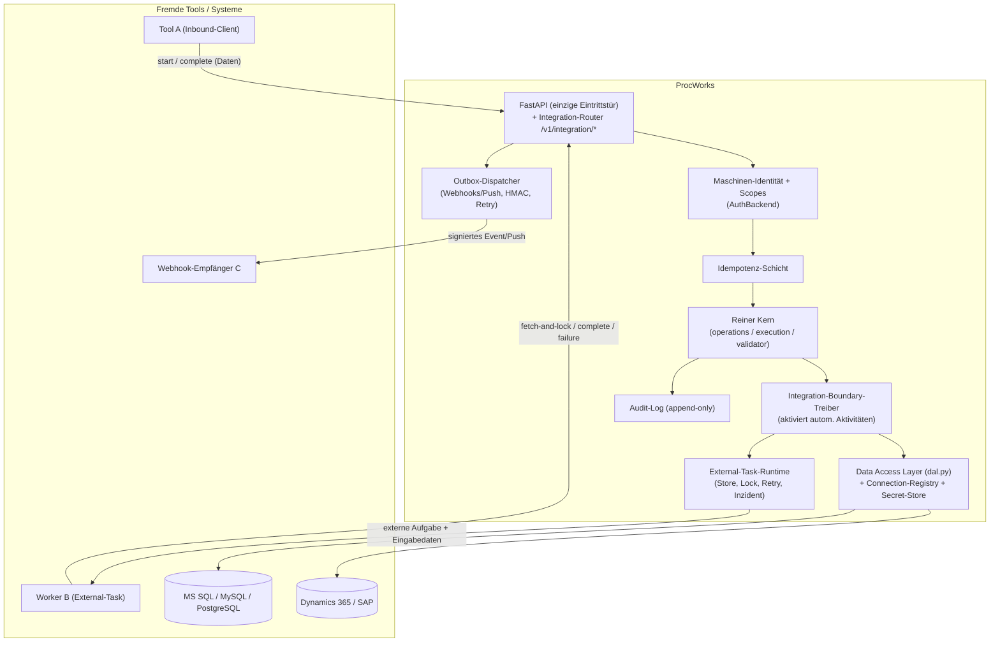
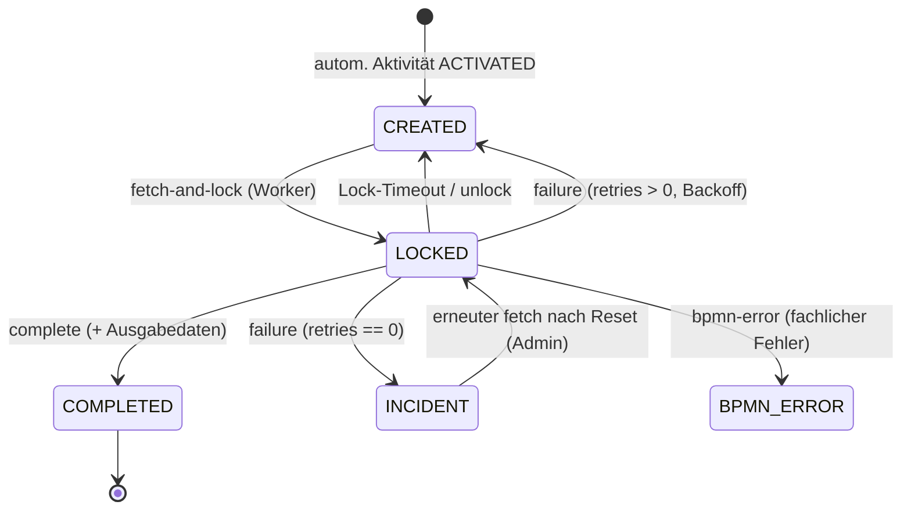

<!-- SPDX-License-Identifier: BUSL-1.1 -->
# Integrations-Konzept: Maximal offene API-Anbindung zur Steuerung von Prozessen

> Schwerpunkt: Eine **maximal offene, maximal robuste** Integrationsschicht, über die
> (1) **fremde Tools ProcWorks steuern** (Instanzen starten, Aufgaben inkl. Daten
> abschließen), (2) **ProcWorks fremde Tools steuert** (Aufgaben als Daten übergeben,
> Ergebnisse zurücknehmen) und (3) **Datenelemente bidirektional** mit fremden Tools
> ausgetauscht oder per **Direktzugriff** aus Datenspeichern (verschiedene SQL-Server,
> OData, SAP …) gelesen/geschrieben werden. Inklusive **GUI** zur intuitiven Modellierung
> der Datenanbindung.
>
> Status: **Konzept (geplant)**. Version 0.1. Baut additiv auf dem bestehenden Kern auf
> (`dal.py`, `ExternalBinding`, `ConnectorDescriptor`, `ServiceBinding`, `ActivityTemplate`,
> `api.py`) und **lockert kein bestehendes Korrektheitskriterium**. Einordnung in das
> Hauptkonzept: [Architektur-Konzept-Prozessmodellierung.md](Architektur-Konzept-Prozessmodellierung.md)
> (§9 Datenhaltung & Connectoren, §13.1 Erweiterungen). Sicherheit/Identitäten:
> [Auth-Konzept.md](Auth-Konzept.md).

---

## 0. Status & Begriffe

| Begriff | Bedeutung |
|---|---|
| **Inbound** | Ein fremdes Tool ruft die ProcWorks-API auf (steuert ProcWorks). |
| **Outbound** | ProcWorks beauftragt ein fremdes Tool mit einer Aufgabe (steuert das Tool). |
| **Externe Aufgabe (External Task)** | Eine automatische Aktivität, deren Arbeit ein externer *Worker* übernimmt (Pull-Muster). |
| **Worker** | Ein fremder Prozess/Dienst, der externe Aufgaben abholt, abarbeitet und zurückmeldet. |
| **Connector** | Adapter zu einem Datenspeicher/Fachsystem (SQL, OData, SAP …) hinter dem Data Access Layer (`dal.py`). |
| **Datenanbindung** | Verknüpfung eines Datenelements mit einer externen Quelle/Senke (Connector **oder** Tool-Schnittstelle). |
| **Outbox** | Transaktional gesicherte Ausgangswarteschlange für zuverlässige Zustellung (Webhooks/Push). |
| **Inzident (Incident)** | Festgehaltener Fehlerzustand einer externen Aufgabe nach Erschöpfung der Wiederholungen. |

Die Integrationsschicht ist eine **Boundary-Fähigkeit** (an der API-Grenze, analog zum
Audit-Log): der **Ausführungskern bleibt rein**. Sie nutzt ausschließlich die bestehenden,
geprüften Mutationswege (`operations.py`, `execution.complete_activity`, Validator) — **kein
Bypass** der Correctness-by-Construction-Invariante (Hauptkonzept §1.1).

---

## 1. Ziele und Leitplanken

### 1.1 Funktionale Ziele

1. **Fremde Tools steuern ProcWorks (Inbound):**
   - Instanzen starten (inkl. Startdaten).
   - Aufgaben abschließen / XOR-Entscheidungen treffen — **inkl. Datenübergabe**.
   - Instanzdaten gezielt lesen/schreiben.
2. **ProcWorks steuert fremde Tools (Outbound):**
   - Eine automatische Aktivität übergibt eine **Aufgabe als Datenpaket** an ein Tool.
   - Das Tool arbeitet ab und **schließt die Aufgabe** mit Rückgabedaten (oder meldet Fehler).
   - Zwei Muster: **Pull** (External Task / Worker, Standard) und **Push** (HTTP-Aufruf/Webhook).
3. **Datenelemente integrieren (bidirektional + Direktzugriff):**
   - **Bidirektionale Tool-Schnittstelle:** Tools lesen/schreiben Datenelemente.
   - **Direktzugriff auf Datenspeicher:** parametrisierter Lese-/Schreibzugriff auf
     MS SQL / MySQL / PostgreSQL / OData (Dynamics 365) / SAP über die Connector-SPI.
4. **GUI** zur **intuitiven, robusten** Modellierung der Datenanbindung und der
   Tool-Aufgaben.
5. **Saubere, maschinenlesbare Dokumentation** für Fremd-Tools (OpenAPI + Integrationsleitfaden + Rezepte).

### 1.2 Nicht verhandelbare Leitplanken

- **L1 – CbC bleibt unangetastet.** Jede modellierende Änderung (Datenanbindung,
  Automatik-Binding) läuft durch `validate-before-commit`. Persistierte Schemata sind
  immer gültig. Neue Regelgruppe **I** (§10) ist additiv und nur aktiv, wenn
  Integrationsmerkmale genutzt werden.
- **L2 – Kern bleibt rein.** Die Integrationsschicht ruft den Kern, nie umgekehrt.
  `execution.py`/`validator.py`/`assignment.py` erhalten **keine** Netz-/IO-Abhängigkeit.
- **L3 – Sicherheit by design.** Keine Secrets im Modell/Audit/Log; nur parametrisierte
  Abfragen (kein Injection); Outbound-Ziele gegen **Allowlist** (SSRF-Schutz); maschinelle
  Identitäten mit **Scopes**; least privilege.
- **L4 – Maximale Robustheit.** Idempotenz, At-least-once mit Einmal-Anwendung,
  Lock/Visibility-Timeout, Wiederholungen mit Backoff, transaktionale Outbox,
  Dead-Letter/Inzident, vollständiges Audit.
- **L5 – Additiv & rückwärtskompatibel.** Bestehende Tests/Clients bleiben grün; alle
  neuen Felder haben sichere Defaults; Default-Verhalten unverändert.

---

## 2. Gesamtarchitektur



**Schichtprinzip:** `API` → `AuthZ/Idempotenz` → **Kern** (unverändert). Die
**Boundary-Treiber** (`BIND`, `XTASK`, `OUTBOX`, `DAL`) sitzen *neben* dem Kern an der
Grenze und treiben ihn über bestehende Operationen.

---

## 3. Überblick der drei Richtungen

| # | Richtung | Mechanismus | Transport | Primärnutzen |
|---|----------|-------------|-----------|--------------|
| R1 | **Inbound** | REST (`/v1/...`) | HTTPS, Bearer/API-Key | Tool startet Instanzen & schließt Aufgaben mit Daten |
| R2 | **Outbound (Pull)** | **External-Task** `fetch-and-lock` | HTTPS, Worker pollt | Robuste, firewall-freundliche Tool-Beauftragung |
| R3 | **Outbound (Push)** | **Webhook/HTTP-Aufruf** | HTTPS, ProcWorks ruft Tool | Synchrone/HTTP-erreichbare Tools, Event-Benachrichtigung |
| R4 | **Daten: Direktzugriff** | **DAL-Connector** | DB-Protokoll/OData/RFC | Externe Datenelemente lesen/schreiben (führende Daten) |
| R5 | **Daten: Tool-Schnittstelle** | REST `instances/{id}/data` | HTTPS | Bidirektionaler Datenfluss zu/von Tools |

> **Empfehlung:** Für Outbound ist **R2 (Pull)** der robuste Standard (kein eingehender
> Port beim Tool nötig, Lock/Retry eingebaut). **R3 (Push)** ergänzt für einfache,
> HTTP-erreichbare Tools und für Ereignisbenachrichtigungen.

---

## 4. Identitäten & Sicherheit

### 4.1 Maschinelle Identitäten (erweitert das Auth-Konzept)

Heute kennt der `AuthBackend` (siehe [Auth-Konzept.md](Auth-Konzept.md)) `open`/`token`/`password`.
Für Integrationen kommt eine **Service-Identität** mit **Scopes** hinzu (additiv, ohne
bestehende Modi zu ändern):

- Neue RBAC-Rolle **`integration`** (neben `admin`/`modeler`/`operator`/`viewer`): darf
  ausschließlich die Integrationsendpunkte gemäß ihren Scopes nutzen.
- **Service-Token** (langlebig, nur als SHA-256-Digest gespeichert, wie `auth_token.py`),
  optional mit **Scopes** zur Feingranularität:

  | Scope | Erlaubt |
  |---|---|
  | `instances:start` | Instanzen starten (optional eingeschränkt auf `schema:<id>`) |
  | `tasks:complete` | Aufgaben abschließen / entscheiden |
  | `tasks:fetch` | externe Aufgaben abholen (`fetch-and-lock`), optional `topic:<name>` |
  | `data:read` / `data:write` | Instanzdaten lesen/schreiben |
  | `events:subscribe` | Webhook-Abonnements verwalten |

- Token-Format/Verwaltung analog `PROCWORKS_TOKENS` (JSON, serverseitig), erweitert um
  `scopes`/`topics`. Default-Modus bleibt `open` → bestehende Tests/Quickstart unverändert.

### 4.2 Sicherheitsmaßnahmen (Querschnitt)

- **SSRF-Schutz (kritisch):** Outbound-Ziele (Webhook/Push-URLs) werden gegen eine
  **Allowlist** (`PROCWORKS_OUTBOUND_ALLOWLIST`) geprüft; private/Link-Local-/Metadaten-IPs
  (`169.254.169.254`, `127.0.0.0/8`, `10/8`, `192.168/16`, `::1` …) werden **blockiert**,
  sofern nicht ausdrücklich freigegeben. Nur `https` (außer ausdrücklich erlaubtem `http`
  im internen Netz). DNS-Rebinding-Schutz: Auflösen + Pinnen der IP.
- **Secrets nur serverseitig:** Connector-Zugangsdaten/Webhook-Signaturschlüssel liegen im
  **Secret-Store** (Umgebungsvariablen/Datei/optional Vault), referenziert per `connector_id`/
  `subscription_id`. **Niemals** im Schema, Audit oder Log (strukturell durch Regel **I4**
  erzwungen).
- **Parametrisierte Zugriffe:** DAL übergibt `key`/`values`/`filters` ausschließlich als
  Parameter (bereits Invariante in `dal.py`) → kein SQL-Injection-Vektor.
- **HMAC-signierte Webhooks:** Jede ausgehende Zustellung trägt `X-ProcWorks-Signature:
  sha256=<hmac>` über den Rohbody; Empfänger verifiziert mit dem geteilten Secret.
- **Eingabevalidierung & Limits:** Pydantic an der Grenze, Größenlimits, Rate-Limit auf
  `fetch-and-lock`/`start`, Timeouts auf alle Outbound-Aufrufe.
- **Least privilege:** je Connector ein eigenes DB-Dienstkonto mit minimalen Rechten.
- **Audit:** jede externe Interaktion (Inbound-Aufruf, Lock, Complete, Push-Zustellung,
  Datenzugriff) erzeugt ein Audit-Event.

---

## 5. Inbound — Fremde Tools steuern ProcWorks (R1, R5)

### 5.1 Endpunkte (nutzen vorhandene Kernlogik)

| Methode | Pfad | Zweck | Scope |
|---|---|---|---|
| `POST` | `/v1/schemas/{id}/instances` | Instanz starten (inkl. `data`) | `instances:start` |
| `GET` | `/v1/instances/{id}` | Instanzzustand abrufen | `data:read` |
| `GET` | `/v1/instances/{id}/tasks` | offene Aufgaben der Instanz | `data:read` |
| `POST` | `/v1/instances/{id}/nodes/{nodeId}/complete` | Aufgabe abschließen (**`data` Übergabe**) | `tasks:complete` |
| `GET` | `/v1/instances/{id}/data` | **alle Instanzdatenwerte lesen** | `data:read` |
| `PUT` | `/v1/instances/{id}/data` | **Datenwerte setzen** (typ-/zugriffsgeprüft) | `data:write` |

> Diese Endpunkte spiegeln die bestehenden (`POST /schemas/{id}/instances`,
> `.../complete`) unter einem **versionierten** `/v1`-Präfix mit
> Integrations-Scopes. `complete` nimmt `data_values` bereits heute entgegen; das
> Konzept ergänzt nur die explizite Datenlese-/-schreib-Schnittstelle und Idempotenz.

### 5.2 Datenübergabe & Korrektheit

- Beim `complete`/`PUT data` werden Werte gegen die **deklarierten Datenelement-Typen**
  validiert (Boundary-Typprüfung, ergänzt die statische D3 zur Laufzeit). Schreibzugriffe
  außerhalb der für den Knoten erlaubten `WRITE`/`READ_WRITE`-Datenelemente werden
  abgelehnt (409/422).
- Die handelnde Identität wird wie bei interaktiven Aufgaben über die BZR/Token geprüft;
  unberechtigte Abschlüsse → **409** (bestehendes Verhalten, `performed_by`).

### 5.3 Idempotenz

- Header `Idempotency-Key: <uuid>` auf allen mutierenden Inbound-Endpunkten.
- Ein **Idempotency-Store** (in-memory / DB) merkt sich `(token, key) → Antwort` für ein
  TTL-Fenster; Wiederholung liefert die **gleiche** Antwort, ohne erneut auszuführen
  (schützt vor Doppelstarts/Doppelabschlüssen bei Netzfehlern/Retries).

---

## 6. Outbound — ProcWorks steuert fremde Tools

### 6.1 Automatische Aktivität als Integrationspunkt

Heute ist eine `ServiceBinding.automatic`-Aktivität modelliert (B1), wird aber von der
Engine **noch nicht** automatisch ausgeführt — sie wartet auf `complete_activity`. Das
Konzept führt am **Boundary-Treiber** die Brücke ein:

> Sobald eine **automatische** Aktivität in den Zustand `ACTIVATED` wechselt, erzeugt der
> Boundary-Treiber – je nach Binding-Typ – **eine externe Aufgabe** (Pull) **oder** einen
> **Outbound-Aufruf** (Push). Erst die erfolgreiche Rückmeldung treibt über das *bestehende*
> `execution.complete_activity` weiter. Der Kern bleibt unverändert.

Ein neues, additives Feld `automation` an `ServiceBinding` (§9) wählt das Muster:
`MANUAL_NONE` (Default = wie bisher), `EXTERNAL_TASK` (Pull) oder `HTTP_PUSH` (Push).

### 6.2 R2 — External-Task-Muster (Pull, Standard)

Robust, firewall-freundlich, eigene saubere Umsetzung (clean-room, kein Fremdcode).

**Lebenszyklus einer externen Aufgabe:**



**Endpunkte:**

| Methode | Pfad | Zweck |
|---|---|---|
| `POST` | `/v1/external-tasks/fetch-and-lock` | Aufgaben eines/mehrerer `topics` abholen + sperren (Body: `worker_id`, `topics[]`, `lock_ms`, `max_tasks`, `use_priority`) |
| `POST` | `/v1/external-tasks/{taskId}/complete` | Erfolg + **Ausgabedaten** (`variables`); engine schreibt Outputs + treibt weiter |
| `POST` | `/v1/external-tasks/{taskId}/failure` | technischer Fehler (`error_message`, `retries`, `retry_timeout_ms`) → Backoff oder Inzident |
| `POST` | `/v1/external-tasks/{taskId}/bpmn-error` | **fachlicher** Fehler (`error_code`) → optionaler Fehlerpfad/Markierung |
| `POST` | `/v1/external-tasks/{taskId}/extend-lock` | Lock verlängern (lange Arbeit) |
| `POST` | `/v1/external-tasks/{taskId}/unlock` | Lock freigeben (Aufgabe sofort wieder verfügbar) |

**Eingabedaten an den Worker:** Beim `fetch-and-lock` liefert ProcWorks je Aufgabe das
**Eingabe-Datenpaket** – aufgelöst aus `ServiceBinding.parameter_mapping` bzw. den
`READ`-Datenzugriffen des Knotens (Instanzwerte + ggf. via DAL vorgeladene externe Werte).
Der Worker bekommt also genau die fachlichen Daten, nicht das ganze Modell.

**Rückgabe:** `complete.variables` werden über `parameter_mapping`/`WRITE`-Zugriffe in die
Instanz geschrieben (und – falls als `EXTERNAL` gebunden – per DAL in den Datenspeicher
geflusht), dann `complete_activity`.

**Robustheit:**
- **Lock-Token** + **monotone Instanz-Revision** als Guard → eine Aufgabe wird **höchstens
  einmal** angewendet (At-least-once-Zustellung, Exactly-once-Effekt).
- **Lock-/Visibility-Timeout:** abgelaufene Locks → Aufgabe wird neu vergeben.
- **Wiederholungen mit exponentiellem Backoff + Jitter**; bei `retries == 0` → **Inzident**
  (Dead-Letter), sichtbar im Monitoring, manuell rücksetzbar.
- **Priorisierung:** `use_priority` reiht nach `OpenTask.priority` (E8) → wichtige
  Aufgaben zuerst.
- **Rate-Limit/Backpressure** auf `fetch-and-lock`.

### 6.3 R3 — Webhook/HTTP-Push (Call-out & Events)

Zwei Spielarten:

1. **Aktivitäts-Push (`HTTP_PUSH`):** Bei Aktivierung ruft der Outbox-Dispatcher das
   konfigurierte Tool-Endpoint mit dem Eingabe-Datenpaket auf.
   - **Asynchron (umgesetzt):** Der Push trägt ein **Callback-Token**; das Tool quittiert
     und ruft später `/v1/external-tasks/{taskId}/complete` mit diesem Token auf. Die
     gepushte Aufgabe ist intern eine `LOCKED` External-Task ohne Lock-Ablauf (sie wird
     **nie** per `fetch-and-lock` gezogen, da sie kein Topic trägt) — so teilt sich der
     Push-Pfad den geprüften Completion-/Failure-/Inzident-Weg mit dem Pull-Pfad.
   - **Synchron (bewusst aufgeschoben):** Eine Variante, bei der die HTTP-Antwort
     (2xx + JSON) sofort `complete_activity` auslöst, würde die Outbox-Zustellung
     **zurück in den Kern** koppeln und damit L2 (Kern bleibt rein) verletzen. Sie ist als
     optionale Erweiterung dokumentiert, aber nicht implementiert.
2. **Ereignis-Webhooks:** Abonnements auf Domänenereignisse (`instance.started`,
   `instance.completed`, `task.ready`, `task.completed`, `task.incident`). ProcWorks stellt
   signierte Events zu.

**Endpunkte (Verwaltung):**

| Methode | Pfad | Zweck |
|---|---|---|
| `GET/POST` | `/v1/webhooks` | Abonnements auflisten/anlegen (`url`, `events[]`, `secret_ref`) |
| `DELETE` | `/v1/webhooks/{id}` | Abonnement löschen |
| `POST` | `/v1/webhooks/{id}/test` | Test-Zustellung |

**Robuste Zustellung (Transaktionale Outbox):**
- Jedes Event/jeder Push wird zunächst **in der DB-Outbox** gespeichert (gleiche
  Transaktion wie der auslösende Zustand) → kein Verlust bei Absturz.
- Ein Dispatcher liest die Outbox, stellt zu, mit **Backoff-Retry**, **HMAC-Signatur**,
  **Timeout** und **Circuit-Breaker** je Ziel; nach Erschöpfung → Dead-Letter + Inzident.
- **Idempotenz beim Empfänger:** jedes Event trägt eine eindeutige `delivery_id` und
  `Idempotency`-Semantik (Empfänger entdoppelt).
- **Zustellprotokoll** (Delivery-Log) je Abonnement (Versuche, Status, letzte Antwort).

---

## 7. Datenanbindung — bidirektional & Direktzugriff (R4, R5)

### 7.1 Direktzugriff auf Datenspeicher (DAL-Connectoren)

Vervollständigt die in `dal.py` angelegte SPI um **reale** Connectoren. Jeder implementiert
das bestehende `Connector`-Protokoll (`read`/`write`/`query`) **streng parametrisiert**:

| Connector | Technik | Bemerkung |
|---|---|---|
| **PostgreSQL** | SQLAlchemy Core (parametrisiert) | bereits Hausstack |
| **MS SQL Server** | SQLAlchemy + `pyodbc`/`pymssql` | Stored Procedures via `text()` mit Bind-Params |
| **MySQL/MariaDB** | SQLAlchemy + Treiber | analog |
| **Generisch SQL** | SQLAlchemy-URL | jeder von SQLAlchemy unterstützte Dialekt |
| **OData (Dynamics 365)** | HTTP/OData v4 | Entitäten als Quelle/Senke |
| **SAP** | OData/Gateway bzw. BAPI/RFC | später; SPI bleibt gleich |
| **REST/CUSTOM** | offene SPI | beliebige Fachsysteme |

**Bidirektionaler Datenfluss (Pre-Fetch / Post-Flush):** Der Boundary-Treiber wertet die
`DataAccess`-Modi am aktiven Knoten aus:
- **READ** auf einem `EXTERNAL`-Element → **Pre-Fetch** über DAL vor Aktivierung
  (Schlüssel = `key_element_id`, parametrisiert).
- **WRITE** auf einem `EXTERNAL`-Element → **Post-Flush** über DAL nach Abschluss.
- **READ_WRITE** → beides (bidirektional).

So „wandern" Datenobjekte konsistent zwischen Instanz und Fachsystem, ohne dass das Modell
connector-spezifisch wird (Hauptkonzept §9.2). Verfügbarkeit/Schlüsselversorgung wird
statisch über **D1/C2/C3** geprüft, Typ-Mapping über **D3/Z4**.

### 7.2 Bidirektionale Tool-Schnittstelle (ohne Datenspeicher)

Wenn nicht ein Datenspeicher, sondern ein **Tool** Datenquelle/-senke ist:
- **Schreiben in die Instanz:** Tool ruft `PUT /v1/instances/{id}/data` (R5).
- **Lesen aus der Instanz:** Tool ruft `GET /v1/instances/{id}/data`.
- **Im Aufgabenkontext:** External-Task `fetch-and-lock` liefert Eingabedaten, `complete`
  nimmt Ausgabedaten — die natürliche, transaktional saubere Form des bidirektionalen
  Austauschs (bevorzugt gegenüber freiem `PUT data`).

### 7.3 Secret-Store & Connection-Registry

- **`ConnectorDescriptor`** im Schema trägt weiterhin **nur Metadaten** (`id`, `name`,
  `kind`). Die **Connection-Registry** (serverseitig, neu) ordnet `connector_id` →
  Verbindungsdaten (URL/DSN, Konto, Secret-Referenz) zu, gespeist aus dem Secret-Store.
- **`POST /v1/connectors/{id}/test`** prüft die Verbindung sicher (read-only Ping), ohne
  Secrets preiszugeben. **`POST /v1/connectors/{id}/sample-read`** liefert einen
  Beispieldatensatz für die GUI-Mapping-Hilfe (rechtegeprüft, ohne sensible Felder zu loggen).

---

## 8. Meta-Modell-Erweiterungen (additiv)

Alle Felder mit sicheren Defaults; bestehende Schemata/Tests bleiben gültig.

```python
# model.py – additive Ergänzungen

class AutomationKind(StrEnum):
    MANUAL_NONE = "MANUAL_NONE"     # Default: interaktiv/wie bisher
    EXTERNAL_TASK = "EXTERNAL_TASK" # Pull (Worker)
    HTTP_PUSH = "HTTP_PUSH"         # Push (Outbox)

class ServiceBinding(BaseModel):
    # ... bestehende Felder ...
    automation: AutomationKind = AutomationKind.MANUAL_NONE
    topic: str | None = None            # bei EXTERNAL_TASK: Themenkanal des Workers
    endpoint_ref: str | None = None     # bei HTTP_PUSH: Referenz auf serverseitiges Ziel
    retry_max: int = 5
    retry_backoff_ms: int = 2000
    request_timeout_ms: int = 30000

class WebhookSubscription(BaseModel):    # serverseitige Entität (nicht im Schema)
    id: str
    url: str
    events: list[str]
    secret_ref: str
    active: bool = True

class ExternalTask(BaseModel):           # Laufzeit-Entität (Store)
    id: str
    instance_id: str
    node_id: str
    topic: str
    state: str                            # CREATED/LOCKED/COMPLETED/INCIDENT/BPMN_ERROR
    worker_id: str | None = None
    lock_expires_at: float | None = None
    retries_left: int
    input_variables: dict[str, object]
    priority: PriorityLevel = PriorityLevel.MEDIUM
    instance_revision_guard: int          # Exactly-once-Anwendung

class Incident(BaseModel):
    id: str
    external_task_id: str
    instance_id: str
    node_id: str
    message: str
    created_at: float
    resolved: bool = False
```

Neue **serverseitige** Verbindungs-/Secret-Strukturen (nicht im Schema, kein Pydantic im
Modell nötig): `ConnectionConfig(connector_id, dsn_ref, account_ref)` in der
Connection-Registry.

---

## 9. Korrektheits- & Robustheitsregeln — Regelgruppe I (additiv)

Eingeordnet als **Stufe B** (Release-Reife) bzw. strukturelle Vorprüfung; **stumm**, solange
keine Integrationsmerkmale gesetzt sind (analog T1/T2). Erweitert `validator.validate()`.

| Regel | Aussage |
|---|---|
| **I1 – Wohlgeformtes Binding** | `EXTERNAL_TASK` ⇒ nicht-leeres `topic`; `HTTP_PUSH` ⇒ gültige `endpoint_ref` mit `https`-Ziel (Allowlist-fähig). |
| **I2 – Automatik-Konsistenz** | Eine `automation != MANUAL_NONE`-Aktivität trägt **keine** interaktive Staff-Rule und genau **ein** Ausführungsmuster (Topic XOR Endpoint XOR Script). Spiegelt Z4/B2. |
| **I3 – Typkonforme E/A-Abbildung** | Jeder Eingabeparameter bildet auf ein Datenelement ab, das **garantiert vorher** geschrieben ist (D1-analog); jeder Ausgabeparameter auf ein beschreibbares, typkonformes Element (D3-analog). |
| **I4 – Keine Secrets im Modell** | `ConnectorDescriptor`/`ExternalBinding`/`ServiceBinding` enthalten **keine** Zugangsdaten/URLs mit Credentials (nur Referenzen). Strukturell geprüft. |
| **I5 – Idempotente Anwendung** | Ausgaben externer Aufgaben werden über `instance_revision_guard`/Lock-Token **höchstens einmal** angewendet. (Laufzeitinvariante, durch Runtime erzwungen.) |
| **I6 – SSRF-sicheres Ziel** | Outbound-Ziele (Push/Webhook) müssen die Allowlist passieren; private/Metadaten-Adressen sind verboten. (Boundary-Runtime + Validierung der `endpoint_ref`.) |

> I1–I4 sind **statisch** (im Validator, Release-blockierend wie B1–B3). I5/I6 sind
> **Laufzeit**-Invarianten der Boundary-Runtime (zusätzlich I1/I6 statisch geprüft, soweit
> die URL im Modell/Registry bekannt ist).

---

## 10. Robustheits-Patterns (Querschnitt, Zusammenfassung)

| Pattern | Wo | Zweck |
|---|---|---|
| **Idempotency-Key** | Inbound | Doppelstarts/-abschlüsse verhindern |
| **Lock-Token + Revision-Guard** | External-Task `complete` | Exactly-once-Effekt bei At-least-once-Zustellung |
| **Lock/Visibility-Timeout** | External-Task | hängende Worker → Neuvergabe |
| **Exponential Backoff + Jitter** | failure/Outbox | Lastspitzen/Thundering-Herd vermeiden |
| **Transaktionale Outbox** | Webhook/Push | kein Ereignisverlust bei Absturz |
| **Circuit-Breaker + Timeout** | Outbound-Aufrufe | langsame/ausgefallene Ziele isolieren |
| **Dead-Letter / Inzident** | External-Task/Outbox | Poison-Messages festhalten, manuell lösbar |
| **Rate-Limit / Backpressure** | fetch-and-lock/start | Überlast abwehren |
| **Vollständiges Audit** | alle externen Interaktionen | Nachvollziehbarkeit, Forensik |
| **Allowlist + IP-Pinning** | Outbound | SSRF/DNS-Rebinding verhindern |

---

## 11. GUI — intuitive & robuste Modellierung der Datenanbindung

Neue **Integrationssicht** im No-Build-Web-Client (`web/app.js`/`index.html`/`styles.css`),
zusätzlich zu den sechs bestehenden Sichten. Konsequentes **Angebotsmodell**: nur gültige
Optionen werden angeboten, jede Änderung läuft durch `validate-before-commit` (CbC).

### 11.1 Connector-Registry-Panel
- Liste aller Connectoren (Kind-Badge, Status: **verbunden / Fehler / ungeprüft**).
- „Connector hinzufügen" (Kind wählen) und **„Verbindung testen"** (`/connectors/{id}/test`).
- Secrets werden **nie** angezeigt/abgefragt im Klartext-Feld der Modellierung — nur eine
  **Secret-Referenz** wird ausgewählt (Verwaltung getrennt, admin-only).

### 11.2 Datenanbindungs-Assistent (pro Datenelement) — 3 Schritte
1. **Quelle wählen:** *Instanz* (Default) · *Externer Datenspeicher (Connector)* ·
   *Tool-Schnittstelle*.
2. **Abbildung:** bei Connector → Entität/Tabelle wählen, **Schlüssel-Datenelement**
   bestimmen, Feld/Spalte zuordnen. **„Testlesen"** zeigt einen Beispieldatensatz
   (`/connectors/{id}/sample-read`) zur visuellen Bestätigung.
3. **Richtung & Typ:** *Lesen / Schreiben / Bidirektional* + **Live-Typabgleich**
   (D3/Z4); Inline-Findings (I1/I3) erscheinen sofort, ungültige Kombinationen sind
   ausgegraut.

### 11.3 Automatik-Schritt-Binding (auf einer Aktivität)
- Umschalter **„Bearbeitung: Person / Automatisch (Tool)"**.
- Bei *Automatisch*: Muster wählen — **External-Task (Topic)** oder **HTTP-Push (Ziel)**;
  Eingabe-/Ausgabe-Mapping mit demselben typgeprüften Picker; **Release-Reife-Badge**
  (B/I-Regeln) live.
- Robustheits-Parameter (Retry/Timeout) mit sinnvollen Defaults, einklappbar
  („Erweitert").

### 11.4 Webhook-/Ereignis-Panel
- Abonnements anlegen (URL gegen Allowlist geprüft, Ereignisse als Checkboxen),
  Secret-Referenz wählen, **„Testzustellung"**, Zustellprotokoll einsehen.

### 11.5 Inzident-/Monitoring-Integration
- In der Monitoring-Sicht: **Inzident-Liste** externer Aufgaben (Topic, Fehler, Versuche)
  mit **„Erneut versuchen"** / „Auflösen" (admin/operator).

> **Leitprinzip GUI:** Die GUI trägt **keine** Korrektheitslogik (wie der übrige Client) —
> sie ruft geprüfte Endpunkte; Validität ist eine Eigenschaft des Serverzustands. Intuitiv
> durch geführte Assistenten, sofortiges Feedback, „Testen"-Buttons und sichere Defaults.

---

## 12. Dokumentation für Fremd-Tools

1. **OpenAPI (automatisch):** FastAPI liefert `/openapi.json` + Swagger-UI (`/docs`) +
   ReDoc; Integrations-Endpunkte sind getaggt (`integration`), mit Beispiel-Payloads,
   Fehlercodes (422/409/429) und Scope-Anforderungen.
2. **Integrationsleitfaden** (`docs/Integrations-Leitfaden.md`, separat, bei Umsetzung):
   - Authentifizierung (Service-Token + Scopes anlegen).
   - **Inbound-Rezepte:** Instanz starten, Aufgabe mit Daten abschließen (curl/Python/JS).
   - **Outbound-Worker-Rezept:** `fetch-and-lock → arbeiten → complete/failure`-Schleife
     (lauffähiger Pseudocode in Python & JS).
   - **Webhook-Setup:** Abonnement, **Signaturprüfung** (HMAC), Idempotenz beim Empfänger.
   - **Daten-Connector-Setup:** Connector registrieren, Datenelement binden, testen.
   - **Fehler-/Retry-Semantik, Idempotenz, Versionierung (`/v1`).**
3. **Stabilitätsgarantie:** versionierter Pfad `/v1`; additive Änderungen sind
   abwärtskompatibel; Breaking Changes nur mit neuer Version (SemVer, CHANGELOG).

---

## 13. Umsetzungs-Roadmap (Vorbereitung der Implementierung)

Jede Phase ist **additiv**, mit eigenen Tests, `ruff` + `mypy --strict` grün, ohne
Lockerung bestehender Kriterien (K/D/Z/B/R/M, H/F, T).

| Phase | Inhalt | Aufschlagpunkte (Code) | Tests |
|---|---|---|---|
| **P0 – Modell & Regeln** ✅ | `AutomationKind`, `ServiceBinding`-Felder, `ExternalTask`/`Incident`/`WebhookSubscription`; Regelgruppe **I1–I4** (stumm by default) | `model.py`, `validator.py` (`_check_integration`), `operations.set_automation`/`subscribe_webhook` | `test_integration_rules.py` |
| **P1 – Inbound-Härtung** ✅ | `integration`-Rolle + Service-Token-Scopes; Idempotenz-Schicht; `GET/PUT /v1/instances/{id}/data`; `/v1`-Router | `auth.py`/`auth_token.py`, `api.py` (Router, Idempotency-Middleware) | `test_integration_inbound.py` |
| **P2 – External-Task-Runtime** ✅ | `ExternalTaskStore` (in-mem + SQLAlchemy), Endpunkte fetch-and-lock/complete/failure/bpmn-error/extend-lock/unlock; Boundary-Treiber, der aktivierte Automatik-Aktivitäten zu Tasks macht und `complete_activity` ruft; Lock/Retry/Inzident | `integration_runtime.py` (neu), `store.py`/`db.py`, `api.py`, Migration `0006` | `test_external_tasks.py` |
| **P3 – Daten-Connectoren** ✅ | reale Connectoren (PostgreSQL/MySQL/MS SQL via SQLAlchemy; OData offen), Connection-Registry + Secret-Store; Pre-Fetch/Post-Flush-Verdrahtung; `/connectors/{id}/test` + `/sample-read` | `dal.py` (`SqlAlchemyConnector`), `connections.py` (neu), `integration_runtime.py`, `api.py` | `test_connectors_sql.py` |
| **P4 – Webhooks & Outbox** ✅ | `WebhookStore` (in-mem + SQLAlchemy) + transaktionaler Outbox-Dispatcher; HMAC-Signatur; Delivery-Log; Retry/Dead-Letter/Circuit-Breaker; SSRF-Allowlist (I6); Boundary-Event-Senke (`task.*`, `instance.*`); `/v1/webhooks` (CRUD/test/deliveries) | `outbox.py` (neu), `model.py`, `store.py`/`db.py`, `integration_runtime.py`, `api.py`, Migration `0007` | `test_webhooks_outbox.py` |
| **P5 – GUI** ✅ | Integrationssicht: Connector-Registry, Datenanbindungs-Assistent, Automatik-Binding, Webhook-Panel, Inzident-Liste | `web/app.js`, `web/index.html`, `web/styles.css` | Browser-Smoketest (Playwright) |
| **P6 – HTTP-Push & Doku** ✅ | **Aktivitäts-Push (`HTTP_PUSH`, async)**: `PushEndpointRegistry` (server-seitige `endpoint_ref`→URL/Secret-Auflösung via `PROCWORKS_PUSH_ENDPOINTS`), `OutboxDispatcher.push` (signierte, subskriptionslose Outbox-Zustellung), `ExternalTaskRuntime.drive_push` (materialisiert + pusht aktivierte Schritte, `LOCKED` mit Callback-Token), `/v1/push-endpoints` + `/v1/external-tasks/drive-push`; Best-Effort-Drive nach jedem Engine-Fortschritt. Plus `docs/Integrations-Leitfaden.md`, OpenAPI-Beispiele, README/core-README, CHANGELOG | `outbox.py`, `integration_runtime.py`, `api.py`, `model.py` (`OutboxEntry.secret_ref`), `docs/`, `README.md`, `core/README.md` | `test_http_push.py` |

**Reihenfolge-Begründung:** P0/P1 schaffen Modell + sichere Eintrittstür; P2 ist das Herz
(Outbound-Pull); P3 ergänzt Datenflüsse; P4 ergänzt Push/Events; P5/P6 machen es bedien-
und dokumentierbar. Jede Phase ist eigenständig releasefähig (SemVer-MINOR).

---

## 14. Sicherheits-Checkliste (OWASP-orientiert)

- [ ] **A01 Broken Access Control:** Scopes je Token, RBAC `integration`, Instanz-/Topic-Bindung.
- [ ] **A02 Cryptographic Failures:** Secrets nur im Secret-Store; HMAC-Webhooks; TLS überall.
- [ ] **A03 Injection:** ausschließlich parametrisierte DAL-Zugriffe (kein String-Concat).
- [ ] **A04 Insecure Design:** Idempotenz, Lock/Guard, Outbox, Inzident als Designprinzip.
- [ ] **A05 Security Misconfiguration:** sichere Defaults (`automation=MANUAL_NONE`, Allowlist leer = restriktiv).
- [ ] **A07 Identification/Auth:** Service-Token nur als Digest; Rotation möglich.
- [ ] **A08 Integrity:** signierte Webhooks; Revision-Guard gegen Replays.
- [ ] **A10 SSRF:** Outbound-Allowlist + IP-Pinning + Block privater/Metadaten-Adressen.
- [ ] **Logging/Monitoring:** Audit aller externen Zugriffe; **keine** Secrets/PII im Log.
- [ ] **DoS:** Rate-Limits, Größenlimits, Timeouts, Circuit-Breaker.

---

## 15. Nicht-Ziele / bewusst offen

- **Vollständige Work-Item-Zustandsmaschine (E1)** und **SUSPENDED/FAILED-Knotenzustände
  (E2):** Das Inzident-Konzept ist ein *leichtgewichtiger* Vorgriff (Fehlerprotokoll ohne
  vollständige Marking-Erweiterung); die volle Zustandsmaschine bleibt eigenes Inkrement.
- **Komplexe Saga-/2-Phasen-Commit-Transaktionen** über mehrere Fachsysteme: außerhalb des
  Scopes; wir garantieren Exactly-once **pro Aufgabe**, nicht verteilte Transaktionen.
- **Echtzeit-Streaming (WebSocket/SSE):** Polling (Worker) + Webhooks reichen für robuste
  Integration; Streaming bleibt optional späteres Inkrement.
- **SAP-BAPI/RFC-Connector:** SPI ist vorbereitet, konkrete Umsetzung später.

---

## 16. Verhältnis zu bestehenden Konzepten

- **Hauptkonzept §1.1 (CbC):** Integrationsschicht ist Boundary-Fähigkeit, kein Bypass.
- **Hauptkonzept §9 (Daten/Connectoren):** dieses Dokument **vervollständigt** §9 (reale
  Connectoren, bidirektionaler Fluss, GUI-Anbindung).
- **Hauptkonzept §3.2/§3.2.1 (D/Z-Regeln):** I3 spiegelt D1/D3, I2 spiegelt Z4/B2.
- **Hauptkonzept §13.1 (Erweiterungen):** neue Einträge **E10–E13** (Inbound-API,
  External-Task-Runtime, Daten-Connectoren, Webhooks/Outbox) + GUI.
- **Auth-Konzept:** Service-Token + Scopes + Rolle `integration` als additive Erweiterung.

---

© 2026 Tobias Häcker. Veröffentlicht unter BUSL-1.1.
