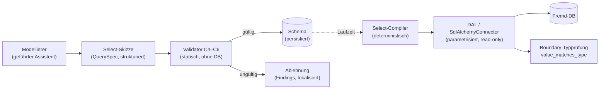

<!-- SPDX-License-Identifier: BUSL-1.1 -->
# Konzept: Intuitive, CbC-sichere SQL-Datenanbindung (strukturierter Select-Builder)

> Schwerpunkt: Datenelemente sollen **intuitiv und einfach** an sonstige
> Datenquellen (SQL-Server u. a.) über die Connector-Schnittstelle angebunden
> werden – per **SQL-`SELECT`**. Dabei gilt **Correctness by Construction auch
> für die Erzeugung des SQL-Befehls**: Ein `SELECT` wird nur so erzeugt, dass
> sein Ergebnis **zum zu füllenden Datenelement passt** (Typ **und**
> Kardinalität). Freitext-SQL kommt nicht vor; das `SELECT` wird aus einer
> strukturierten, entscheidbaren Spezifikation deterministisch **kompiliert** –
> analog zur K7-Lösung für XOR-Verzweigungen.
>
> Status: **Konzept (geplant)**. Version 0.1. **Additiv** zum bestehenden Kern
> (`dal.py`, `connections.py`, `ExternalBinding`, `ConnectorDescriptor`,
> `DataElement`, `integration_runtime.py`, Validator C1–C3) und **lockert kein
> bestehendes Korrektheitskriterium**. Die vorhandene record-basierte Bindung
> (`ExternalBinding` = ganze Zeile) bleibt **unverändert** bestehen; die
> skalar-typisierte Select-Bindung tritt **daneben**.
>
> Einordnung: Hauptkonzept
> [Architektur-Konzept-Prozessmodellierung.md](Architektur-Konzept-Prozessmodellierung.md)
> (§9 Datenhaltung & Connectoren, §3.2 Datenfluss D1–D5, §13.1 E12/E15);
> [Integrations-Konzept](Integrations-Konzept-Externe-Anbindung.md) (§7
> Daten-Connectoren). Vorbild für den CbC-Mechanismus: die XOR-Partition (K7).

---

## 0. Status & Begriffe

| Begriff | Bedeutung |
|---|---|
| **EXTERNAL-Datenelement** | Ein Datenelement, dessen Wert nicht in der Instanz liegt, sondern über einen Connector aufgelöst wird (`DataElement.source = EXTERNAL`). |
| **Record-Bindung** | Bestehende Bindung `ExternalBinding{connector_id, entity, key_element_id}`: `SELECT * … WHERE key = :key` liefert eine **ganze Zeile** (Dict Spalte→Wert). |
| **Skalar-Select-Bindung** | **Neu**: eine strukturierte Spezifikation, aus der ein `SELECT` **einer** typisierten Spalte kompiliert wird; das Ergebnis ist ein **Skalar**, der in genau ein Datenelement passt. |
| **Select-Skizze (QuerySpec)** | Die block-strukturierte, entscheidbare Beschreibung des gewünschten `SELECT` (Entität, Projektion, Filter, Kardinalität) – **kein** SQL-Text. |
| **Select-Compiler** | Deterministische Funktion `QuerySpec → parametrisiertes SQL`; einziger Weg, wie SQL entsteht. |
| **Projektion** | Die **eine** ausgewählte Ergebnisspalte (oder ein Aggregat darüber). |
| **Diskriminator/Filterquelle** | Ein **INSTANCE**-Datenelement, dessen Wert als **Bind-Parameter** in eine `WHERE`-Bedingung fließt. |

Die SQL-Datenanbindung ist eine **Boundary-Fähigkeit** (an der API-Grenze / im
DAL): Der **Ausführungskern bleibt rein**. Kein Freitext-SQL, kein Bypass der
CbC-Invariante.

---

## 1. Ausgangslage & die geschlossene Lücke

Heute wird ein EXTERNAL-Element über `ExternalBinding` gebunden. Der
`SqlAlchemyConnector.read(entity, key)` erzeugt `SELECT * FROM entity WHERE
key_col = :key` und liefert **die ganze Zeile** als Dict zurück. Daraus folgt
eine **Correctness-Lücke** genau an der Stelle, die dieses Konzept schließt:

- Ein EXTERNAL-Element „ist" faktisch ein **Record** (Dict), obwohl es eine
  skalare `DataType` (INTEGER/STRING/…) deklariert. Der deklarierte Typ wird
  gegen das Ergebnis **nicht geprüft** – `DataType` ist für EXTERNAL-Elemente
  praktisch bedeutungslos.
- Es gibt **keine Möglichkeit**, gezielt **einen Wert** aus einer Quelle in ein
  Datenelement zu ziehen (z. B. „das Kreditlimit dieses Kunden" → ein
  FLOAT-Element), ohne im Prozess selbst aus dem Record die richtige Spalte zu
  fischen (unstrukturiert, fehleranfällig, nicht CbC-geprüft).
- Filter über die Instanzdaten hinaus (mehr als der eine Schlüssel) sind gar
  nicht ausdrückbar.

Ziel ist die **typ- und kardinalitätssichere** Anbindung: Der Modellierer
beschreibt „welcher Wert" gewünscht ist, das Werkzeug **erzeugt** das passende
`SELECT` und **garantiert konstruktiv**, dass es in das Zielelement passt.

---

## 2. Ziele und Leitplanken

### 2.1 Funktionale Ziele

1. **Intuitiv & einfach.** Ein geführter 3-Schritt-Assistent (Quelle → Spalte →
   Filter) mit Live-Vorschau des erzeugten `SELECT` und sofortigem
   Typ-Abgleich. Kein SQL-Wissen nötig.
2. **CbC für die SQL-Erzeugung.** Das `SELECT` entsteht **nur** so, dass sein
   Ergebnis zum Datenelement passt – **statisch garantiert**, bevor gespeichert
   wird.
3. **Additiv.** Record-Bindung bleibt; Skalar-Select-Bindung kommt daneben.
4. **Sicher.** Werte stets als Bind-Parameter, Bezeichner whitelisted +
   dialekt-gequotet, read-only, Secrets nie im Modell.

### 2.2 Architektur-Leitplanken (nicht verhandelbar)

- **L1 – Kern bleibt rein.** Validator/`execution.py`/`operations.py` bekommen
  **keine** DB-Abhängigkeit. Die statische CbC-Prüfung arbeitet nur auf dem
  **Schema** (offline, ohne Datenbank), siehe §4.3.
- **L2 – Kein Freitext-SQL.** Wie K7 die *Freitext*-XOR-Bedingung durch eine
  **entscheidbare Partition** ersetzt, ersetzt dieses Konzept *Freitext*-SQL
  durch eine **strukturierte, kompilierbare Spezifikation**. Die
  Vollständigkeit/Sicherheit beliebiger SQL-Texte ist praktisch nicht
  garantierbar; eine strukturierte Spezifikation ist es.
- **L3 – Deterministische Kompilation.** Genau **eine** Funktion erzeugt SQL;
  sie ist die einzige Stelle, an der Bezeichner interpoliert werden.
- **L4 – Boundary-Typprüfung zusätzlich.** Der statischen Garantie folgt zur
  Laufzeit eine Wert-Typprüfung (`value_matches_type`) an der Grenze – Gürtel
  **und** Hosenträger (analog Inbound-`/v1`).

---

## 3. Kernidee: der strukturierte Select-Builder

Statt „schreib dein SQL" bietet das Werkzeug eine **Select-Skizze** an, aus der
das SQL **erzeugt** wird. Die Skizze ist so eng gefasst, dass drei Dinge
**konstruktiv** garantiert sind:

1. **Einspaltigkeit ⇒ Skalar.** Es wird **genau eine** Spalte projiziert (oder
   **ein** Aggregat). Das Ergebnis ist damit strukturell ein Skalar, der in
   genau **ein** Datenelement passt.
2. **Deklarierter Spaltentyp ⇒ Typkonformität.** Die projizierte Spalte trägt
   einen **deklarierten Ergebnistyp** (aus DB-Introspektion vorgeschlagen, §5).
   Die neue Regel **C4** erzwingt: `binding.result_type == element.data_type`.
3. **Kardinalitäts-Garantie ⇒ höchstens ein Treffer.** Die Skizze muss eine von
   drei entscheidbaren **Kardinalitäts-Garantien** wählen (§4.2), sodass das
   `SELECT` **höchstens eine Zeile** liefert.



---

## 4. Das erweiterte Meta-Modell (additiv)

### 4.1 Neue Modell-Bausteine (`model.py`)

```text
FilterOperator (StrEnum): EQ | NE | LT | LE | GT | GE | LIKE | IN
AggregateKind  (StrEnum): NONE | COUNT | SUM | MIN | MAX | AVG
Cardinality    (StrEnum): KEY_UNIQUE | AGGREGATE | FIRST_ORDERED

QueryFilter(BaseModel):
    column: str                 # whitelisted identifier
    column_type: DataType       # deklarierter Typ der Filterspalte
    operator: FilterOperator
    key_element_id: str         # INSTANCE-Element (liefert den Bind-Wert)

OrderBy(BaseModel):
    column: str
    descending: bool = False

SqlSelectBinding(BaseModel):
    connector_id: str
    entity: str                 # Tabelle/Sicht, whitelisted (optional schema.table)
    column: str                 # DIE EINE projizierte Spalte (bei AGGREGATE Argument)
    result_type: DataType       # deklarierter Ergebnistyp der Projektion
    aggregate: AggregateKind = NONE
    filters: list[QueryFilter] = []
    cardinality: Cardinality
    order_by: list[OrderBy] = []   # nur/erforderlich bei FIRST_ORDERED
```

`DataElement` erhält **additiv** ein optionales Feld `select: SqlSelectBinding |
None = None`. Ein EXTERNAL-Element ist damit **entweder** record-gebunden
(`external`, wie bisher) **oder** skalar-select-gebunden (`select`) – nie
beides. Bestehende Modelle bleiben unverändert (Feld ist `None`).

### 4.2 Die drei Kardinalitäts-Garantien (entscheidbar)

| Garantie | Bedeutung | Erzeugtes `SELECT` (Muster) | Statisch prüfbar? |
|---|---|---|---|
| **KEY_UNIQUE** | Filter adressiert einen als **eindeutig deklarierten** Schlüssel (der Connector-Key oder eine als unique markierte Spalte). | `SELECT col FROM t WHERE key = :k` | Ja – Filter enthält Gleichheit auf die deklarierte Key-Spalte. |
| **AGGREGATE** | Ein Aggregat liefert **immer genau eine** Zeile. | `SELECT COUNT(col) FROM t WHERE …` | Ja – `aggregate != NONE`, keine Gruppierung. |
| **FIRST_ORDERED** | Sortierte Auswahl, **erste** Zeile. | `SELECT col FROM t WHERE … ORDER BY … LIMIT 1` | Ja – `order_by` nichtleer, `LIMIT 1` immer gesetzt. |

Fehlt eine passende Garantie (z. B. Gleichheitsfilter auf eine nicht-eindeutige
Spalte ohne Aggregat/Ordnung), wird die Skizze **abgelehnt** (C6). Damit ist ein
Mehrzeilen-Ergebnis, das nicht in ein Skalar-Element passt, **konstruktiv
ausgeschlossen**.

### 4.3 Warum „deklarierter" Typ statt Live-DB-Prüfung?

CbC ist eine **statische Schema-Eigenschaft**: Der Validator läuft **ohne**
Datenbank (offline, in CI, im Editor). SQL-Spaltentypen leben aber in der DB.
Die Auflösung (bewusst, wie an anderen Boundaries im Projekt):

- Die Skizze trägt den **deklarierten** `result_type`/`column_type`. Er wird bei
  der Erstellung per **DB-Introspektion vorgeschlagen** und optional **live
  verifiziert** (§5) – die Bequemlichkeit kommt aus der GUI, die Garantie aus
  der Deklaration.
- **Statisch** garantiert der Validator: „Projektionstyp == Elementtyp",
  „Filtertyp == Typ des Quellelements", „Ergebnis ist skalar". Das ist eine
  vollständige, DB-freie CbC-Aussage über das Schema.
- **Zur Laufzeit** prüft die Boundary den **tatsächlich** gelesenen Wert gegen
  `element.data_type` (`value_matches_type`); ein Typbruch (DB weicht von der
  Deklaration ab) wird sauber als Datenzugriffsfehler (502) abgewiesen, statt
  einen falsch getypten Wert in die Instanz zu lassen.

Diese Aufteilung ist **identisch** zum bewährten Muster für Inbound-Daten und
External-Task-Outputs (statische Struktur + Laufzeit-Boundary-Typprüfung).

---

## 5. Deterministischer Select-Compiler & Introspektion

### 5.1 Kompilation (einzige SQL-erzeugende Stelle)

Ein neuer `SqlAlchemyConnector.select_scalar(spec, params)` (bzw. eine reine
Compiler-Funktion `compile_select(spec) → (sql, bind_names)`) baut das `SELECT`
**deterministisch**:

- **Projektion:** `aggregate == NONE` → `"<col>"`, sonst
  `"<AGG>(<col>)"` (z. B. `AVG(betrag)`). `col` über den bestehenden
  `_safe_identifier` whitelisted **und** dialekt-gequotet.
- **`FROM`:** `entity` über den bestehenden `_safe_entity`/`_quote_entity`.
- **`WHERE`:** je Filter `"<col> <op> :f_i"`; **Werte immer als Bind-Parameter**
  (`:f_i`), Operator aus einer festen Whitelist (`EQ→=`, `LIKE→LIKE`, `IN→IN`,
  …). Für `IN` bindet SQLAlchemy die Liste als expandierenden Parameter.
- **`ORDER BY … LIMIT 1`:** nur bei `FIRST_ORDERED` (Spalten gequotet, Richtung
  `ASC/DESC` aus dem Enum).

Es gibt **keine** andere Stelle im System, die SQL-Text aus Skizzen erzeugt. Die
Sicherheitsgarantien (Parametrisierung, Identifier-Whitelist, Dialekt-Quoting)
sind damit an **einer** Stelle gebündelt und testbar (Golden-Tests, DB-frei).

### 5.2 Introspektion für die intuitive Erstellung

Ein neuer, rein lesender Boundary-Endpunkt hilft der GUI, Spalten und Typen
anzubieten (nutzt SQLAlchemy-Reflection, `inspect(engine)`):

- `GET /v1/connectors/{id}/columns?entity=<t>` → Liste `{column, sql_type,
  data_type}` (SQL-Typ auf ProcWorks-`DataType` gemappt, z. B. `INT→INTEGER`,
  `NVARCHAR→STRING`, `DECIMAL/NUMERIC→FLOAT`, `BIT→BOOLEAN`, `DATE/DATETIME→
  DATE`). Nicht abbildbare Typen werden als „nicht bindbar" markiert.
- Bestehend & wiederverwendet: `POST /v1/connectors/{id}/sample-read`
  (Beispielzeilen) und `POST /v1/connectors/{id}/test` (Ping) helfen beim
  Erkunden – **nie** werden Secrets/URLs preisgegeben (`ConnectorInfo`).

So schlägt die GUI beim Spaltenklick den `result_type` automatisch vor; der
Modellierer muss nichts über den DB-Typ wissen.

---

## 6. Correctness by Construction: die neuen Regeln C4–C6

Additive Validierungsgruppe im `validator.py` (`_check_scalar_queries`),
**stumm**, solange kein Element eine `select`-Bindung trägt (voll additiv wie
die Temporal-/Integrations-Gruppen). Findings tragen die Regel-Codes **C4–C6**.

| Regel | Garantie | Prüfung |
|---|---|---|
| **C4 – Projektions-Typkonformität** | Das `SELECT`-Ergebnis passt in das Zielelement. | `binding.result_type == element.data_type`. Bei Aggregaten wird der Ergebnistyp **abgeleitet und erzwungen**: `COUNT → INTEGER`; `AVG → FLOAT`; `SUM/MIN/MAX → column_type`. `result_type` muss dazu passen. |
| **C5 – Filter-Wohlgeformtheit & D1-Kopplung** | Jeder Filterwert ist typkonform vorhanden. | (a) `connector_id` registriert (C1-Analogie), `entity` nichtleer (C3-Analogie). (b) Jede `key_element_id` existiert, ist **INSTANCE** und `column_type == key_element.data_type`. (c) Operator passt zum Typ (`LIKE` nur `STRING`; Ordnungs-Operatoren nur `INTEGER/FLOAT/DATE`; `IN` nur mit Mengensemantik). (d) **D1-Kopplung:** Alle Filter-/Key-Elemente müssen auf **jedem** Pfad **vor** dem lesenden Knoten geschrieben sein – exakt wie der XOR-Diskriminator bei K7 (`_must_written_before`). So kann kein Lesezugriff auf einen noch nicht gesetzten Schlüssel entstehen (deadlock-/leerfrei). |
| **C6 – Kardinalitäts-Garantie** | Höchstens ein Treffer. | Genau eine der drei Garantien (§4.2) ist erfüllt: `KEY_UNIQUE` (Gleichheitsfilter auf die deklarierte Key-/Unique-Spalte), `AGGREGATE` (`aggregate != NONE`, keine Gruppierung) **oder** `FIRST_ORDERED` (`order_by` nichtleer). Sonst Ablehnung. |

Die bestehenden **C1–C3** (Record-Bindung) bleiben **unverändert**; C4–C6 gelten
ausschließlich für `select`-gebundene Elemente. **Kein** bestehendes Kriterium
wird gelockert.

> **Analogie zu K7:** Dort garantiert die Partition, dass jede XOR-Verzweigung
> vollständig **und** überschneidungsfrei entschieden wird, ohne Freitext.
> Hier garantiert die Skizze, dass jedes `SELECT` **typkonform** **und**
> **skalar** ist, ohne Freitext. In beiden Fällen ersetzt eine entscheidbare
> Struktur das nicht garantierbare Freiform-Konstrukt.

---

## 7. Laufzeit-Boundary (Kern bleibt rein)

- **DAL:** neuer `DataAccessLayer.read_scalar(schema, instance_values,
  element_id)` – löst die `select`-Bindung auf, sammelt die Filter-Bind-Werte
  aus `instance_values`, ruft `connector.select_scalar(spec, params)`.
- **Pre-Fetch (`integration_runtime.py`):** In `_prefetch_external` werden
  `select`-gebundene READ-Elemente als **Skalar** (nicht als Record) in das
  Eingabepaket des Workers gelegt – bereits `value_matches_type`-geprüft
  (Bruch → `ExternalTaskError(502)`). Record-gebundene READs bleiben wie bisher.
- **Direkter Pre-Fetch bei manuellen/automatischen Aktivitäten:** analog dem
  bestehenden Pre-Fetch-Pfad; der skalare Wert steht der Aktivität als typ­
  konformer Eingabewert zur Verfügung.
- **Schreiben (Q4, umgesetzt):** Symmetrisch zum Lesen bindet
  `SqlWriteBinding` ein Element an einen **strukturierten Skalar-Write**
  (parametrisiertes `UPDATE <entity> SET <column> = :val WHERE <filter>`). Wird
  das Element von einer Aktivität geschrieben, wird der erzeugte, typgeprüfte
  Skalar **post-flushed** (`DataAccessLayer.write_scalar` →
  `SqlAlchemyConnector.update_scalar`). Eigene, symmetrische CbC-Regeln
  **C7–C9**: C7 = Zielspaltentyp == Elementtyp; C8 = Filter wohlgeformt,
  typkonform und vor dem schreibenden Knoten versorgt (D1-gekoppelt); C9 =
  **genau eine Zeile** (deklarierte `unique_column` + Gleichheitsfilter darauf –
  ein `UPDATE` fächert nie auf viele Zeilen auf). Operation `bind_sql_write`,
  Endpunkt `POST …/data-elements/{id}/sql-write`, Web-Assistent „SQL-Write".

Der reine Execution-Kern ruft **nie** einen Connector; die Auflösung bleibt an
der Grenze (wie bei allen externen Zugriffen heute).

---

## 8. Intuitive Erstellung: der geführte Assistent (GUI)

Erweiterung der bestehenden **Integrationssicht** / **Datensicht**
(`web/app.js`, `dataBindingPanel`), **Angebotsmodell** (nur Zulässiges wird
angeboten):

**Schritt 1 – Quelle wählen.** Connector + Entität aus der Registry; „Testlesen"
zeigt Beispielzeilen.

**Schritt 2 – Wert (Projektion) wählen.** Spaltenliste aus
`/connectors/{id}/columns` mit vorgeschlagenem `DataType`. Der Assistent bietet
**nur Spalten an, deren Typ zum Zielelement passt** (oder erlaubt ein Aggregat,
dessen abgeleiteter Typ passt – z. B. `COUNT(*) → INTEGER` für ein
INTEGER-Element). Typ wird automatisch gefüllt; der Modellierer sieht sofort
„✓ passt zu «Kreditlimit» (FLOAT)".

**Schritt 3 – Eingrenzen (Filter & Kardinalität).** Filterzeilen
`Spalte · Operator · Quelle`; als **Quelle** werden **nur typkonforme
INSTANCE-Elemente** angeboten, die (D1) garantiert vorher gesetzt sind. Die
Kardinalitäts-Garantie ergibt sich meist automatisch (Gleichheit auf Key =
KEY_UNIQUE; Aggregat = AGGREGATE) und ist sonst per „erste nach Sortierung"
(FIRST_ORDERED) explizit wählbar.

**Live-Vorschau.** Das erzeugte `SELECT` wird als **Klartext** angezeigt
(read-only, Werte als `:parameter` sichtbar) **und** ein Typ-/Kardinalitäts-
Ampelindikator. Erst wenn alles „grün" ist, ist „Anbinden" aktiv – der
klassische CbC-Effekt: **den Fehler kann man gar nicht erst machen**.

---

## 9. Sicherheit (OWASP-orientiert)

| Bedrohung | Gegenmaßnahme |
|---|---|
| **SQL-Injection (A03)** | **Keine** Freitext-SQL. Werte ausschließlich Bind-Parameter; Bezeichner gegen strikte Whitelist (`_safe_identifier`/`_safe_entity`) **und** dialekt-gequotet. Operator-/Aggregat-Enum statt Freitext. |
| **Übermäßiger Datenabfluss** | Projektion **einer** Spalte + Kardinalitäts-Garantie (LIMIT 1 / Aggregat) verhindern Massenauslesen. Read-only-Dienstkonto je Connector (least privilege). |
| **Secret-/Konfig-Leak (A02/A05)** | URLs/Secrets nur serverseitig (`connections.py`, `${ENV}`); Schema trägt nur Metadaten; Introspektions-/Test-Endpunkte geben **nie** Secrets zurück. |
| **DoS über teure Abfragen** | Nur einspaltige, indizierbare Zugriffe; optional Query-Timeout/Row-Cap im Connector. |
| **Rechteanmaßung** | Introspektions-/Bind-Endpunkte unter `data:read`-Scope bzw. Modellierer-Rolle; Bindung nur in ENTWURF (R0). |

---

## 10. Modell-Deltas (additiv, Übersicht)

| Baustein | Änderung |
|---|---|
| `model.py` | **Neu**: `FilterOperator`, `AggregateKind`, `Cardinality`, `QueryFilter`, `OrderBy`, `SqlSelectBinding`; `DataElement.select: SqlSelectBinding \| None = None` (additiv). Ergebnistyp-Ableitung `aggregate_result_type(agg, column_type)`. |
| `validator.py` | **Neu**: `_check_scalar_queries` (C4–C6), in `validate()` nach `_check_connectors` verdrahtet; stumm ohne `select`-Bindung. D1-Kopplung über bestehendes `_must_written_before`. |
| `operations.py` | **Neu**: `bind_sql_select(schema, element_id, *, connector_id, entity, column, result_type, aggregate=NONE, filters, cardinality, order_by=())` – `model_copy(deep)` → `_require_editable` → setzt `source=EXTERNAL` + `select=…`, leert `external`, `raise_if_invalid`. Umkehr `unbind_external` (bestehend/erweitert). |
| `dal.py` | **Neu**: `compile_select(spec) → (sql, binds)` (Compiler), `SqlAlchemyConnector.select_scalar(spec, params)`, `DataAccessLayer.read_scalar(...)`. Introspektion `columns(entity)` (SQLAlchemy `inspect`). |
| `integration_runtime.py` | `_prefetch_external` behandelt `select`-Elemente skalar (typgeprüft). |
| `api.py` | **Neu**: `POST /schemas/{id}/data-elements/{eid}/sql-select` (Bindung), `GET /v1/connectors/{id}/columns` (Introspektion, `data:read`). Request-Modelle `SqlSelectRequest`, `QueryFilterRequest`. |
| `connections.py` | Introspektion an die Registry (`columns(connector_id, entity)`), Cache. |
| `web/app.js` / `index.html` / `styles.css` | 3-Schritt-Assistent im Datenanbindungs-Panel, Live-`SELECT`-Vorschau, Typ-/Kardinalitäts-Ampel. |
| `bpmn.py` | `select`-Bindung im `procworks:model`-Extension mitführen (Round-Trip), wie `data_elements`/`xor_decisions`. |
| Migration | **Keine** – Bindung liegt als JSON im bestehenden Schema-Dokument. |

`__init__.py` exportiert die neuen Symbole (Import + `__all__`), wie bei früheren
additiven Inkrementen.

---

## 11. Abgrenzung / Nicht-Ziele (v0.1)

- **Kein Join über mehrere Tabellen.** Genau **eine** Entität (Tabelle/**Sicht**)
  pro Bindung. Mehrtabellen-Logik wird über eine **DB-seitige Sicht (VIEW)**
  gekapselt und dann als eine Entität gebunden – die Komplexität bleibt in der
  DB, das Modell bleibt CbC-einfach.
- **Kein Freitext-SQL** (bewusst, L2).
- **Kein Gruppieren/`HAVING`** (würde Mehrzeiligkeit einführen → widerspricht der
  Skalar-Garantie).
- **OData/SAP** nutzen dieselbe Skizze: der **OData-v4-Connector** (`odata.py`,
  Q5, umgesetzt) übersetzt `SqlSelectBinding`/`SqlWriteBinding` in
  `$select`/`$filter`/`$orderby`/`$top`/`$count`/`$apply` bzw. ein keyed
  `PATCH` – **dieselbe SPI** (`read`/`write`/`query`/`select_scalar`/
  `update_scalar`/`columns`), sodass Kern, Regeln (C4–C9) und GUI unverändert
  bleiben. Dynamics 365 (Dataverse) und SAP (über SAP Gateway/OData) werden so
  bedient; SAP-RFC/BAPI bleibt offen.

---

## 12. Qualitätssicherung

- **Compiler-Golden-Tests (DB-frei):** `QuerySpec → erwartetes SQL` je Muster
  (Projektion, Aggregat, jede Kardinalitäts-Garantie, jeder Operator);
  Injection-Versuche in `entity`/`column` → `DataAccessError`.
- **Validator-Tests C4–C6:** Typbruch Projektion/Filter, unbekanntes/nicht-
  INSTANCE-Quellelement, fehlende Kardinalitäts-Garantie, D1-Verletzung
  (Filterquelle nicht vorher geschrieben), Aggregat-Typableitung.
- **Round-Trip:** `SqlAlchemyConnector.select_scalar` gegen SQLite (Datei-basiert
  wie bei `test_connectors_sql.py`); Pre-Fetch end-to-end (Skalar landet
  typkonform im Eingabepaket).
- **Boundary-Typprüfung:** DB liefert abweichenden Typ → 502, kein falsch
  getypter Wert in der Instanz.
- **Additivität:** Bestehende Suite unverändert grün; neue Gruppe stumm ohne
  `select`-Bindung.

---

## 13. Roadmap

| Schritt | Inhalt |
|---|---|
| **Q0** | Modell-Deltas + Compiler + C4–C6 (DB-frei, Golden-/Validator-Tests) – der eigentliche CbC-Kern **zuerst**. **✅ umgesetzt** (`model.py`, `dal.py` `compile_select`, `validator.py` `_check_scalar_queries`, `test_scalar_query.py`). |
| **Q1** | `bind_sql_select`-Operation + API-Endpunkt + `__init__`-Export + BPMN-Round-Trip. **✅ umgesetzt** (`operations.bind_sql_select`, `POST /schemas/{id}/data-elements/{eid}/sql-select`, `bpmn.py` führt jetzt auch `connectors` mit). |
| **Q2** | Introspektion (`/v1/connectors/{id}/columns`) + DAL `read_scalar` + Pre-Fetch-Integration + SQLite-Round-Trip. **✅ umgesetzt** (`SqlAlchemyConnector.select_scalar`/`columns`, `DataAccessLayer.read_scalar`, `integration_runtime` Pre-Fetch skalar, `test_scalar_query_sql.py`). |
| **Q3** | GUI-Assistent (3 Schritte, Live-Vorschau, Typ-/Kardinalitäts-Ampel). **✅ umgesetzt** (`web/app.js` `bindSqlSelect`: Datenanbindungs-Sicht, Spalten-Introspektion, Live-`SELECT`-Vorschau, C4/C6-Ampel). |
| **Q4** | strukturierter Skalar-**Write** (parametrisiertes `UPDATE`), symmetrisch mit eigenen Regeln C7–C9. **✅ umgesetzt** (`SqlWriteBinding`, `compile_update`, `update_scalar`/`write_scalar`, `bind_sql_write`, `POST …/sql-write`, Post-Flush, Web-Assistent). |
| **Q5** | OData/SAP-Übersetzung derselben Skizze (Connector-Impl., SPI unverändert). **✅ umgesetzt** (`odata.py` `ODataConnector`: `$select`/`$filter`/`$orderby`/`$top`/`$count`/`$apply` + keyed `PATCH`, injizierbarer Transport, Registry-Dispatch nach Connector-Art). |

**Vorschlag für das Hauptkonzept (§13.1), noch nicht eingetragen:**

> **E15 – CbC-sichere SQL-Datenanbindung (strukturierter Select-Builder):**
> typ- und kardinalitätssichere Anbindung von Datenelementen an SQL-Quellen über
> eine strukturierte, kompilierbare Select-Skizze (kein Freitext-SQL); neue
> Regeln C4–C6; additiv zu E12. Bezug: §9, dieses Konzept. Status: **geplant**.

---

## 14. Zusammenfassung

Die SQL-Datenanbindung wird **intuitiv** (geführter Assistent mit Introspektion
und Live-Vorschau) **und** zugleich **Correctness by Construction** für die
**SQL-Erzeugung**: Ein `SELECT` entsteht nur aus einer entscheidbaren
Select-Skizze, die **konstruktiv** garantiert, dass das Ergebnis **einspaltig
(skalar)** und **typkonform** zum Zielelement ist (C4/C6) und dass alle Filter
typkonform und rechtzeitig versorgt sind (C5, D1-gekoppelt). Freitext-SQL – und
damit die zugehörige Fehler- und Injektionsklasse – ist konstruktiv
ausgeschlossen. Der Ansatz ist **additiv** (Record-Bindung bleibt), hält den
**Kern rein** (statische Prüfung ohne DB, Auflösung nur an der Boundary) und
folgt exakt dem bewährten Muster von K7 (entscheidbare Struktur statt
nicht-garantierbarem Freiform-Konstrukt).
